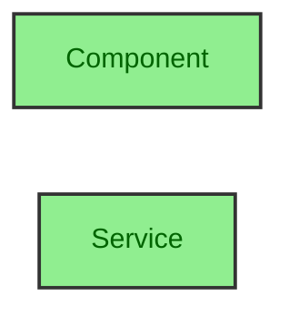
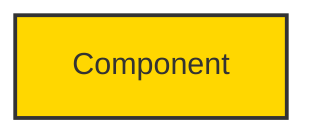

# High-Contrast Mermaid Diagram Update

This file is a historical note for the project-local `design-doc-mermaid` skill. The installed skill now requires generated Mermaid diagrams to include readable, high-contrast styling.

## Current Rule

Every `classDef` or explicit `style` statement should include a `color:` property that contrasts with the fill color. Light fills need dark text. Dark fills need light text.

Good example:

Avoid this pattern:

## Validation Checklist

- Check every `classDef` and `style` for an explicit text color.
- Confirm the diagram remains readable in both light and dark page themes.
- Prefer the high-contrast examples in `SKILL.md` and `references/mermaid-diagram-guide.md`.

## Maintenance

Do not use upstream absolute paths or Claude-specific workflow files as project truth. The local source of truth is this skill directory plus `docs/AI_SKILLS.md`.
