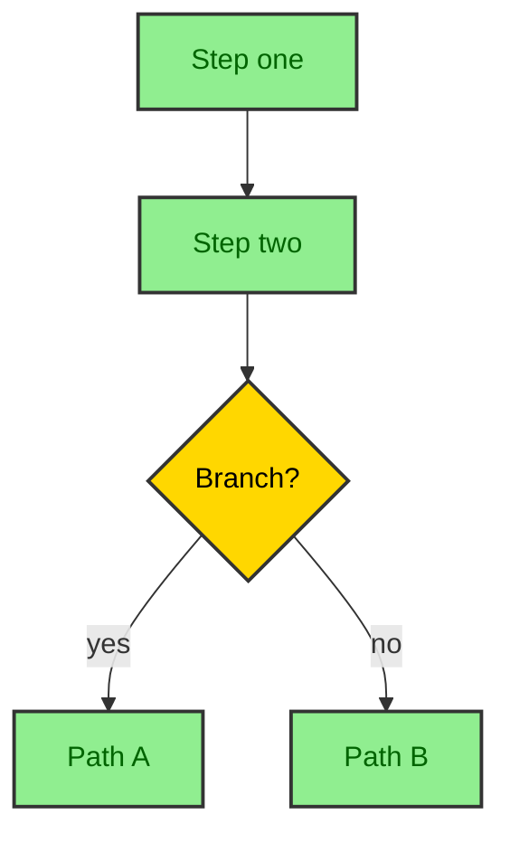

# MDX Blog Post Writer

Project-local writing workflow for albertoduran.com journal entries. Use it to
draft or revise files under `src/thejournal/` while matching the local Astro
content schema, existing publication style, and Mermaid rendering constraints.

---

## REFERENCE FILES

Load these when you need full detail on a subsystem. Both are in `references/`:

| File | When to load |
|------|-------------|
| `references/humanizer.md` | Full humanizer guidelines, banned phrases, and the complete checklist — load when reviewing a draft or when the user asks to humanize text |
| `references/mdx-rules.md` | Frontmatter template, document structure, all Markdown rules, and the visual variety checklist — load when formatting or delivering the final `.mdx` file |

For Mermaid diagrams, use the **`design-doc-mermaid`** skill for diagram design
rules, node shapes, edge types, and styling. Review `docs/MERMAID_RENDERING.md`
before changing Mermaid rendering code, generated diagram assets, or theme
behavior. See Part 1C below for when to use each diagram type.

For project context, inspect `docs/PROJECT_CONTEXT.md`, `src/content.config.ts`,
and nearby files under `src/thejournal/` before creating a new publication.

---

## HOW TO USE THIS SKILL

When the user provides a topic, follow this sequence without skipping steps:

1. **Receive** the topic or draft (`<TOPIC>` or source text).
2. **Inspect** the local journal schema and similar posts when writing a file.
3. **Plan** the structure using the Content Architecture rules below.
4. **Write** the intro paragraph using the Hook Rules (Part 1B).
5. **Write** the body following Voice and Style rules (Part 2).
6. **Identify diagram opportunities** using the Diagram Decision Guide (Part 1C).
7. **Humanize** the draft using `references/humanizer.md`.
8. **Format and deliver** the complete `.mdx` file using `references/mdx-rules.md`.

When creating files, place standalone posts directly under `src/thejournal/`.
Place vault roots at `src/thejournal/<vault>/index.mdx`; child entries live
under that vault folder. Use repository-relative image paths that match existing
content examples.

---

## PART 1 — CONTENT PHILOSOPHY

### 1A. What Every Post Must Do

A post is only worth publishing if it does at least one of these:

- Teaches something the reader didn't know before.
- Answers a question they've been sitting on.
- Challenges an assumption they hold.
- Walks them through a real process, step by step.

If a post just *mentions* a topic without doing any of the above, it fails. Mentioning is not enough.

### 1B. Hook Rules — The Intro Paragraph

**Every post must begin with a single introductory paragraph that hooks the reader.** This paragraph appears immediately after the frontmatter (before any H2), with no heading above it.

The hook paragraph must do all three of these things at once:

1. **Signal the problem or tension** — what situation is the reader in, or what question are they carrying?
2. **Promise the payoff** — what will they know or be able to do after reading?
3. **Earn their attention** — use a concrete observation, a surprising fact, a brief story beat, or a counterintuitive statement. Never start with a generic definition or a marketing sentence.

**Hook patterns that work:**

- Open with a specific scenario: *"You've shipped the feature, the deploy is green, and the bug is still there."*
- Open with a number or fact that reframes: *"Most React performance problems don't live in the component — they live in how state flows."*
- Open with a direct admission: *"I spent three days debugging a race condition that had a one-line fix."*
- Open with a contrast: *"The docs make it look simple. The production logs tell a different story."*

**Hook patterns that fail (never use these):**

- Starting with a definition: *"Authentication is the process of verifying identity."*
- Starting with a vague claim: *"In the modern tech landscape..."*
- Starting with a rhetorical question as filler: *"Have you ever wondered why..."*
- Starting with a content summary disguised as a hook: *"In this article, I'll cover..."*

**Length:** The hook paragraph is 40–90 words. One paragraph only. Go straight into the first H2 after it.

### 1C. Diagram Decision Guide

**Use a Mermaid diagram when it replaces or clarifies what prose alone struggles to convey.** Diagrams are not decorations — they are structure made visible.

Add a diagram when the content includes one of the following. The third column shows which guide in the **`design-doc-mermaid`** skill to load for node shapes, edge types, and styling:

| Content type | Mermaid diagram | design-doc-mermaid guide |
|---|---|---|
| A multi-step process, workflow, or user flow | `flowchart TD` or `flowchart LR` | `references/guides/diagrams/activity-diagrams.md` |
| A sequence of API or service calls | `sequenceDiagram` | `references/guides/diagrams/sequence-diagrams.md` |
| A system with components and relationships | `graph TB` with subgraphs | `references/guides/diagrams/architecture-diagrams.md` |
| Infrastructure, cloud deployment, or K8s | `graph TB` or deployment-style graph | `references/guides/diagrams/deployment-diagrams.md` |
| A data model or schema | `erDiagram` | `references/guides/diagrams/architecture-diagrams.md` |
| State transitions in an entity | `stateDiagram-v2` | `references/guides/diagrams/activity-diagrams.md` |
| A class hierarchy or OOP design | `classDiagram` | `references/guides/diagrams/architecture-diagrams.md` |
| A project or release timeline | `gantt` | `references/guides/diagrams/activity-diagrams.md` |
| A mental map of a concept | `mindmap` | `references/guides/diagrams/activity-diagrams.md` |

**Do NOT add a diagram for:**

- Prose-only opinion or narrative posts with no process to map.
- Content where a table or list already covers it clearly.
- Lists of unrelated items with no relational structure.

**Placement:** Place the diagram after the introductory sentence(s) of the section it belongs to, not at the end. Introduce it with one sentence before the code block.

**Theming:** Do NOT add `%%{init: {...}}%%` theme directives or custom `themeVariables`. The system publisher applies its own theme and will override any custom theme. Adding one creates conflicts.

**Styling:** Use `classDef` for node-level styling with high-contrast colors. Always specify the `color:` property in every `classDef`. Light background gets dark text; dark background gets light text. Load the appropriate `design-doc-mermaid` guide for full styling templates.

**Minimal working example:**



### 1D. Reader-First Structure

Think of content as a series of answers to unspoken questions. The reader is always asking "why does this matter to me?" Deliver the value early. Don't bury the useful part in paragraph six.

Format like you care about people's eyeballs. Big blocks of uninterrupted text cause readers to leave. Subheadings, short paragraphs, and visual variety — including diagrams — keep them reading.

If a reader finishes and thinks "okay, that was actually useful", the post has done its job.

### 1E. Content Strategies (use at least one per post)

- **Step-by-step process** — explain a workflow in a logical sequence.
- **FAQ in-depth** — answer a real, frequently asked question with more depth than typical results.
- **Case study or behind-the-scenes story** — share what actually happened, not just theory.
- **Unique perspective** — add your own take, not just what's already ranking.
- **Analogy or metaphor** — use one (not several) to explain a complex idea. Keep it grounded.

---

## PART 2 — VOICE AND STYLE RULES

### Point of View

Write in first person. Use "I" and "me" only when the context genuinely calls attention to your person. Don't pepper every sentence with it.

### Talk Like a Person

Use contractions naturally: "it's", "don't", "you'll", "that's". Let sentences have rhythm. Some short. Others a bit longer to balance the flow. Avoid the monotone of academic or corporate writing.

### Paragraph Rules

- Each paragraph must contain **between 20 and 80 words**.
- Let ideas overlap naturally across sentences within a paragraph.
- **Do not** break every single sentence into its own paragraph.
- Use blank lines between paragraphs.

### Omit the Fluff

Every word must earn its place. If a phrase doesn't add meaning, remove it. No preamble. No throat-clearing. No filler like "It's important to note that..." or "In today's world...".

### Subtle Personality

Small honest observations and dry humor are welcome. Don't force friendliness. A wry aside lands better than a performed exclamation point.

### SEO and GEO — Without Sacrificing Clarity

Optimize for search and generative engine visibility, but never at the cost of readable prose. Keywords should appear naturally. If inserting a keyword makes a sentence awkward, rewrite the sentence, not the keyword placement.

---

## PART 3 — HARD RULES (NON-NEGOTIABLE)

These are absolute. They apply to every sentence, every time.

### Banned Words and Phrases

Never use any of the following:

- **AI buzzwords:** revolutionary, leverage, synergy, delve, robust, elevate, game-changer, seamless, cutting-edge, innovative, dive into, unleash, transformative.
- **Marketing hype openers:** "In today's fast-paced world...", "Now more than ever...", "This changes everything...".
- **Filler starters:** "It's important to note that...", "In conclusion...", "In closing...", "Ah the old...".
- **Hollow contrasts:** "This isn't X, it's Y." / "Not just X, but also Y."
- **Salesperson triads:** "You can. You will. You must." — any pattern repeating the same subject three times.

### Punctuation Rules

- **No em dashes (—) anywhere.** Zero exceptions. If you need to connect two ideas, use a comma, a period, or a semicolon.
- **No colons (:) in prose.** Colons are allowed only inside code blocks or technical syntax.
- **Hyphens** are for compound words only (e.g., "step-by-step", "first-person").
- No semicolons in casual prose. Use them only when the logical relationship between two independent clauses is tight enough to warrant it, and even then sparingly.

### Structural Don'ts

- No subjective qualifiers used as fillers: "incredibly", "amazing", "truly", "really" (unless essential to meaning).
- No rhetorical questions used as section openers.
- No dramatic hyperbolic exaggeration.
- No inline "not just this, but also that" constructions.

---

## PART 4 — WRITING HUMANIZER

Before finalizing any draft, load **`references/humanizer.md`** and run the full checklist there.

**Summary of what the humanizer pass fixes:**

- Removes AI-giveaway phrases and banned words (see Part 3 above).
- Converts passive voice to active.
- Trims filler phrases, redundant ideas, and unnecessary hedges.
- Confirms the tone is conversational, not scripted.
- Verifies sentence length is varied and rhythm is natural.

If the user provides an **audience profile**, **tone/style preference**, **key terms**, or **target length**, apply those constraints during the humanizer pass. Full guidance is in `references/humanizer.md`.

---

## PART 5 — FORMATTING AND DELIVERY

Load **`references/mdx-rules.md`** when formatting and delivering the final `.mdx` file.

**Summary of what it covers:**

- Full frontmatter template with field-by-field rules.
- Document structure template (hook, then `---` before every H2, then content).
- All Markdown rules: headings, separators, paragraphs, emphasis, lists, blockquotes, code, links, images, and tables.
- MDX-specific rules for component imports and code block syntax.
- Visual variety checklist — run it before every delivery.

---

## QUICK REFERENCE — WHAT NOT TO DO

| Rule | Wrong | Right |
| ---- | ----- | ----- |
| Hook paragraph | Starting with a definition | Start with a scenario, fact, or direct admission |
| `---` before H2 | `## Section` with no separator | `---\n\n## Section` |
| No em dashes | "It works — most of the time." | "It works most of the time." |
| No colons in prose | "The answer is: use a hook." | "The answer is to use a hook." |
| No banned words | "This robust solution leverages..." | "This setup uses..." |
| No salesperson triads | "You can. You will. You must." | "You can do this in three steps." |
| No hollow contrasts | "This isn't a tutorial, it's a guide." | "This is a practical guide." |
| Active over passive | "The config was updated by the user." | "The user updated the config." |
| Specific link text | "Click here to learn more." | "Read the deployment guide." |
| Code block with lang | ` ```\ncode\n``` ` | ` ```js\ncode\n``` ` |
| Mermaid — no custom theme | `%%{init:...}%%` before graph | No init block — let the publisher theme it |
| Mermaid — use classDef | Node with no styling | `classDef step fill:#90EE90,...,color:darkgreen` |
| Mermaid — design rules | Guessing node shapes | Load `design-doc-mermaid` guide for the diagram type |
