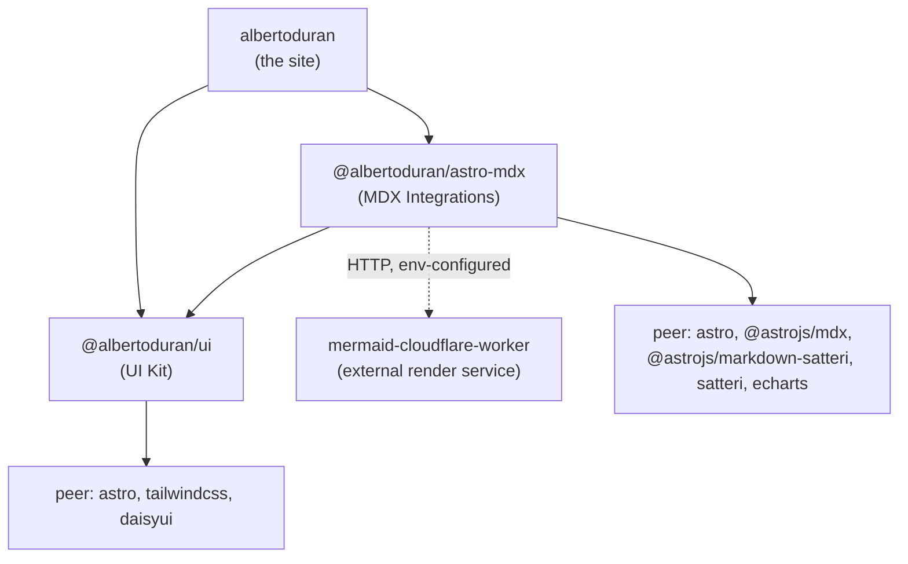
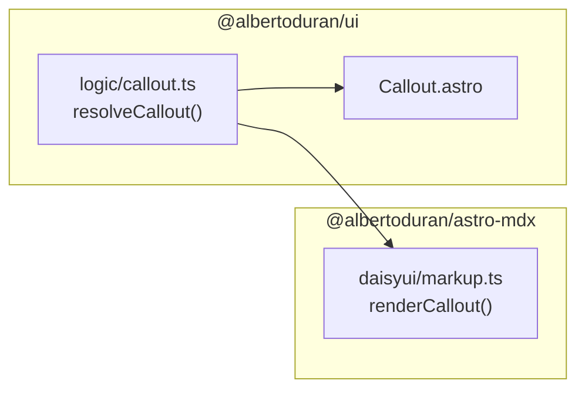
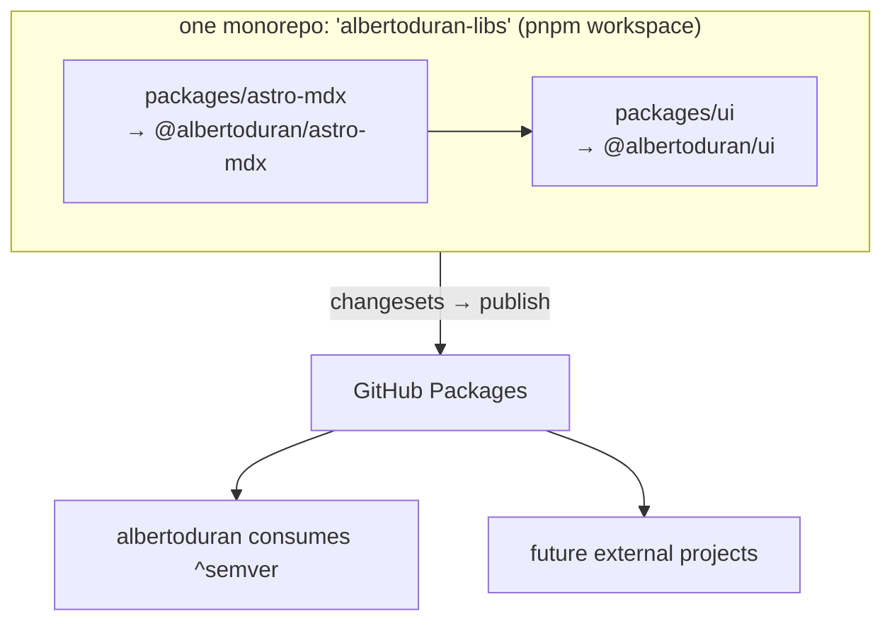

# Extraction Strategy — Splitting the UI Kit and MDX Integrations into Reusable Projects

> **Status:** Design proposal. No code has been written yet. This document, together
> with [`PROJECT_UI_KIT.md`](./PROJECT_UI_KIT.md) and
> [`PROJECT_MDX_INTEGRATIONS.md`](./PROJECT_MDX_INTEGRATIONS.md), describes _how_ to
> carve two standalone, reusable projects out of the current `albertoduran`
> repository so the logic can be consumed by future external projects.

## 1. Goal

Today, three MDX build-time integrations (**DaisyUI fences**, **ECharts**, **Mermaid**)
and a set of **DaisyUI-based UI components** live inside `albertoduran/src`. We want to:

1. Move the three MDX integrations into their own project so they can be reused by
   other Astro sites.
2. Move the reusable DaisyUI UI components into their own project.
3. Let **both** `albertoduran` **and** the MDX-integrations project consume the UI
   components — because the integrations render markup that must stay byte-identical
   to the components (the components are the visual "reference" the integrations mirror).
4. Import everything back into `albertoduran` (and future projects) cleanly — as
   published dependencies, git submodules, or an equivalent.

## 2. The two new projects

| # | Working name | What it is | Depends on |
|---|--------------|------------|------------|
| 1 | **`@albertoduran/ui`** | Presentation-only DaisyUI + Astro component kit: components, their pure domain logic, client web components, styles, shared types. | Nothing (leaf) |
| 2 | **`@albertoduran/astro-mdx`** | The three Astro build-time integrations (DaisyUI fences, ECharts, Mermaid): integration hooks, Sätteri fence plugins, server-side renderers, caching, and the MDX render components. | `@albertoduran/ui` |

> Names are placeholders. Pick a real npm scope you control (e.g. your GitHub org).
> The rest of this doc uses `@albertoduran/ui` (**UI Kit**) and
> `@albertoduran/astro-mdx` (**MDX Integrations**).

### 2.1 Dependency direction (the key insight)

The single most important design decision is that **the UI Kit is a leaf** — it depends
on neither the integrations nor `albertoduran`. Everything else points _at_ it. This is
what makes "consumed by both" work without a dependency cycle.



Why the integrations depend on the UI Kit:

- The **DaisyUI fence plugin** (` ```daisyui `) renders raw HTML that must match the
  `Callout` / `ChatBubble` / `List` / `Steps` / `Mockup*` / `SectionHeader` components
  exactly. Today they already share the same `.ts` resolvers — see §4.1.
- The **ECharts** and **Mermaid** render components (`EChart.astro`,
  `MermaidDiagram.astro`, `MermaidDiagramWrapper.astro`) are the surfaces the
  integrations target. They ship _with_ the integrations (they need build output), but
  they reuse the UI Kit's primitives, panel styles, and DaisyUI classes.

## 3. Current coupling map (what we are actually cutting)

A full scan of cross-boundary imports (`grep` over `src/integrations`, `src/components/ui`,
`src/runtime`) reveals exactly four seams to cut. Everything else is internal.

| Seam | Where it appears | Problem | Resolution |
|------|------------------|---------|------------|
| **`@content/processors/thejournal-manifest`** | `mermaid/integration.ts`, `echarts/integration.ts` (2×) | Integrations import `albertoduran`'s "which entries are published/draft" logic to decide which files' diagrams/charts to render. **Project-specific.** | Invert to dependency injection: integrations accept a `selectSources()` callback. Default = render everything discovered. See §4.2. |
| **`../../lib/astro-disk-bus.ts`** | `mermaid/integration.ts`, `mermaid/build-context.ts` (3×) | Generic disk-cache utility used only by the mermaid pipeline. | Move _into_ the MDX Integrations project (`shared/astro-disk-bus.ts`). |
| **`@appTypes/icon` (the `Icon` type)** | `daisyui/callout.ts`, `daisyui/markup.ts` (2×), and several UI components (3×) | Shared type used by both projects. | The `Icon` type is **owned by the UI Kit**. The MDX Integrations import it from `@albertoduran/ui`. |
| **`@data/icons` (icon _data_), `@utils/ribbon`** | `HeadingAnchor`, `ThemeToggle`, `SocialTire`, `StripBackground` | Actual icon SVG data + skills ribbon = project _content_, not reusable logic. | Components that need icons take them as **props** (injected). Brand/content components stay in `albertoduran` (see §5). |

Additionally, the current re-export direction is **inverted** and must be flipped:
`src/components/ui/display/callout.ts` (etc.) currently does
`export * from "@integrations/daisyui/callout"`. After extraction, the resolver is the
**UI Kit's** to own, and the integration imports _from the UI Kit_ (§4.1).

## 4. Required decoupling refactors (do these _before_ or _during_ the move)

### 4.1 Flip the DaisyUI resolver ownership

- **Today:** the source of truth for `resolveCallout`, `resolveStepItems`,
  `chatBubbleColorClass`, `resolveListItems`, `resolveSectionHeader` lives in
  `src/integrations/daisyui/*.ts`. The `.astro` components re-export from there.
- **Target:** these pure resolvers move to the **UI Kit** (`logic/*`). The UI Kit's
  `.astro` components import them directly. The MDX Integrations' `daisyui/markup.ts`
  imports the _same_ resolvers from `@albertoduran/ui`, guaranteeing the fenced HTML and
  the component HTML stay identical.



### 4.2 Inject content selection into Mermaid + ECharts integrations

Replace the direct `filterPublishedJournalEntries` import with an option:

```ts
// New public option on both integrations
interface SourceSelection {
  /**
   * Given every scanned {filePath, content} doc, return the subset whose
   * diagrams/charts should actually be rendered & emitted. Default: identity.
   */
  selectSources?: (docs: SourceDocument[]) => SourceDocument[];
}
```

`albertoduran` then passes its journal logic in from `astro.config.mjs`:

```ts
mermaidIntegration({ themes, selectSources: collectPublishableMermaidDocuments })
echartsIntegration({ selectSources: collectPublishableEChartDocuments })
```

External projects that omit `selectSources` get "render all discovered diagrams",
which is the correct zero-config default. This removes the only project-specific import
from the integrations.

### 4.3 Own the shared types in the UI Kit

Move `src/types/icon.ts` (the `Icon`, `RibbonIcon` types) and `src/types/button.ts`
(`ButtonVariant`, `ButtonSize`) into the UI Kit and re-export them from its public
entry. The MDX Integrations depend on `@albertoduran/ui` for `Icon`.

### 4.4 Make icon-consuming components prop-driven

`HeadingAnchor` and `ThemeToggle` currently reach into `@data/icons`. In the UI Kit they
should accept the icon(s) as props (with a sensible inline default for `HeadingAnchor`'s
anchor glyph). `albertoduran` supplies its own icon data at the call site.

## 5. What moves vs. what stays

| Module (current path) | Destination |
|-----------------------|-------------|
| `src/integrations/{daisyui,echarts,mermaid}/**` | **MDX Integrations** |
| `src/lib/astro-disk-bus.ts` | **MDX Integrations** (`shared/`) |
| `src/components/ui/display/{Callout,ChatBubble,List,Steps,MockupBrowser,MockupPhone,MockupWindow,SectionHeader}.astro` | **UI Kit** |
| `src/components/ui/display/*.ts` (callout/chat/list/steps resolvers) | **UI Kit** (`logic/`, as source of truth) |
| `src/components/ui/primitive/{SVGIcon,Button,GlassPanel,OverlayPanel}.astro` | **UI Kit** |
| `src/components/ui/mdx/{CodeBlock,ProseTable,HeadingAnchor,VideoPlayer}.astro` | **UI Kit** (generic prose surfaces, no build coupling) |
| `src/components/ui/mdx/{EChart,MermaidDiagram,MermaidDiagramWrapper}.astro` | **MDX Integrations** (they need build output) |
| `src/runtime/elements/{overlay-panel,video-player-shell}.ts` | **UI Kit** |
| `src/runtime/elements/{echart-shell,mermaid-diagram-shell}.ts` | **MDX Integrations** |
| `src/styles/ui/**`, `shared/_daisyui-overrides.css`, `thejournal/article/_diagram.css` | **UI Kit** (see §6) |
| `src/types/{icon,button}.ts` | **UI Kit** |
| `src/integrations/html-minifier/**` | Out of scope; movable to MDX Integrations later |
| `src/content/processors/thejournal-manifest.ts` | **Stays** in `albertoduran` (passed in via `selectSources`) |
| `@data/icons`, `@utils/ribbon`, `AlbertoDuran.astro`, `SocialTire.astro`, `StripBackground.astro`, `ThemeToggle` icon data | **Stays** in `albertoduran` (brand/content) |
| `runtime/{atlas-schedule,on-this-page,theme_manager}.ts`, layouts, pages, journal/profile/project components | **Stays** in `albertoduran` |

Co-located tests move with their modules: `tests/unit/{callout,chat,list,steps,daisyui-*}.test.ts`
→ UI Kit; `tests/unit/{mermaid-*,echarts-*,daisyui-satteri-*,daisyui-markup,daisyui-definition}.test.ts`
→ MDX Integrations; `tests/unit/thejournal-manifest.test.ts` stays.

## 6. Styling: how to ship CSS

The current CSS is Tailwind v4 + DaisyUI, assembled by `src/styles/global.css` via
`@import` and one `@plugin "daisyui"` block. For reuse:

- The **UI Kit** ships its component CSS partials (`ui/display/*`, `ui/mdx/*`,
  `ui/primitive/_panel.css`, `shared/_daisyui-overrides.css`) plus the Mermaid diagram
  styling (`thejournal/article/_diagram.css`) as an importable stylesheet, e.g.
  `@albertoduran/ui/styles.css`.
- The UI Kit also ships a **DaisyUI include preset** documenting which DaisyUI parts the
  components need (`button, card, badge, mockup, steps, chat, list, modal, join, alert,
  link, table, input …`). Consumers keep their own `@plugin "daisyui"` block but can
  copy the preset.
- Consumers keep ownership of **theme tokens** (`_daisyui-themes.css`,
  `_tailwind-theme.css`) — those are brand-specific. The UI Kit's CSS is written against
  DaisyUI semantic classes (`bg-base-100`, `text-base-content`, `btn-primary`, …) so it
  inherits whatever theme the consumer defines.
- Because Tailwind v4 scans source for class names, consumers must add the UI Kit package
  to their Tailwind `@source`/content globs (documented in the UI Kit README).

## 7. Distribution & consumption strategy

Three viable mechanisms, in order of recommendation:

### Option A — Published npm packages (recommended)

Publish both packages to **GitHub Packages** (private to your org) or public npm, versioned
with semver. `albertoduran` and future projects install them like any dependency.

```jsonc
// albertoduran/package.json
"dependencies": {
  "@albertoduran/ui": "^1.0.0",
  "@albertoduran/astro-mdx": "^1.0.0"
}
```

- **Pros:** cleanest reuse story, real semver, no path hacks, works for any external
  project, CI-friendly.
- **Cons:** needs a publish pipeline + registry auth (`.npmrc` with a GitHub token).
- **Versioning:** use [Changesets](https://github.com/changesets/changesets) to automate
  version bumps + changelogs. Because the MDX Integrations depend on the UI Kit, keep the
  UI dependency as a **caret range** and cut a UI release first, then an integrations release.

### Option B — git submodule + path aliases (best during active co-evolution)

Add each project as a submodule under `albertoduran` (e.g. `packages/ui`, `packages/astro-mdx`)
and wire `tsconfig.json` `paths` + Astro/Vite aliases to the submodule source. No publish step.

- **Pros:** zero publishing, edit-and-see-immediately, exact-commit pinning via the
  submodule SHA, works before the API stabilizes.
- **Cons:** submodule ergonomics (`git submodule update --init --recursive`), no semver,
  each consumer must replicate the alias wiring, and you build the libraries' source
  directly (fine for Astro/TS source-shipping packages).

### Option C — git-URL / tarball dependency (middle ground, no registry)

`npm i github:your-org/albertoduran-ui#semver:^1.0.0`. Tag releases; npm resolves the tag.

- **Pros:** no registry, still tag-versioned, single `package.json` line.
- **Cons:** installs from git (slower), private repos need token-authenticated git,
  no dependency dedupe guarantees across transitive git deps.

### Recommendation

Because the MDX Integrations depend on the UI Kit and both will co-evolve, host **both
packages in one monorepo** (pnpm/npm workspaces) — this lets an `A → B` change land
atomically in a single PR with one release pipeline — and **publish them as two separate
versioned packages (Option A)**. The two packages are still independent artifacts; a
consumer can take just the UI Kit.

For the **initial extraction loop**, use workspace linking or a submodule (Option B) so
you can move code and fix imports without publishing on every change. Graduate to
published packages once the public API settles.



> If you would rather have two independent GitHub repositories instead of one monorepo,
> that also works — the only cost is that an `astro-mdx` change needing a `ui` change spans
> two repos/PRs and you must `npm link` the UI Kit while developing. Publishing is otherwise
> identical.

## 8. Peer dependencies (avoid duplicate installs)

Both packages must declare their framework deps as **peers**, so the consumer owns a single
copy (critical for Astro/Tailwind/DaisyUI, which break if duplicated):

- **UI Kit peers:** `astro`, `tailwindcss`, `daisyui`.
- **MDX Integrations peers:** `astro`, `@astrojs/mdx`, `@astrojs/markdown-satteri`,
  `satteri`, `echarts`, and `@albertoduran/ui`.
- The MDX Integrations own (as regular deps) the build-only libs: `postcss`,
  `hast-util-*`, `unist-util-visit`, `fast-glob`, `@astrojs/internal-helpers`.

Current versions to target (from `albertoduran/package.json`): Astro 7, `@astrojs/mdx` 7,
DaisyUI 5, ECharts 6, Tailwind 4, `satteri` 0.9, `@astrojs/markdown-satteri` 0.3.

## 9. External dependency: the Mermaid render worker

The Mermaid integration renders SVGs via an **external Cloudflare Worker**
(`MERMAID_RENDERER_URL` / `MERMAID_RENDERER_API_KEY`) and falls back to `mermaid.ink`.
That worker is already a separate concern (its own repo). It is **not** part of this
extraction — the MDX Integrations package just calls it over HTTP, configured by env vars,
and degrades gracefully when unset. Document the env contract in the package README.

## 10. Suggested execution order

1. **In `albertoduran`, decouple in place first** (safest — everything still builds):
   `selectSources` injection (§4.2), flip resolver ownership (§4.1), prop-drive icons
   (§4.4). Ship this as a normal PR; nothing moves yet.
2. **Scaffold the monorepo** with two empty workspace packages + tooling (tsup/Astro
   package build, Vitest, Changesets, publish workflow).
3. **Move the UI Kit** (Project 1) — see [`PROJECT_UI_KIT.md`](./PROJECT_UI_KIT.md). Get its
   tests green in isolation.
4. **Move the MDX Integrations** (Project 2) — see
   [`PROJECT_MDX_INTEGRATIONS.md`](./PROJECT_MDX_INTEGRATIONS.md), depending on the UI Kit.
5. **Point `albertoduran` at the packages** (workspace link → then published semver),
   delete the moved source, keep only the wiring (`astro.config.mjs` options, icon data,
   `selectSources`).
6. **Verify** with `albertoduran`'s existing e2e/build (`npm run test:e2e`,
   `npm run check:bundle`) before cutting the first published versions.

## 11. Definition of done

- `albertoduran` builds and passes `astro check` + Vitest + Playwright using **only** the
  two packages (no `src/integrations`, no `src/components/ui/*` except brand components).
- Each package builds, type-checks, and passes its own unit tests in isolation.
- A throwaway blank Astro project can install both packages and render a ` ```mermaid `
  fence, a ` ```echart ` fence, a ` ```daisyui ` callout, and a `<Callout>` component with
  zero `albertoduran`-specific configuration beyond a theme + icon data.
