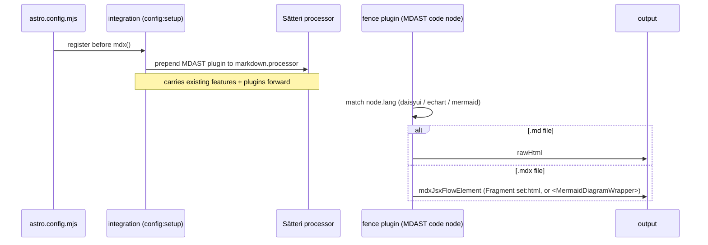
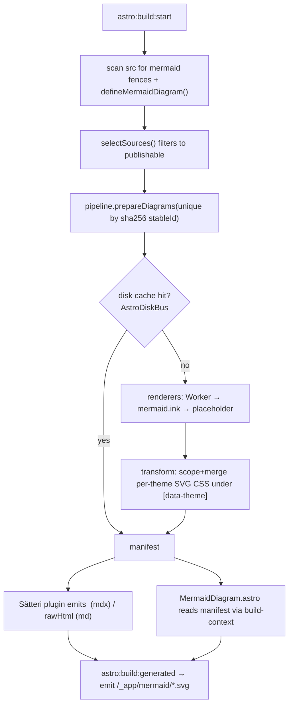

# Project 2 — `@albertoduran/astro-mdx` (Astro MDX Integrations)

> **Read [`EXTRACTION_STRATEGY.md`](./EXTRACTION_STRATEGY.md) first**, and note that this
> package **depends on** [`@albertoduran/ui`](./PROJECT_UI_KIT.md). This document is the
> build sheet for the three build-time integrations: **DaisyUI fences**, **ECharts**, and
> **Mermaid**.

## 1. Purpose & scope

Everything needed to turn Markdown/MDX authoring into rendered output at build time:

- Three **Astro integrations** (`astro:config:setup` hooks that inject Sätteri MDAST
  plugins into `markdown.processor`).
- Three **Sätteri fence plugins** that transform ` ```daisyui `, ` ```echart `, and
  ` ```mermaid ` code fences.
- The **server-side renderers**: ECharts SSR-to-SVG (headless `echarts` with `SVGRenderer`)
  and the Mermaid render pipeline (Cloudflare Worker → `mermaid.ink` fallback → placeholder)
  with a disk cache and per-build manifest.
- The **MDX render components** (`EChart.astro`, `MermaidDiagram.astro`,
  `MermaidDiagramWrapper.astro`) and their **client web components** (`echart-shell`,
  `mermaid-diagram-shell`), because they consume build output.
- A programmatic authoring API: `defineMermaidDiagram()` + the `MermaidDiagram` component
  (the "introduce a Mermaid description into the build process" path).

**Depends on `@albertoduran/ui`** for: the `Icon` type, the DaisyUI resolvers
(`resolveCallout`, `resolveStepItems`, `chatBubbleColorClass`, `resolveListItems`,
`resolveSectionHeader`), and the shared panel/diagram styles + DaisyUI classes that the
render components use.

**Out of scope:** the external Mermaid render worker (separate repo, called over HTTP);
`albertoduran`'s journal/publishing logic (injected via `selectSources`, see §6).

## 2. Package identity

```jsonc
{
  "name": "@albertoduran/astro-mdx",
  "version": "0.1.0",
  "type": "module",
  "exports": {
    ".": "./src/index.ts",                       // the 3 integration factories
    "./mermaid": "./src/mermaid/index.ts",       // defineMermaidDiagram, palette types, LIGHT/DARK presets
    "./echarts": "./src/echarts/index.ts",       // preset helpers, ChartOption types
    "./components/*": "./src/components/*",       // EChart.astro, MermaidDiagram*.astro
    "./runtime/*": "./src/runtime/*.ts"          // echart-shell, mermaid-diagram-shell
  },
  "peerDependencies": {
    "astro": "^7.0.0",
    "@astrojs/mdx": "^7.0.0",
    "@astrojs/markdown-satteri": "^0.3.0",
    "satteri": "^0.9.0",
    "echarts": "^6.1.0",
    "@albertoduran/ui": "^0.1.0"
  },
  "dependencies": {
    "@astrojs/internal-helpers": "*",
    "fast-glob": "^3.3.0",
    "hast-util-from-html": "^2.0.0",
    "hast-util-select": "^6.0.0",
    "hast-util-to-html": "^9.0.0",
    "unist-util-visit": "^5.1.0",
    "postcss": "^8.5.0"
  }
}
```

- **Peers:** the framework + `echarts` + the UI Kit — a single shared copy in the consumer.
- **Deps:** the build-only HAST/PostCSS/glob toolchain the integrations own outright.
- ECharts is imported modularly (`echarts/core`, `echarts/renderers`) so only the used
  charts/renderers are pulled in — keep that structure.

## 3. Proposed directory layout

```
@albertoduran/astro-mdx
├─ package.json
├─ src/
│  ├─ index.ts                     # exports daisyuiIntegration, echartsIntegration, mermaidIntegration
│  ├─ shared/
│  │  └─ astro-disk-bus.ts         # from src/lib/astro-disk-bus.ts
│  ├─ daisyui/
│  │  ├─ integration.ts
│  │  ├─ satteri-plugin.ts
│  │  ├─ definition.ts             # daisyui-fence parser
│  │  └─ markup.ts                 # imports resolvers from @albertoduran/ui/logic/*
│  ├─ echarts/
│  │  ├─ index.ts                  # public preset/type surface
│  │  ├─ integration.ts
│  │  ├─ satteri-plugin.ts
│  │  ├─ definition.ts  presets.ts  options.ts  serialization.ts
│  │  ├─ registry.ts  server.ts    # headless echarts SSR → SVG
│  │  ├─ artifacts.ts  constants.ts
│  │  ├─ markup.ts  component.ts    # render-mode/hydration types
│  │  ├─ client-core.ts  client.ts  client-presets.ts
│  │  └─ client-modules/ (cartesian, finance, graph, heatmap, pie).ts
│  ├─ mermaid/
│  │  ├─ index.ts                  # defineMermaidDiagram, palette, LIGHT/DARK presets, types
│  │  ├─ integration.ts
│  │  ├─ satteri-plugin.ts
│  │  ├─ definition.ts  source-parser.ts
│  │  ├─ pipeline.ts  renderers.ts  transform.ts  hast.ts
│  │  ├─ build-context.ts  build-logger.ts  ansi.ts
│  │  ├─ theme.ts  palette.ts  types.ts  constants.ts
│  ├─ components/
│  │  ├─ EChart.astro
│  │  ├─ MermaidDiagram.astro
│  │  └─ MermaidDiagramWrapper.astro
│  └─ runtime/
│     ├─ echart-shell.ts
│     └─ mermaid-diagram-shell.ts
└─ tests/unit/ (mermaid-*, echarts-*, daisyui-satteri/markup/definition tests)
```

## 4. File-by-file migration

| From `albertoduran/src` | To `@albertoduran/astro-mdx/src` | Change on move |
|--------------------------|-----------------------------------|-----------------|
| `integrations/daisyui/{integration,satteri-plugin,definition,markup}.ts` | `daisyui/*` | `markup.ts` imports resolvers from `@albertoduran/ui/logic/*`; drop the local `callout/chat/list/steps/section-header.ts` (now in UI Kit) |
| `integrations/echarts/**` | `echarts/**` | drop `thejournal-manifest` import (→ `selectSources`, §6) |
| `integrations/mermaid/**` | `mermaid/**` | drop `thejournal-manifest` import (→ `selectSources`); repoint `../../lib/astro-disk-bus` → `../shared/astro-disk-bus` |
| `lib/astro-disk-bus.ts` | `shared/astro-disk-bus.ts` | none |
| `components/ui/mdx/{EChart,MermaidDiagram,MermaidDiagramWrapper}.astro` | `components/*` | repoint `@integrations/*` → relative; repoint `@runtime/*` → `../runtime/*` |
| `runtime/elements/{echart-shell,mermaid-diagram-shell}.ts` | `runtime/*` | repoint `@integrations/echarts/client` → `../echarts/client` |
| `tests/unit/{mermaid-*,echarts-*,daisyui-satteri-plugin,daisyui-markup,daisyui-definition}.test.ts` | `tests/unit/*` | update import paths |

The current `@integrations/*` alias imports inside the render components become relative
package-internal imports. The `@appTypes/icon` import in `daisyui/markup.ts` becomes
`import type { Icon } from "@albertoduran/ui"`.

## 5. How the three integrations work (contract to preserve)

All three follow the same shape and **must be registered before `mdx()`** so their
`astro:config:setup` hook can augment `markdown.processor` before MDX finalizes it:



- **DaisyUI** (`node.lang === "daisyui"`): parse fence → `renderDaisyUiMarkup()` (which uses
  the UI Kit resolvers) → emit `Fragment set:html` (mdx) or `rawHtml` (md). Stateless; no
  build hooks beyond `config:setup`.
- **ECharts** (`node.lang === "echart"`): parse fence → compile preset → `renderEChartMarkup()`
  → SSR the option to an SVG via headless `echarts` (`SVGRenderer`, `init(null,…)`), register
  the SVG as a build artifact, and emit HTML. `astro:build:start/done` toggle artifact
  collection and emit `/_app/charts/*.svg`.
- **Mermaid** (`node.lang === "mermaid"`): the most involved (see §7).

## 6. Decoupling refactor: `selectSources` injection (critical)

Today `mermaid/integration.ts` and `echarts/integration.ts` import
`filterPublishedJournalEntries` from `albertoduran`'s `thejournal-manifest` to decide which
files' diagrams/charts to render and emit. That is the **only** project-specific coupling in
this package. Replace it with an injected callback:

```ts
export interface SourceDocument { filePath: string; content: string; }

export interface ContentSelection {
  /** Return the subset of scanned docs whose diagrams/charts to render. Default: identity. */
  selectSources?: (docs: SourceDocument[]) => SourceDocument[];
}

export interface MermaidIntegrationOptions extends ContentSelection {
  themes?: Map<string, MermaidPalette>;
  cacheSubDir?: string;
}
export interface EChartsIntegrationOptions extends ContentSelection {}
```

- Internally, both integrations already glob `src/**/*.{md,mdx,…}` and build a
  `SourceDocument[]`. They currently pass it through `collectPublishable*Documents`; after
  the refactor they pass it through `options.selectSources ?? ((d) => d)`.
- The `shouldRenderDiagram/shouldRenderChart` file-URL predicate used inside the fence
  plugins is derived from the selected set exactly as today — only the _selection function_
  is externalized.
- `albertoduran` keeps `thejournal-manifest.ts` and wires it in:

```ts
// albertoduran/astro.config.mjs
import { collectPublishableMermaidDocuments } from "./src/content/processors/publishable.ts";
mermaidIntegration({ themes, selectSources: collectPublishableMermaidDocuments });
echartsIntegration({ selectSources: collectPublishableEChartDocuments });
```

Zero-config consumers omit `selectSources` and get "render everything discovered".

## 7. Mermaid deep-dive (the pipeline to move intact)

The Mermaid path is a build-time render + cache system, not a client library. Preserve its
moving parts:



Key facts to keep accurate in the package README:

- **Two authoring paths, one registry:** ` ```mermaid ` fences **and**
  `defineMermaidDiagram(String.raw\`…\`)` used with `<MermaidDiagram>`. `source-parser.ts`
  statically extracts the `defineMermaidDiagram()` calls during the pre-scan so the
  component can resolve prepared output at render time. This is the "component that
  introduces a Mermaid description into the build process".
- **Cross-module state via disk, not memory.** Astro's static build prerenders pages in a
  fresh module instance, so the in-memory registry from `astro:build:start` is invisible to
  `MermaidDiagram.astro`. The per-build **manifest** (`AstroDiskBus`,
  `.astro/mermaid-manifest`) is the bridge — `build-context.ts:resolvePreparedMermaidDiagram`
  reads it synchronously. This is why `astro-disk-bus` ships in this package.
- **`RENDERER_VERSION`** (`constants.ts`, currently `v4.9`) seeds the cache key. Any change
  to `theme.ts`/`transform.ts` output must bump it. Document this prominently.
- **Themes/palettes** are passed by the consumer as a `Map<themeName, MermaidPalette>`. Ship
  `LIGHT_PALETTE`/`DARK_PALETTE` from `mermaid/palette.ts` as opinionated presets, but they
  are optional — omitting `themes` uses the render service defaults.
- **Env contract (external worker):** `MERMAID_RENDERER_URL`, `MERMAID_RENDERER_API_KEY`,
  `MERMAID_DISABLE_WORKER`, and the test hooks `MERMAID_RENDERER_FIXTURE`. Keep
  `populateProcessEnvFromDotenv` (loads `.env` in `config:setup` because Astro merges
  non-`PUBLIC_` env too late for `build:start`). Falls back to `mermaid.ink`, then to a
  placeholder SVG so a render outage never crashes the build.

## 8. ECharts deep-dive

- **Server render:** `registry.ts` wires the modular `echarts/core` + `SVGRenderer`;
  `server.ts:renderEChartSvg` calls `echarts.init(null, theme, { renderer: "svg" })`
  headlessly and returns SVG markup. `artifacts.ts` dedupes by content hash and emits
  `/_app/charts/<hash>.svg` in `astro:build:done`.
- **Client hydration is opt-in.** `EChart.astro` conditionally ships `echart-shell` +
  `client*.ts` only when a chart requests hydration/enhancement (`render`/`hydrate` modes).
  The `client-modules/*` split (cartesian/finance/graph/heatmap/pie) keeps client bundles
  minimal. Preserve this render/hydration matrix — it is the package's performance story.
- **Authoring paths:** ` ```echart ` fences (compiled via `presets.ts`) **and** the
  `<EChart option={…} />` component. Both call `renderEChartMarkup`.

## 9. DaisyUI fence integration

Thin but important: it is the reason the MDX Integrations depend on the UI Kit. `markup.ts`
re-implements each component as an HTML string and **must** import the UI Kit's resolvers so
the fenced output equals the component output. After the move:

```ts
// daisyui/markup.ts
import { resolveCallout } from "@albertoduran/ui/logic/callout";
import { chatBubbleColorClass } from "@albertoduran/ui/logic/chat";
import { listActionAttributes, listStatusColorClass } from "@albertoduran/ui/logic/list";
import { resolveStepItems } from "@albertoduran/ui/logic/steps";
import { resolveSectionHeader } from "@albertoduran/ui/logic/section-header";
import type { Icon } from "@albertoduran/ui";
```

`definition.ts` (the fence-syntax parser + its normalized types) stays here — it is
authoring syntax, not presentation.

## 10. Public API (what consumers import)

```ts
// astro.config.mjs
import { daisyuiIntegration, echartsIntegration, mermaidIntegration } from "@albertoduran/astro-mdx";
import { LIGHT_PALETTE, DARK_PALETTE } from "@albertoduran/astro-mdx/mermaid";

export default defineConfig({
  integrations: [
    mermaidIntegration({ themes: new Map([["light", LIGHT_PALETTE], ["dark", DARK_PALETTE]]) }),
    echartsIntegration(),
    daisyuiIntegration(),
    mdx(),               // MUST come after the three above
  ],
  markdown: { processor: satteri({ /* features + hastPlugins */ }) },
});
```

```ts
// programmatic authoring in .astro / .mdx
import MermaidDiagram from "@albertoduran/astro-mdx/components/MermaidDiagram.astro";
import EChart from "@albertoduran/astro-mdx/components/EChart.astro";
import { defineMermaidDiagram } from "@albertoduran/astro-mdx/mermaid";
```

```astro
---
// In .mdx pages, map the Mermaid wrapper into the MDX component scope:
import MermaidDiagramWrapper from "@albertoduran/astro-mdx/components/MermaidDiagramWrapper.astro";
const components = { div: MermaidDiagramWrapper, MermaidDiagramWrapper };
---
<Content components={components} />
```

> **Consumer wiring note (do not lose this):** the Mermaid fence emits a
> `<MermaidDiagramWrapper>` MDX element, so the consumer **must** pass it (and the `div`
> alias) in the `components` map given to `<Content>` — exactly as
> `albertoduran/src/pages/thejournal/[...slug].astro` does today. ECharts and DaisyUI emit
> `Fragment set:html`, so they need no component mapping. Document this clearly.

## 11. Build & tooling

- Source-ship `.astro` components; type-check `.ts` with `tsc`. The render pipeline is pure
  TS/Node and unit-testable without Astro.
- **Vitest** for the (large, existing) suites: `mermaid-{transform,hast,pipeline,satteri-plugin,
  integration,component-registry,pipeline-registry}`, `echarts{,-definition,-markup,-satteri-plugin}`,
  `daisyui-{definition,markup,satteri-plugin}`. Keep `MERMAID_RENDERER_FIXTURE=true` for
  deterministic Mermaid tests (no network).
- CI must compile against a real `@albertoduran/ui` (workspace link or published) to catch
  resolver/`Icon` drift.

## 12. Definition of done

- No `@content|@data|@utils|@appTypes|@components|@lib` alias imports remain; the only
  cross-package import is `@albertoduran/ui`.
- All moved unit suites pass with `MERMAID_RENDERER_FIXTURE=true`.
- A blank Astro app can register the three integrations (with a theme), author a
  ` ```mermaid ` fence, a ` ```echart ` fence, a ` ```daisyui ` callout, and a
  `<MermaidDiagram code={defineMermaidDiagram(String.raw\`graph TD; A-->B\`)} />`, and build
  to static SVG assets — with `selectSources` omitted.
- `albertoduran` builds against the published package with its `selectSources` wired in and
  `npm run test:e2e` + `npm run check:bundle` stay green.
