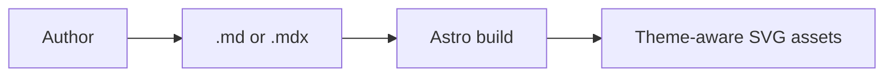

# Markdown And MDX Code Fences

Publications can render diagrams, charts, and static UI components directly from
code fences in `.md` and `.mdx` files. This is useful when an article should stay
mostly Markdown, when a `.md` file cannot import Astro components, or when a
generated document should not carry MDX imports.

Use the Astro component guides when an author needs slots, imported image
metadata, custom icons, or richer MDX composition. Use these fences when the
content can be represented as Mermaid source or strict JSON.

## Supported fences

| Fence language | Input format   | Output                                    | Primary use                               |
| -------------- | -------------- | ----------------------------------------- | ----------------------------------------- |
| `mermaid`      | Mermaid syntax | Theme-aware generated SVG assets          | Architecture, process, sequence diagrams  |
| `echart`       | Strict JSON    | Static-first Apache ECharts figure        | Data charts and financial visualizations  |
| `daisyui`      | Strict JSON    | Static DaisyUI publication display markup | Callouts, lists, mockups, steps, messages |

The language name after the opening backticks must match exactly. Fenced
ECharts and DaisyUI definitions are JSON, not JavaScript: use double quotes, no
comments, no trailing commas, no functions, no `undefined`, and only finite
numbers.

In `.mdx` files, the integrations replace fences with MDX-compatible wrapper
nodes. In `.md` files, they emit raw static HTML. The authoring syntax is the
same in both file types.

## Build behavior

Mermaid and ECharts are static-first. The build prepares diagram and chart
assets before Markdown rendering and leaves readable output in the article when
JavaScript is disabled. ECharts hydration is opt-in per chart.

For journal entries under `src/thejournal/`, production builds prepare Mermaid
and ECharts output only for publishable entries. Draft entries still render
during local development, but draft-only Mermaid and ECharts fences do not need
to produce production assets.

## LaTeX math

The Markdown processor supports LaTeX-style math only when an author asks for it
with double-dollar display math:

```md
$$
x = \frac{-b \pm \sqrt{b^2 - 4ac}}{2a}
$$
```

Single-dollar inline math is disabled in `astro.config.mjs` with
`math.singleDollarTextMath: false`. This is intentional because finance
and valuation articles use currency values like `$144.60` and `$237.53`; with
automatic single-dollar math enabled, prose between two prices can be parsed as
`language-math math-inline` code.

Authoring rules:

- Use `$$ ... $$` for explicit display math.
- Do not use `$ ... $` for inline math; it remains plain text.
- Write normal currency values as `$144.60`; escaping the dollar sign is not
  required while `math.singleDollarTextMath` stays disabled.

## Mermaid fences

Mermaid fences contain Mermaid source directly. There is no JSON wrapper and no
per-fence theme configuration.

````md

````

The integration hashes the trimmed Mermaid source to create a stable diagram
identifier. During build, it renders light and dark SVG assets under
`/_app/mermaid/`. Article HTML references those assets as images, and the
runtime shell keeps the Open SVG link aligned with the active theme.

### Mermaid authoring rules

- Put one concept in each fence and introduce the diagram in nearby prose.
- Use normal Mermaid comments with `%%` when the source needs local notes.
- Do not add Mermaid `%%{init: ...}%%` theme blocks or custom
  `themeVariables`; site theming owns the Mermaid palette.
- Prefer stable node IDs and readable labels so generated asset hashes remain
  predictable when only prose around the diagram changes.
- Use `.agents/skills/design-doc-mermaid` when a diagram needs careful layout,
  grouping, validation, or export guidance.

### Recommended diagram forms

| Mermaid form                            | Use for                                                 |
| --------------------------------------- | ------------------------------------------------------- |
| `flowchart TD`, `flowchart LR`, `graph` | Processes, pipelines, ownership maps, dependency graphs |
| `sequenceDiagram`                       | API calls, retries, service interactions over time      |
| `stateDiagram-v2`                       | Job states, publication states, lifecycle transitions   |
| `erDiagram`                             | Entities, schema relationships, domain models           |
| `classDiagram`                          | Interfaces, object structure, type responsibility       |
| `gantt`                                 | Project milestones and rough delivery dependencies      |
| `mindmap`                               | Concept maps, taxonomies, nested mental models          |

Use ECharts instead when the main point is measured values, trends,
distributions, correlation, weighted flow, or financial series.

## ECharts fences

ECharts fences contain one strict JSON object. The object describes the figure,
rendering behavior, and either a supported chart preset or a raw ECharts option.

````mdx
```echart
{
  "type": "line",
  "figure": {
    "title": "Monthly visitors",
    "caption": "Static SVG with optional browser enhancement.",
    "description": "Line chart showing monthly visitors from January through June."
  },
  "size": { "width": 760, "height": 420 },
  "data": {
    "name": "Visitors",
    "x": ["Jan", "Feb", "Mar", "Apr", "May", "Jun"],
    "y": [1200, 1560, 1410, 1840, 2100, 2480]
  }
}
```
````

The fence uses the same rendering pipeline as
`@components/ui/mdx/EChart.astro`: build-time SVG rendering is the default, and
browser interactivity is optional.

### ECharts base definition

| Field                | Type                                                    | Default        | Purpose                                                   |
| -------------------- | ------------------------------------------------------- | -------------- | --------------------------------------------------------- |
| `version`            | `1`                                                     | `1`            | Fence schema version.                                     |
| `type`               | `string`                                                | Required       | Chart preset name or `"option"`.                          |
| `id`                 | `string`                                                | Content hash   | Chart surface id.                                         |
| `class`              | `string`                                                | -              | Extra class on the `echart-wrapper`.                      |
| `figure`             | `object`                                                | Required       | Figure metadata.                                          |
| `figure.title`       | `string`                                                | -              | Visible title above the chart.                            |
| `figure.caption`     | `string`                                                | -              | Visible supporting caption.                               |
| `figure.description` | `string`                                                | Required       | Accessible chart summary and fallback alt text.           |
| `size.width`         | positive `number`                                       | `760`          | ECharts SSR width.                                        |
| `size.height`        | positive `number`                                       | `420`          | ECharts SSR height.                                       |
| `render`             | `"svg-inline"` or `"svg-file"`                          | `"svg-inline"` | Static output mode.                                       |
| `hydrate`            | `"none"`, `"load"`, `"idle"`, `"visible"`, or `"media"` | `"none"`       | Browser enhancement trigger.                              |
| `media`              | `string`                                                | -              | Required when `hydrate` is `"media"`.                     |
| `cacheKey`           | `string`                                                | -              | Extra namespace for `svg-file` artifact hashing.          |
| `theme`              | `string` or JSON object                                 | -              | ECharts theme name or theme object.                       |
| `aria`               | JSON object                                             | -              | ECharts ARIA option overrides.                            |
| `optionClientPreset` | `"currency"`, `"percent"`, or `"financeOhlc"`           | -              | Restores supported formatter callbacks client-side.       |
| `data`               | JSON object                                             | `{}`           | Preset-specific chart data.                               |
| `option`             | JSON object                                             | -              | Raw ECharts option, required for `type: "option"`.        |
| `clientOption`       | JSON object or `"same"`                                 | -              | JSON-safe option used only when hydrated.                 |
| `overrides`          | JSON object                                             | -              | Shallow root-level merge applied after preset generation. |

`render: "png-file"` and `hydrate: "light"` are reserved for deferred features
and intentionally throw. When `hydrate` is not `"none"`, `clientOption` must be
JSON-serializable. Use `"clientOption": "same"` for preset charts whose
generated options can be enhanced as-is.

### ECharts chart types

| `type`                | Required `data` fields                                                | Optional `data` fields                     |
| --------------------- | --------------------------------------------------------------------- | ------------------------------------------ |
| `line`                | `x: Array<string \| number>`, `y: number[]` or `series`               | `name`, `smooth`, `area`, `legend`         |
| `area`                | Same as `line`                                                        | `name`, `smooth`, `legend`                 |
| `bar`                 | `x: Array<string \| number>`, `y: number[]` or `series`               | `name`, `horizontal`, `legend`             |
| `pie`                 | `data: Array<{ name: string, value: number }>`                        | `name`, `donut`, `rose`                    |
| `donut`               | Same as `pie`                                                         | `name`, `rose`                             |
| `rose`                | Same as `pie`                                                         | `name`, `rose: true \| "radius" \| "area"` |
| `scatter`             | `data: Array<[number, number]>`                                       | `name`, `xName`, `yName`, `symbolSize`     |
| `histogram`           | `values: number[]`                                                    | `bins`, `name`                             |
| `heatmap`             | `x: string[]`, `y: string[]`, `data: Array<[number, number, number]>` | `name`, `min`, `max`                       |
| `correlation-heatmap` | Same as `heatmap`                                                     | `name`, `min`, `max`                       |
| `treemap`             | `data: TreemapNode[]`                                                 | `name`                                     |
| `sankey`              | `nodes: Array<{ name: string }>`, `links: SankeyLink[]`               | -                                          |
| `boxplot`             | `data: BoxplotDatum[]`                                                | `name`                                     |
| `candlestick-volume`  | `data: CandleVolumeDatum[]`                                           | `priceName`, `volumeName`                  |
| `macd`                | `data: CandleVolumeDatum[]`                                           | -                                          |
| `rsi`                 | `data: CandleVolumeDatum[]`                                           | -                                          |
| `bollinger-bands`     | `data: CandleVolumeDatum[]`                                           | -                                          |
| `depth`               | `bids: DepthLevel[]`, `asks: DepthLevel[]`                            | -                                          |
| `order-book`          | `bids: DepthLevel[]`, `asks: DepthLevel[]`                            | -                                          |
| `ohlc`                | `data: CandleVolumeDatum[]`                                           | -                                          |
| `option`              | `option: object` at the fence root                                    | `clientOption`, `overrides`                |

For multi-series `line`, `area`, and `bar` charts, replace root `data.y` with:

```json
{
  "x": ["Q1", "Q2", "Q3"],
  "series": [
    { "name": "Revenue", "y": [12, 14, 18] },
    { "name": "Costs", "y": [7, 8, 9] }
  ],
  "legend": { "top": 8 }
}
```

### ECharts data shapes

```ts
interface TreemapNode {
  name: string;
  value?: number;
  children?: TreemapNode[];
}

interface SankeyLink {
  source: string;
  target: string;
  value: number;
}

interface BoxplotDatum {
  name: string;
  min: number;
  q1: number;
  median: number;
  q3: number;
  max: number;
}

interface CandleVolumeDatum {
  date: string;
  open: number;
  close: number;
  low: number;
  high: number;
  volume: number;
}

interface DepthLevel {
  price: number;
  size: number;
}
```

### ECharts rendering guidance

- Keep `render` omitted for ordinary charts; inline SVG is the default.
- Use `"render": "svg-file"` with a stable `cacheKey` when a chart is repeated
  or would make article HTML too large.
- Use `"hydrate": "visible"` for below-the-fold charts that benefit from
  browser tooltips or zoom.
- Use `"hydrate": "media"` with `media` when interaction is useful only on a
  specific viewport size.
- Prefer preset chart types before `type: "option"` so authors get local
  accessibility defaults and consistent article styling.

## DaisyUI fences

DaisyUI fences contain one strict JSON object with a `component` name. They are
for static publication UI only; they do not create application state or client
behavior.

````md
```daisyui
{
  "component": "callout",
  "variant": "information",
  "title": "Build context",
  "content": [
    {
      "type": "paragraph",
      "text": "This note was authored as JSON inside a daisyui fence."
    }
  ]
}
```
````

### DaisyUI base fields

All DaisyUI components accept these root fields.

| Field              | Type                              | Default  | Purpose                                                                           |
| ------------------ | --------------------------------- | -------- | --------------------------------------------------------------------------------- |
| `version`          | `1`                               | `1`      | Fence schema version.                                                             |
| `component`        | DaisyUI component name            | Required | Selects the renderer.                                                             |
| `id`               | `string`                          | -        | Root element id, except `section-header` uses it on the heading.                  |
| `class`            | `string`                          | -        | Extra classes on the root component.                                              |
| `ariaLabel`        | `string`                          | -        | Emits `aria-label`.                                                               |
| `aria-label`       | `string`                          | -        | Kebab-case alias for `ariaLabel`.                                                 |
| `ariaLabelledBy`   | `string`                          | -        | Emits `aria-labelledby`.                                                          |
| `aria-labelledby`  | `string`                          | -        | Kebab-case alias for `ariaLabelledBy`.                                            |
| `ariaDescribedBy`  | `string`                          | -        | Emits `aria-describedby`.                                                         |
| `aria-describedby` | `string`                          | -        | Kebab-case alias for `ariaDescribedBy`.                                           |
| `data`             | object of string, number, boolean | -        | Emits `data-*` attributes. Keys may use letters, numbers, `_`, `.`, `:`, and `-`. |

Required strings must be non-empty after trimming.

### DaisyUI content blocks

Several components accept `content`, `header`, `footer`, `caption`, `toolbar`,
or `image` arrays. Each item can be a plain string or one of these blocks.

| Block type  | Fields                                                        | Output           |
| ----------- | ------------------------------------------------------------- | ---------------- |
| string      | Plain string                                                  | Paragraph block  |
| `text`      | `text`                                                        | Escaped text     |
| `paragraph` | `text`                                                        | `<p>`            |
| `pre`       | `text`                                                        | `<pre><code>`    |
| `list`      | `items: string[]`, optional `style: "ordered" \| "unordered"` | `<ol>` or `<ul>` |
| `image`     | `src`, `alt`, optional `class`, `width`, `height`, `loading`  | Static ``   |
| `link`      | `href`, `label`, `external`, optional `class`                 | Static `<a>`     |

Content block text is escaped. Use imported Astro components instead of a
`daisyui` fence when the content needs raw HTML, MDX components, named slots, or
Astro image metadata.

### `callout`

Use for supporting context, risk notes, cautions, or failure explanations.

| Field          | Type                                                              | Default               |
| -------------- | ----------------------------------------------------------------- | --------------------- |
| `content`      | content block or content block array                              | Required              |
| `variant`      | `"note"`, `"information"`, `"warning"`, `"caution"`, or `"error"` | `"note"`              |
| `title`        | `string`                                                          | Variant default title |
| `palette`      | object with any callout palette fields                            | Variant colors        |
| `headerClass`  | `string`                                                          | -                     |
| `iconClass`    | `string`                                                          | -                     |
| `titleClass`   | `string`                                                          | -                     |
| `contentClass` | `string`                                                          | -                     |

`palette` can override `accent`, `surface`, `border`, `title`, `content`,
`icon`, and `iconSurface`. Prefer theme variables such as `var(--color-info)`
over hardcoded colors.

### `chat-bubble`

Use for one static message where sender, side, or status matters.

| Field         | Type                                                                                                  | Default   |
| ------------- | ----------------------------------------------------------------------------------------------------- | --------- |
| `content`     | content block or content block array                                                                  | Required  |
| `align`       | `"start"` or `"end"`                                                                                  | `"start"` |
| `color`       | `"neutral"`, `"primary"`, `"secondary"`, `"accent"`, `"info"`, `"success"`, `"warning"`, or `"error"` | -         |
| `image`       | content block array                                                                                   | -         |
| `header`      | content block array                                                                                   | -         |
| `footer`      | content block array                                                                                   | -         |
| `imageClass`  | `string`                                                                                              | -         |
| `headerClass` | `string`                                                                                              | -         |
| `bubbleClass` | `string`                                                                                              | -         |
| `footerClass` | `string`                                                                                              | -         |

`image`, `header`, and `footer` render only when they contain content.

### `list`

Use for an information-rich collection of peer items.

| Field       | Type         | Default  |
| ----------- | ------------ | -------- |
| `items`     | `ListItem[]` | Required |
| `itemClass` | `string`     | -        |

Each `ListItem` supports:

| Item field     | Type                   | Purpose                             |
| -------------- | ---------------------- | ----------------------------------- |
| `title`        | `string`               | Required visible row title.         |
| `href`         | `string`               | Makes the whole row a link.         |
| `ariaLabel`    | `string`               | Label for the row link.             |
| `subtitle`     | `string`               | Compact metadata under the title.   |
| `description`  | `string`               | Wrapped supporting row text.        |
| `media`        | marker or image object | Leading visual marker.              |
| `status`       | status object          | Badge beside the title.             |
| `action`       | action object          | Trailing link button.               |
| `class`        | `string`               | Classes for this row.               |
| `contentClass` | `string`               | Classes for title/subtitle content. |

`media` is either `{ "kind": "marker", "label": "01" }` or
`{ "kind": "image", "src": "/path.png", "alt": "Description" }`.

`status` requires `label` and accepts the same color names as `chat-bubble`.
`action` requires `label` and `href`; `external: true` adds
`target="_blank"` and `rel="noopener noreferrer"`.

### `mockup-browser`

Use when a browser route or address context is part of the explanation.

| Field          | Type                                 | Default                               |
| -------------- | ------------------------------------ | ------------------------------------- |
| `content`      | content block or content block array | Required                              |
| `url`          | `string`                             | Required unless `toolbar` has content |
| `toolbar`      | content block array                  | -                                     |
| `caption`      | content block array                  | -                                     |
| `browserClass` | `string`                             | -                                     |
| `toolbarClass` | `string`                             | -                                     |
| `addressClass` | `string`                             | -                                     |
| `contentClass` | `string`                             | -                                     |
| `captionClass` | `string`                             | -                                     |

When `toolbar` is present, it replaces the generated address display and
`addressClass` is unused.

### `mockup-phone`

Use for mobile screens or narrow-state previews.

| Field          | Type                                 | Default  |
| -------------- | ------------------------------------ | -------- |
| `content`      | content block or content block array | Required |
| `caption`      | content block array                  | -        |
| `phoneClass`   | `string`                             | -        |
| `cameraClass`  | `string`                             | -        |
| `displayClass` | `string`                             | -        |
| `captionClass` | `string`                             | -        |

The camera notch is decorative. Use `ariaLabel` or `ariaLabelledBy` on the
root definition to identify the mockup.

### `mockup-window`

Use for a desktop app surface, generated report, or bounded command output.

| Field          | Type                                 | Default  |
| -------------- | ------------------------------------ | -------- |
| `content`      | content block or content block array | Required |
| `header`       | content block array                  | -        |
| `caption`      | content block array                  | -        |
| `windowClass`  | `string`                             | -        |
| `contentClass` | `string`                             | -        |
| `headerClass`  | `string`                             | -        |
| `bodyClass`    | `string`                             | -        |
| `captionClass` | `string`                             | -        |

`contentClass` targets the complete interior surface beneath the window chrome.
`bodyClass` targets only the body region that contains `content`.

### `section-header`

Use for a styled section heading with an optional action link.

| Field           | Type       | Default                     |
| --------------- | ---------- | --------------------------- |
| `title`         | `string`   | Required                    |
| `level`         | `2` or `3` | `2`                         |
| `link.href`     | `string`   | Required when `link` exists |
| `link.label`    | `string`   | Required when `link` exists |
| `link.external` | `boolean`  | `false`                     |

For this component, root `id` becomes the heading id. If `link.external` is
true, the generated link opens in a new tab with `rel="noopener noreferrer"`.

### `steps`

Use for a linear sequence or current progress state.

| Field         | Type                                                                                                  | Default        |
| ------------- | ----------------------------------------------------------------------------------------------------- | -------------- |
| `items`       | `StepItem[]`                                                                                          | Required       |
| `currentStep` | positive integer between `1` and `items.length`                                                       | -              |
| `activeColor` | `"neutral"`, `"primary"`, `"secondary"`, `"accent"`, `"info"`, `"success"`, `"warning"`, or `"error"` | `"primary"`    |
| `orientation` | `"responsive"`, `"horizontal"`, or `"vertical"`                                                       | `"responsive"` |
| `itemClass`   | `string`                                                                                              | -              |

Each `StepItem` requires `label` and accepts optional `marker`, `color`, and
`class`. Items up to `currentStep` receive `activeColor` unless an item has its
own `color`.

## Choosing fences or Astro syntax

Use fences when the document can stay data-driven:

- `.md` content needs charts, diagrams, or static display components.
- The content is generated and should avoid MDX imports.
- ECharts data is JSON-safe and does not need author-side functions.
- DaisyUI content can be represented as text, paragraphs, lists, images, links,
  or preformatted text.

Use Astro/MDX component syntax when the document needs:

- Imported local images through Astro's image pipeline.
- Custom icons, named slots with rich MDX, or nested components.
- Raw ECharts options with functions used only at build time.
- UI behavior beyond static publication markup.

The component reference docs remain the source for Astro syntax:

- `docs/components/ECHARTS_MDX_CHARTS.md`
- `docs/components/CALLOUT.md`
- `docs/components/CHAT.md`
- `docs/components/LIST.md`
- `docs/components/MOCKUP_BROWSER.md`
- `docs/components/MOCKUP_PHONE.md`
- `docs/components/MOCKUP_WINDOW.md`
- `docs/components/STEPS.md`
- `docs/components/MERMAID_RENDERING.md`
