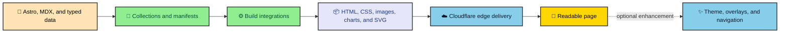

```mermaid
flowchart LR
    Source["📝 Astro, MDX, and typed data"] --> Resolve["🧭 Collections and manifests"]
    Resolve --> Build["⚙️ Build integrations"]
    Build --> Output["📦 HTML, CSS, images, charts, and SVG"]
    Output --> Edge["☁️ Cloudflare edge delivery"]
    Edge --> Reader["👤 Readable page"]
    Reader -. "optional enhancement" .-> Runtime["✨ Theme, overlays, and navigation"]

    classDef source fill:#FFE4B5,stroke:#333,stroke-width:2px,color:#000
    classDef process fill:#90EE90,stroke:#333,stroke-width:2px,color:#064E3B
    classDef output fill:#E6E6FA,stroke:#333,stroke-width:2px,color:#1E3A8A
    classDef delivery fill:#87CEEB,stroke:#333,stroke-width:2px,color:#0F172A
    classDef reader fill:#FFD700,stroke:#333,stroke-width:2px,color:#000

    class Source source
    class Resolve,Build process
    class Output output
    class Edge,Runtime delivery
    class Reader reader
```
