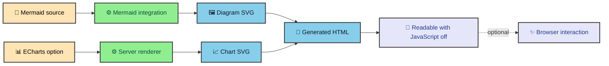

```mermaid
flowchart LR
    Mermaid["📝 Mermaid source"] --> MermaidBuild["⚙️ Mermaid integration"]
    Chart["📊 ECharts option"] --> ChartBuild["⚙️ Server renderer"]
    MermaidBuild --> Diagram["🖼️ Diagram SVG"]
    ChartBuild --> Figure["📈 Chart SVG"]
    Diagram --> Page["📄 Generated HTML"]
    Figure --> Page
    Page --> Reader["👤 Readable with JavaScript off"]
    Reader -. "optional" .-> Enhance["✨ Browser interaction"]

    classDef source fill:#FFE4B5,stroke:#333,stroke-width:2px,color:#000
    classDef build fill:#90EE90,stroke:#333,stroke-width:2px,color:#064E3B
    classDef output fill:#87CEEB,stroke:#333,stroke-width:2px,color:#0F172A
    classDef reader fill:#E6E6FA,stroke:#333,stroke-width:2px,color:#1E3A8A

    class Mermaid,Chart source
    class MermaidBuild,ChartBuild build
    class Diagram,Figure,Page output
    class Reader,Enhance reader
```
