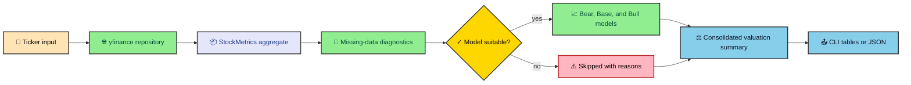

```mermaid
flowchart LR
    Ticker["👤 Ticker input"] --> Source["🌐 yfinance repository"]
    Source --> Metrics["📦 StockMetrics aggregate"]
    Metrics --> Diagnostics["📝 Missing-data diagnostics"]
    Diagnostics --> Gate{"✓ Model suitable?"}
    Gate -->|yes| Scenarios["📈 Bear, Base, and Bull models"]
    Gate -->|no| Skipped["⚠️ Skipped with reasons"]
    Scenarios --> Summary["⚖️ Consolidated valuation summary"]
    Skipped --> Summary
    Summary --> Output["📤 CLI tables or JSON"]

    classDef input fill:#FFE4B5,stroke:#333,stroke-width:2px,color:#000
    classDef process fill:#90EE90,stroke:#333,stroke-width:2px,color:#064E3B
    classDef data fill:#E6E6FA,stroke:#333,stroke-width:2px,color:#1E3A8A
    classDef decision fill:#FFD700,stroke:#333,stroke-width:2px,color:#000
    classDef warning fill:#FFB6C1,stroke:#B91C1C,stroke-width:2px,color:#000
    classDef output fill:#87CEEB,stroke:#333,stroke-width:2px,color:#0F172A

    class Ticker input
    class Source,Diagnostics,Scenarios process
    class Metrics data
    class Gate decision
    class Skipped warning
    class Summary,Output output
```
