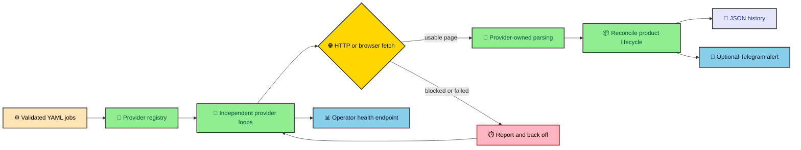

```mermaid
flowchart LR
    Jobs["⚙️ Validated YAML jobs"] --> Registry["🔌 Provider registry"]
    Registry --> Loops["🔄 Independent provider loops"]
    Loops --> Fetch{"🌐 HTTP or browser fetch"}
    Fetch -->|usable page| Parse["📝 Provider-owned parsing"]
    Fetch -->|blocked or failed| Backoff["⏱️ Report and back off"]
    Backoff --> Loops
    Parse --> State["📦 Reconcile product lifecycle"]
    State --> Persist["💾 JSON history"]
    State --> Notify["📨 Optional Telegram alert"]
    Loops --> Health["📊 Operator health endpoint"]

    classDef config fill:#FFE4B5,stroke:#333,stroke-width:2px,color:#000
    classDef process fill:#90EE90,stroke:#333,stroke-width:2px,color:#064E3B
    classDef decision fill:#FFD700,stroke:#333,stroke-width:2px,color:#000
    classDef warning fill:#FFB6C1,stroke:#B91C1C,stroke-width:2px,color:#000
    classDef data fill:#E6E6FA,stroke:#333,stroke-width:2px,color:#1E3A8A
    classDef output fill:#87CEEB,stroke:#333,stroke-width:2px,color:#0F172A

    class Jobs config
    class Registry,Loops,Parse,State process
    class Fetch decision
    class Backoff warning
    class Persist data
    class Notify,Health output
```
