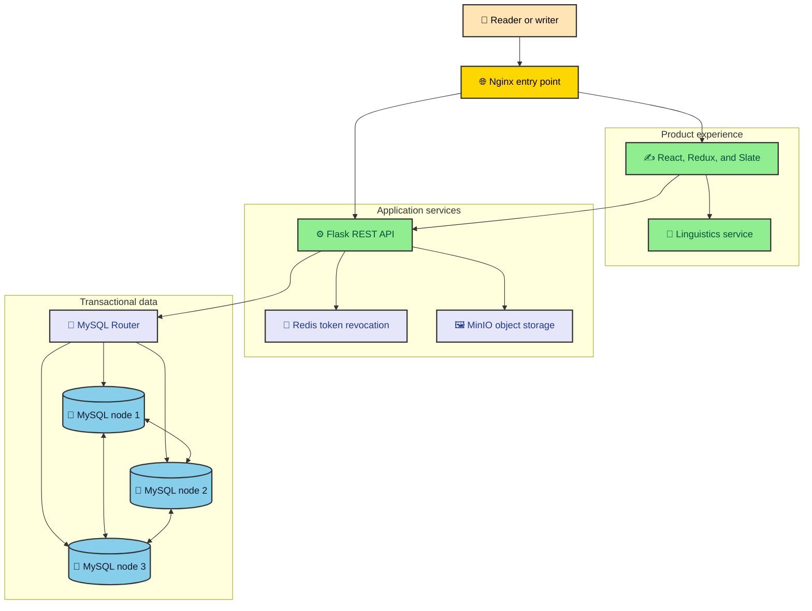

```mermaid
flowchart TB
    Reader["👤 Reader or writer"] --> Nginx["🌐 Nginx entry point"]

    subgraph Experience["Product experience"]
        React["✍️ React, Redux, and Slate"]
        Linguistics["🧠 Linguistics service"]
    end

    subgraph Application["Application services"]
        Flask["⚙️ Flask REST API"]
        Redis["🔐 Redis token revocation"]
        MinIO["🖼️ MinIO object storage"]
    end

    subgraph Data["Transactional data"]
        Router["🔀 MySQL Router"]
        DB1[("💾 MySQL node 1")]
        DB2[("💾 MySQL node 2")]
        DB3[("💾 MySQL node 3")]
    end

    Nginx --> React
    Nginx --> Flask
    React --> Linguistics
    React --> Flask
    Flask --> Redis
    Flask --> MinIO
    Flask --> Router
    Router --> DB1
    Router --> DB2
    Router --> DB3
    DB1 <--> DB2
    DB1 <--> DB3
    DB2 <--> DB3

    classDef person fill:#FFE4B5,stroke:#333,stroke-width:2px,color:#000
    classDef edge fill:#FFD700,stroke:#333,stroke-width:2px,color:#000
    classDef service fill:#90EE90,stroke:#333,stroke-width:2px,color:#064E3B
    classDef storage fill:#E6E6FA,stroke:#333,stroke-width:2px,color:#1E3A8A
    classDef database fill:#87CEEB,stroke:#333,stroke-width:2px,color:#0F172A

    class Reader person
    class Nginx edge
    class React,Linguistics,Flask service
    class Redis,MinIO,Router storage
    class DB1,DB2,DB3 database
```
