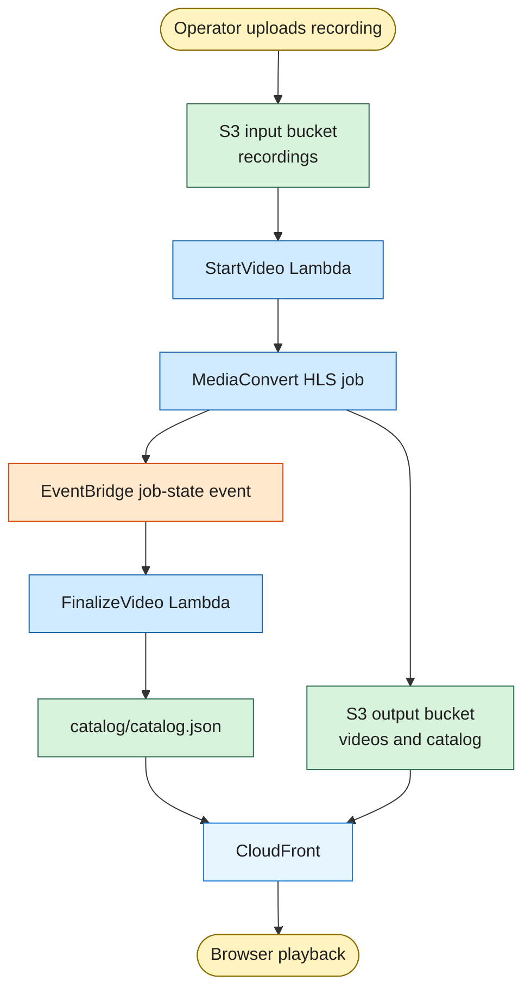
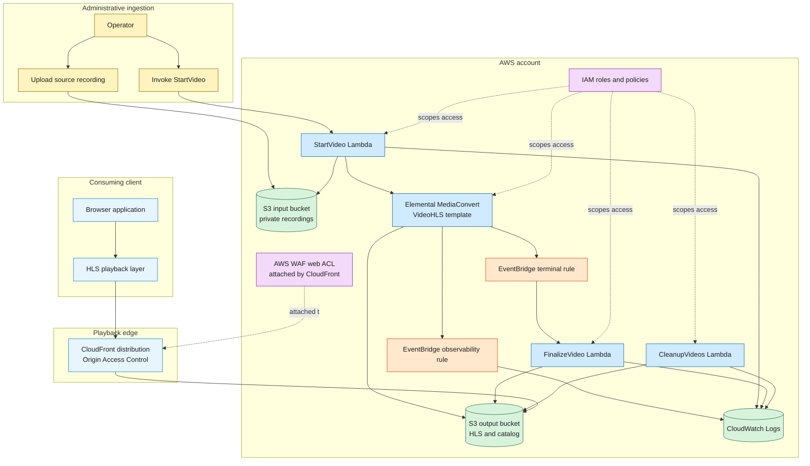
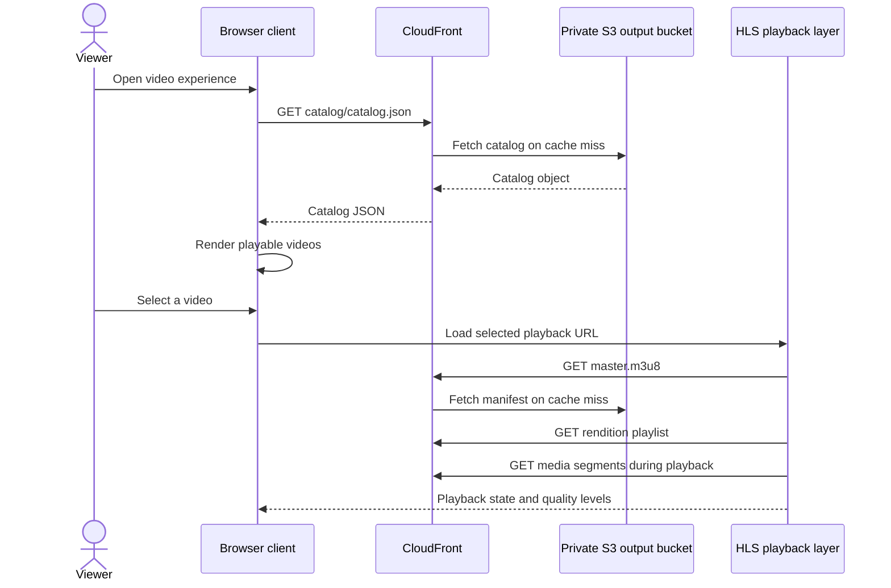
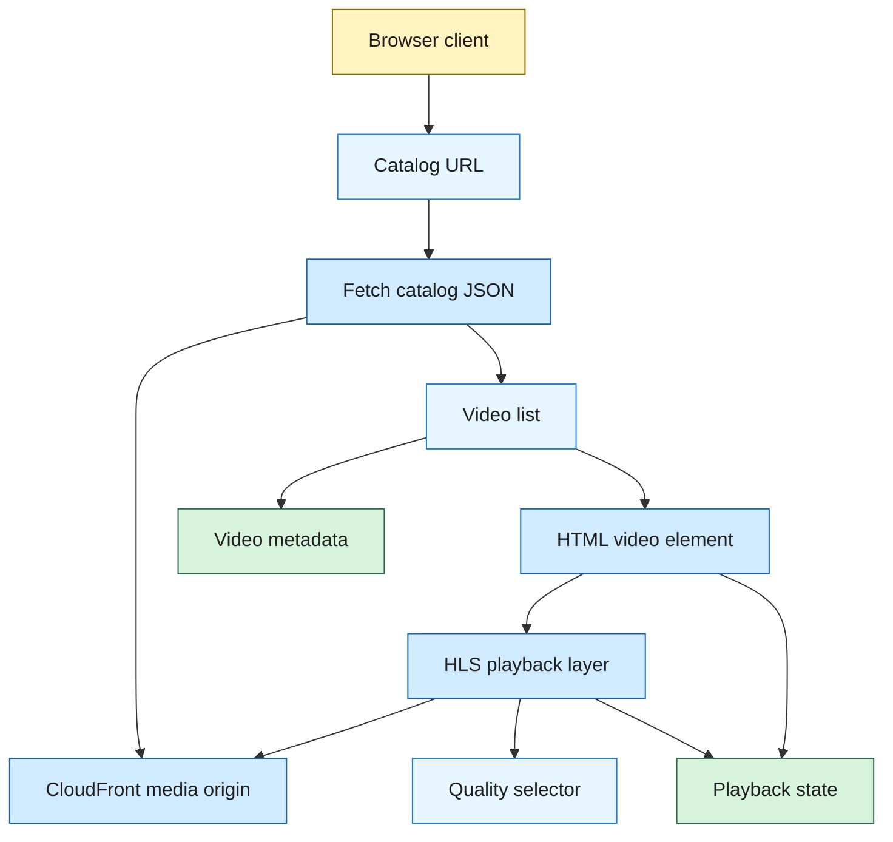

import VideoPlayer from "@components/ui/mdx/VideoPlayer.astro";

Uploading a video sounds like the easy part until the browser has to play it. A single video in a bucket is fine for storage, but it does not answer adaptive playback, private source files, publishable metadata, browser CORS, cache behavior, or how the system learns that a transcode finished. This project solves that with a small AWS workflow that turns operator-managed recordings into HLS streams and a static catalog.

---

See a live example of the final result. Also, you will be able to see me win in Splatoon Rainmaker. Waith till the end! 👀

<VideoPlayer
  src="https://d2mcml34hdlt3o.cloudfront.net/videos/2026-07-02-v1/master.m3u8"
  title="See My Splatoon win in Rainmaker 👀"
/>

---

## The workflow in one pass

The workflow starts with an operator, not with a public upload form. A source recording lands in a private S3 input bucket under `recordings/`, then the operator invokes `StartVideo` with the source key and the video metadata that should appear in the catalog later.

`StartVideo` does the boring checks that save time later. It verifies that the source object exists, rejects source keys outside the recordings prefix, checks that the destination prefix is still empty, loads the `VideoHLS` MediaConvert template, and creates a job with workflow metadata attached.

MediaConvert does the video work. It reads the private source recording, writes HLS manifests and transport stream segments into the private output bucket, and emits job state changes as the job moves through AWS. The Lambda does not wait around for this. It submits the job and leaves.

When MediaConvert reaches a terminal state, EventBridge picks up the service event. The application rule sends `COMPLETE` and `ERROR` events for the `video-v1` workflow to `FinalizeVideo`. A separate observability rule writes matching job-state events to CloudWatch Logs.

`FinalizeVideo` publishes only completed work. On success, it confirms that `master.m3u8` exists, builds the catalog record, and writes `catalog/catalog.json`. On failure, it logs the MediaConvert error and leaves the catalog alone. CloudFront then serves the catalog and the HLS files from the private output bucket.

This shape keeps the pipeline asynchronous. The operator gets a submitted job, MediaConvert works at its own pace, and publication happens only after AWS sends the completion event. That matters because video processing time varies with duration, resolution, and the work already sitting in the MediaConvert queue.

---

## The high-level architecture

The system has four boundaries that are worth keeping separate. There is an administrative ingestion side, an AWS processing side, a playback edge, and a consuming client. Treating those as different spaces makes the project easier to reason about.

The ingestion side is deliberately small. There is no public upload API and no user account model. The operator uploads a recording to S3 and invokes a Lambda. That is less convenient than a polished admin app, but it also removes a lot of surface area from a project whose main job is video packaging.

The AWS processing side is event based. Lambda validates and submits work, MediaConvert creates the HLS package, EventBridge routes state changes, and another Lambda publishes the static catalog. CloudWatch Logs collects function logs and the optional MediaConvert observability stream.

The playback side is CloudFront over a private S3 origin. Viewers never read directly from a public bucket. CloudFront uses Origin Access Control to fetch from S3, applies the managed cache and CORS policies in the distribution, and gives the browser stable URLs for the catalog and manifests.

`CleanupVideos` sits outside the normal publish path. It is a manually invoked maintenance Lambda for deleting generated video prefixes and reconciling catalog entries with objects that still exist in S3. I like that it has its own role instead of borrowing the publishing role. Deleting content should feel different from publishing it.

---

## Why these AWS services fit

Amazon S3 is the base of the system because the workload is object shaped. The source is a file, the result is a set of HLS files, and the catalog is a small JSON object. EFS and EBS solve shared filesystem and block storage problems. This pipeline needs durable object storage with prefix-based access boundaries and direct integration with CloudFront.

AWS Lambda fits the orchestration work because the code wakes up for short, specific tasks. `StartVideo` validates an event and submits a job. `FinalizeVideo` reacts to completion. `CleanupVideos` handles occasional maintenance. EC2, ECS, and EKS would make sense if there were a long-running API, workers with heavy local dependencies, or more control over the runtime. This project does not need that weight.

AWS Elemental MediaConvert is the right service for the transcode. It takes a source file and produces a video-on-demand HLS package, including the master playlist, rendition playlists, audio playlist, and media segments. Running FFmpeg on EC2 or in a container would give more control, but it would also move queueing, scaling, retries, packaging, and operational care into the project. MediaPackage solves a different problem. It is more natural for live or origin packaging workflows than this file-based VOD pipeline.

Amazon EventBridge is the handoff between video processing and publication. MediaConvert already emits job-state events, so the project can react to `COMPLETE` and `ERROR` without polling. SNS could fan out notifications, and SQS could buffer work, but neither is needed for the simple rule that says a completed `video-v1` job should invoke `FinalizeVideo`.

Amazon CloudFront is the public face of the output bucket. It gives the browser HTTPS playback URLs, caches catalog and HLS requests, and keeps S3 private through Origin Access Control. Serving from S3 directly would either expose the bucket more than necessary or skip the edge behavior that viewers expect. Making the bucket public would be the easy path in the worst sense.

Amazon CloudWatch Logs is the operational memory for the workflow. The Lambda functions write their logs there, and the observability EventBridge rule can copy all matching MediaConvert job-state events into a log group. The project also documents alarms around Lambda errors, throttles, MediaConvert errors, and failed EventBridge invocations. For this size of system, CloudWatch is enough before bringing in a separate observability stack.

IAM is the service boundary glue. It decides which service can assume which role, which prefixes each function can touch, and whether `StartVideo` can pass the MediaConvert service role. AWS WAF also appears in the CloudFront distribution as an attached web ACL, but it is not the media authorization model. Access control for the media path lives mainly in private S3, CloudFront Origin Access Control, and scoped IAM permissions.

---

## The IAM shape

The roles in this project follow the same idea as the code. Each service gets the permissions for its job and little else. That is especially important because the output bucket contains public-facing assets while the input bucket holds private source recordings.

`StartVideoLambdaRole` is trusted by Lambda and uses `StartVideoLambdaPolicy`. It can read source recordings under the input bucket's `recordings/` prefix, list the output bucket enough to check whether a video prefix already exists, read the MediaConvert job template, create MediaConvert jobs, and pass the MediaConvert service role.

`MediaConvertVodRole` is trusted by `mediaconvert.amazonaws.com` and uses `MediaConvertVodS3Policy`. This role lets MediaConvert read the private input recordings and write generated HLS output under `videos/` in the output bucket. It keeps the transcoder from needing the Lambda execution role.

`FinalizeVideoLambdaRole` is trusted by Lambda and uses `FinalizeVideoLambdaPolicy`. It reads generated master manifests and reads or writes `catalog/catalog.json`. That matches the function's job. It should prove the output exists, build a catalog entry, and publish metadata. It does not need delete access.

`CleanupVideosLambdaRole` is trusted by Lambda and uses `CleanupVideosLambdaPolicy`. It can list, read, and delete generated video objects, then read and write the catalog during reconciliation. The policy does not grant access to the source recording bucket, which is exactly where a maintenance cleanup tool should stop.

`EventBridgeInvokeFinalizeVideoRole` is trusted by `events.amazonaws.com` with a source condition scoped to the terminal-state rule. Its invoke policy allows `lambda:InvokeFunction` on `FinalizeVideo` only. EventBridge also needs a CloudWatch Logs resource policy for the observability target, because CloudWatch Logs authorizes that delivery through the log group resource policy rather than a target role.

Every Lambda execution role also needs the managed `AWSLambdaBasicExecutionRole` policy so the functions can write CloudWatch Logs. That is not glamorous, but without it the system loses the first place you would look when a job is malformed or a permission boundary is too tight.

There is one implementation note I would keep visible. The committed `start-video-policy.json` allows `iam:PassRole` on `MediaConvertVideoRole`, while the repo documentation and exported role use `MediaConvertVodRole`. If the deployed policy matches the committed JSON exactly, `StartVideo` can validate a request and still fail when it tries to hand the job to MediaConvert.

---

## Viewer playback flow

The viewer path begins with the catalog file that `FinalizeVideo` publishes. A consuming client fetches `catalog/catalog.json` through CloudFront, reads the `videos` array, and uses each entry's `playbackUrl` as the starting point for playback.

That catalog is the handoff between the publishing workflow and the browser. The client does not need to know which Lambda created the entry or how MediaConvert arranged the output directory. It needs the metadata for display and the HLS manifest URL for playback.

After a viewer selects a video, the client loads the master manifest. An HLS playback layer reads the rendition playlists and requests media segments through CloudFront as playback moves forward. Browsers with native HLS support can use the video element directly, while other browsers can use a JavaScript HLS player.

The important detail is that all viewer-facing files come from CloudFront. The catalog, master manifest, rendition playlists, and media segments are available to any client that knows the CloudFront paths and can satisfy the browser's CORS requirements.

---

## Client architecture

The client architecture can stay thin because the backend publishes static files. A browser client needs a catalog loader, a video list, metadata rendering, an HLS playback layer, and a video element. The heavier work already happened before the viewer arrived.

This is a clean boundary. The client consumes a JSON catalog and HLS URLs. It does not create jobs, inspect S3 prefixes, call MediaConvert, or update the catalog. That keeps playback code focused on selection, loading, controls, and error states.

The practical client concern is failure visibility. A playback surface should tell the viewer when the catalog is unavailable, when a manifest cannot load, when CORS blocks the request, or when the browser cannot play HLS. The files are static, but the browser still needs honest state when a request fails.

---

## What I like about this shape

The project does one job without pretending to be a whole streaming platform. Source files stay private. The output bucket stays private. CloudFront handles public playback. MediaConvert handles packaging. EventBridge tells the system when a job is done. Lambda writes the catalog only after the output exists.

The static catalog is a good fit for this version. It is easy to inspect, cheap to serve, and small enough that a JSON object in S3 is more useful than a database table. DynamoDB would be the next move if catalog writes became frequent, if per-video updates needed conditional consistency, or if viewers needed query patterns beyond loading the newest videos.

The tradeoff is that simple storage does not remove all coordination problems. `FinalizeVideo` writes the catalog without an ETag precondition, while `CleanupVideos` does use conditional writes during reconciliation. That is fine for a small operator-driven workflow, but it is the kind of detail I would revisit before adding concurrent publishers or a public admin UI.

Mostly, I like that every part has a plain reason to exist. There is no always-on backend waiting for a request, no public bucket shortcut, and no custom video worker trying to be smarter than a managed transcoder. The system uses AWS where AWS has a native handoff, then gives clients simple files they can consume.
