import { Picture } from "astro:assets";
import MockupBrowser from "bloomwright-ui/components/display/MockupBrowser.astro";
import vodLogin from "@assets/thejournal/pub/vod_login.png";
import vodStart from "@assets/thejournal/pub/vod_recording_start_mediaconvert_job.png";
import vodSubmitted from "@assets/thejournal/pub/vod_recording_start_mediaconvert_job_validation.png";
import vodCatalog from "@assets/thejournal/pub/vod_catalog.png";
import vodPreview from "@assets/thejournal/pub/vod_catalog_preview.png";
import streamvaultHome from "@assets/thejournal/pub/streamvault_home.png";
import streamvaultVideo from "@assets/thejournal/pub/streamvault_video.png";

The first version of this pipeline ended with me typing `aws lambda invoke` and a browser client that only existed as a diagram. Both of those changed. The operator now signs in to a manager page, and viewers watch on a real site hosted on GitHub Pages. Getting there took one new Lambda, an HTTP API, Cognito, and a CORS bug that every curl test passed and a large share of browser requests failed.

---

## What changed since part one

[Part one](/thejournal/aws_serverless_vod/) described a pipeline that takes a private recording, transcodes it into HLS with MediaConvert, and publishes a static catalog behind CloudFront. That core didn't change. Every addition sits at an edge of it, either where the operator starts work or where a browser reads the result. The list below gives the five pieces and why each one exists.

```daisyui
{
  "component": "list",
  "aria-label": "Components added since part one",
  "class": "my-8 shadow-sm",
  "items": [
    {
      "title": "Amazon Cognito user pool",
      "subtitle": "Identity for the operator",
      "description": "Admin-created users sign in and get a JWT. There is no self-registration.",
      "media": { "kind": "marker", "label": "01" },
      "status": { "label": "New", "color": "info" }
    },
    {
      "title": "API Gateway HTTP API",
      "subtitle": "Five routes behind a JWT authorizer",
      "description": "The browser calls it directly, and API Gateway rejects any request without a valid token before Lambda runs.",
      "media": { "kind": "marker", "label": "02" },
      "status": { "label": "New", "color": "info" }
    },
    {
      "title": "ManagerApi Lambda",
      "subtitle": "One router for the manager page",
      "description": "It lists recordings, edits catalog metadata, and hands start and cleanup work to the existing functions.",
      "media": { "kind": "marker", "label": "03" },
      "status": { "label": "New", "color": "info" }
    },
    {
      "title": "CloudFront Function and CORS gate",
      "subtitle": "Constant CORS headers, checked before publishing",
      "description": "Every response carries CORS headers, and FinalizeVideo refuses to publish a video a browser could not read.",
      "media": { "kind": "marker", "label": "04" },
      "status": { "label": "Fix", "color": "warning" }
    },
    {
      "title": "StreamVault",
      "subtitle": "Public player on GitHub Pages",
      "description": "A static React site that reads the catalog and plays HLS from CloudFront.",
      "media": { "kind": "marker", "label": "05" },
      "status": { "label": "New", "color": "info" }
    }
  ]
}
```

The before and after fits in one picture. On the left is the operator flow from part one. On the right is the same pipeline with the new doors around it. The processing nodes in the middle are identical on both sides.

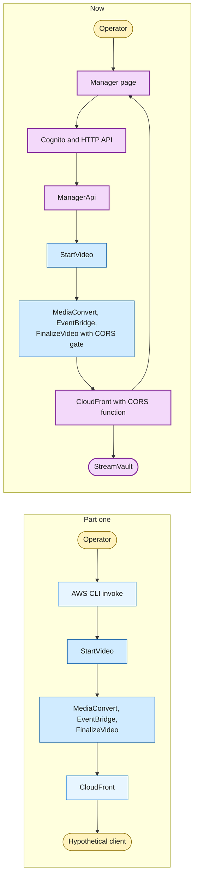

Only one new Lambda showed up. `ManagerApi` is a thin front for the functions that already existed, and that choice shapes most of this post.

---

## The system now

The architecture has five boundaries where part one had four. There is an admin plane that runs on my machine, an API layer in AWS, the unchanged processing core, a CloudFront edge that now runs a function, and a public client on GitHub Pages. The diagram below is the full map, and it replaces the architecture diagram from part one.

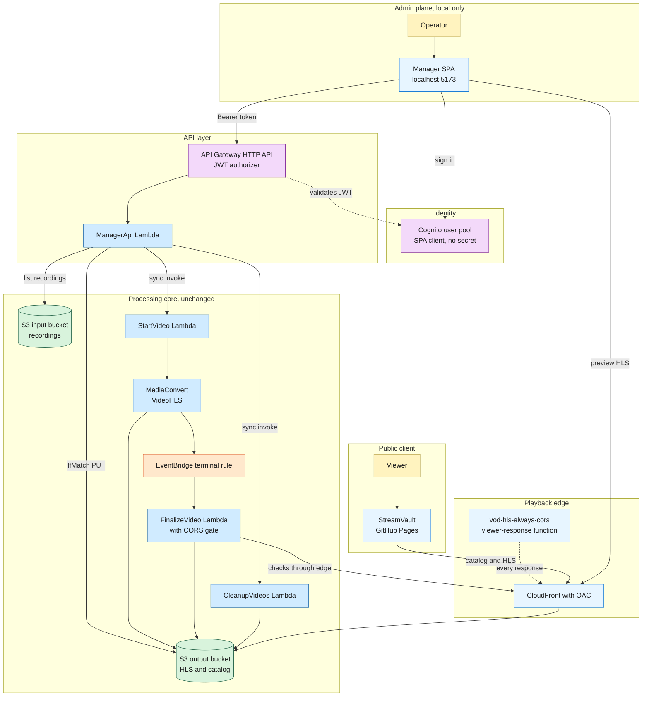

One edge in that diagram is easy to miss. `FinalizeVideo` now reads through CloudFront before it writes the catalog. That loop exists because of the CORS incident later in this post, and it's the only change inside the processing core.

---

## The manager page

The CLI flow worked, but it had costs I kept paying. Every run needed AWS credentials on my laptop, a hand-written JSON payload, and a video ID I had to remember. The manager page keeps the same operations and adds a login, input validation, and a confirmation step for anything destructive. It's a React and Vite app that runs only on the local dev server.

The flow moves in one direction, from sign-in to a published video. The one step the page can't speed up is MediaConvert, which still takes as long as it takes.

```daisyui
{
  "component": "steps",
  "aria-label": "Manager page workflow",
  "items": [
    { "label": "Sign in", "marker": "1" },
    { "label": "Pick a recording", "marker": "2" },
    { "label": "Submit the job", "marker": "3" },
    { "label": "MediaConvert runs", "marker": "4" },
    { "label": "FinalizeVideo publishes", "marker": "5" },
    { "label": "Edit or remove", "marker": "6" }
  ]
}
```

The sign-in screen is the Amplify UI `Authenticator` component with sign-up hidden. There is no "create account" link because there is nothing to sign up for. An administrator creates users in the Cognito console.

<MockupBrowser url="http://localhost:5173/" aria-label="Manager page sign-in screen">
  <Picture
    src={vodLogin}
    alt="Manager sign-in form with username and password fields and no sign-up option"
    widths={[640, 960, 1252]}
    formats={["avif", "webp"]}
    sizes="(max-width: 1024px) 100vw, 960px"
    quality={80}
    loading="lazy"
    decoding="async"
    class="block h-auto w-full select-none"
    draggable={false}
  />
  <span slot="caption">Sign-in only. Users come from the Cognito console.</span>
</MockupBrowser>

After sign-in, the left panel lists source files from the input bucket's `recordings/` prefix, with size and upload time. Selecting one fills the source field of the start form. The operator adds a video ID, a title, a description, a publish date, and tags, then presses Start.

<MockupBrowser url="http://localhost:5173/" aria-label="Recording selection and start form">
  <Picture
    src={vodStart}
    alt="Recordings list with one .mov file selected and the Start Video form filled with a Mario Kart World title and description"
    widths={[640, 960, 1254]}
    formats={["avif", "webp"]}
    sizes="(max-width: 1024px) 100vw, 960px"
    quality={80}
    loading="lazy"
    decoding="async"
    class="block h-auto w-full select-none"
    draggable={false}
  />
  <span slot="caption">Pick a source recording, describe it, and submit.</span>
</MockupBrowser>

The response comes back fast, and all it confirms is that a MediaConvert job exists. The banner shows the job ID and the form resets. Publication still waits for EventBridge to deliver the `COMPLETE` event to `FinalizeVideo`, exactly as it did in part one, so a new video only reaches the catalog once the job finishes.

<MockupBrowser url="http://localhost:5173/" aria-label="Job submitted confirmation">
  <Picture
    src={vodSubmitted}
    alt="Green status banner reading MediaConvert job submitted, with the start form cleared"
    widths={[640, 960, 1252]}
    formats={["avif", "webp"]}
    sizes="(max-width: 1024px) 100vw, 960px"
    quality={80}
    loading="lazy"
    decoding="async"
    class="block h-auto w-full select-none"
    draggable={false}
  />
  <span slot="caption">A submitted job, not a published video.</span>
</MockupBrowser>

Below the forms sits the catalog. Each entry shows its title, ID, publish date, and public playback URL with copy and play buttons. Selecting an entry opens a metadata editor for title, description, date, and tags. The Remove button opens a panel that asks for the video ID typed out in full before it deletes anything.

<MockupBrowser url="http://localhost:5173/" aria-label="Catalog editor">
  <Picture
    src={vodCatalog}
    alt="Catalog list of four videos with playback URLs and a metadata editor showing a Mario Tennis Fever entry with Save and Remove buttons"
    widths={[640, 960, 1254]}
    formats={["avif", "webp"]}
    sizes="(max-width: 1024px) 100vw, 960px"
    quality={80}
    loading="lazy"
    decoding="async"
    class="block h-auto w-full select-none"
    draggable={false}
  />
  <span slot="caption">Metadata edits only. The ID and playback URL can't change.</span>
</MockupBrowser>

The play button opens a drawer with an hls.js player pointed at the same CloudFront URL that viewers use. That's a quick sanity check before sharing a link, and it also meant the manager page ran into the same CORS rules as any other client.

<MockupBrowser url="http://localhost:5173/" aria-label="HLS preview drawer">
  <Picture
    src={vodPreview}
    alt="Preview drawer playing a Mario Tennis Fever match with the master.m3u8 URL below the player"
    widths={[640, 960, 1254]}
    formats={["avif", "webp"]}
    sizes="(max-width: 1024px) 100vw, 960px"
    quality={80}
    loading="lazy"
    decoding="async"
    class="block h-auto w-full select-none"
    draggable={false}
  />
  <span slot="caption">The preview plays from CloudFront, like any viewer.</span>
</MockupBrowser>

The page also leaves some things out on purpose. It can't upload recordings, so large files still go to S3 through the console or CLI. It can't delete source recordings. It can't call `FinalizeVideo` either, because that function should only react to real MediaConvert events. Each of those limits keeps the page's permissions smaller than the CLI's.

---

## Authentication with Cognito and a JWT authorizer

The Cognito app client uses the single page application type. That makes it a public client with no secret, which is the only honest option for code that ships to a browser. Sign-in uses email, self-registration is disabled, and email is the only required attribute. Cognito makes sign-in identifiers and required attributes hard to change later, so I kept both minimal.

The SPA signs in, receives tokens, and sends the access token as a bearer header on every call. API Gateway's JWT authorizer checks the issuer and audience before the Lambda runs, so a request with a bad token is rejected without costing an invocation.

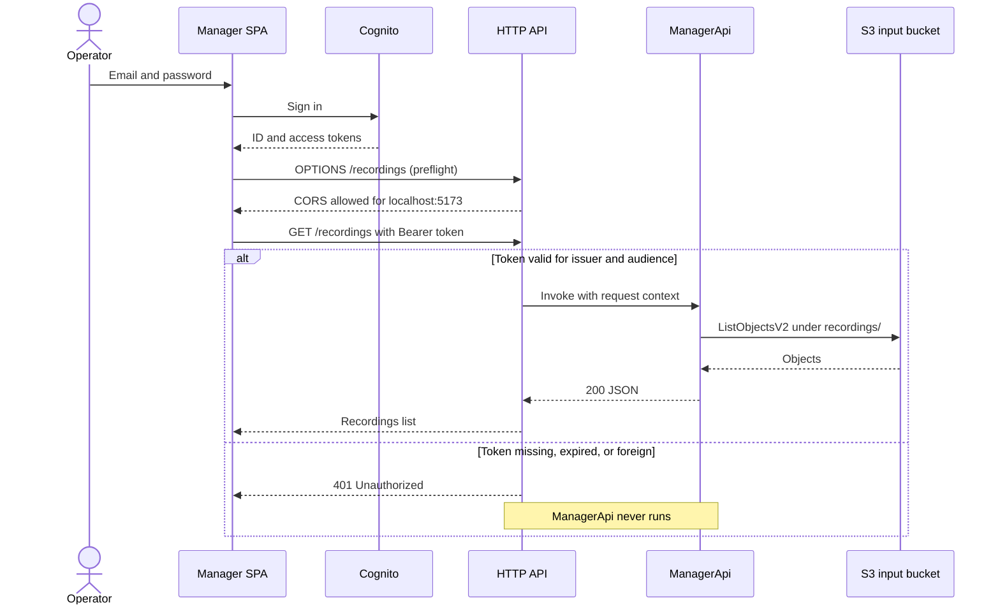

I picked an HTTP API over a REST API because the JWT authorizer is built in and the cheaper, lighter API type covers everything this needs. There are no usage plans, API keys, or request transforms here. Throttling is still available on an HTTP API, and it's worth setting so a double-clicked Start button can't queue two jobs.

```daisyui
{
  "component": "callout",
  "variant": "warning",
  "title": "CORS is not the lock",
  "content": "The API is public at the network level because the browser calls it directly. Its CORS setting only allows http://localhost:5173, which stops JavaScript on other websites and does nothing against curl or a script holding a stolen token. The security boundary is the Cognito JWT plus a narrow IAM role behind the Lambda."
}
```

---

## One Lambda, five routes

`ManagerApi` answers every route of the API. It's a single Python function on arm64 with 128 MB and a 30-second timeout. The table lists the routes with the status each one returns on success.

| Method  | Route                       | What it does                                      | Success |
| :------ | :-------------------------- | :------------------------------------------------ | :------ |
| `GET`   | `/recordings`               | Lists `.mp4`, `.mov`, and `.mkv` under `recordings/` | `200`   |
| `GET`   | `/catalog/videos`           | Reads `catalog/catalog.json` from the output bucket | `200`   |
| `PATCH` | `/catalog/videos/{videoId}` | Edits title, description, date, or tags           | `200`   |
| `POST`  | `/videos/start`             | Invokes `StartVideo`                              | `202`   |
| `POST`  | `/videos/cleanup`           | Invokes `CleanupVideos`                           | `200`   |

Cleanup is a `POST` and not a `DELETE` because `CleanupVideos` takes a batch of IDs and supports dry runs, and neither fits a delete on one resource. The start route returns `202` because the job was accepted, and nothing is published yet.

One router Lambda instead of five small ones was a deliberate trade. There is one IAM role to reason about, one log group to tail, and one deploy. The cost is coarser permissions, since every route shares the same role. That's acceptable here because every route serves the same single admin audience. With more user types, I'd split the function along those lines.

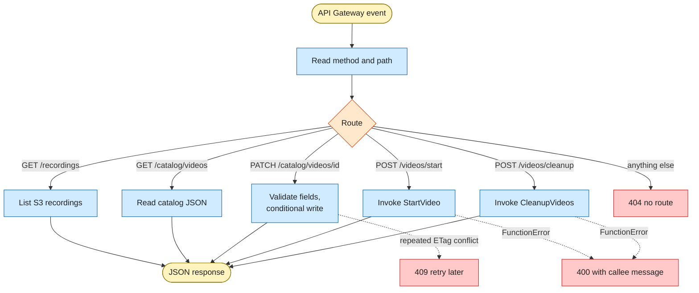

The start and cleanup routes don't reimplement anything. `StartVideo` already knows how to validate a source key, check that the output prefix is empty, and load the MediaConvert template. `ManagerApi` invokes it synchronously and passes its answer through, so there is still exactly one place that decides whether a job can start.

```python
def _invoke_json_lambda(function_name: str, payload: dict[str, Any]) -> dict[str, Any]:
    response = lambda_client.invoke(
        FunctionName=function_name,
        InvocationType="RequestResponse",
        Payload=json.dumps(payload).encode("utf-8"),
    )

    raw_payload = response["Payload"].read().decode("utf-8")
    result = json.loads(raw_payload) if raw_payload else {}

    if response.get("FunctionError"):
        error_message = result.get("errorMessage") or f"{function_name} failed."
        raise ApiError(400, error_message)

    return result
```

When `StartVideo` rejects a request, its error message becomes the `400` body, and the manager page shows it in the status bar. Any unexpected exception becomes a plain `500` with "Internal server error" so stack traces stay in CloudWatch. The function logs one structured JSON line per request, completed or rejected.

A few small checks do most of the input hygiene. The recordings prefix is forced under `recordings/` and rejects `..` segments. Page size is capped at 100 keys. The PATCH body accepts only four fields and refuses unknown ones, so `id`, `durationMs`, and `playbackUrl` can never change through the API.

---

## Three writers, one JSON file

Part one ended with a caveat. `FinalizeVideo` wrote the catalog without an ETag check, and I said I'd revisit that before adding a public admin UI. The admin UI arrived, and with it a third process that writes `catalog/catalog.json`. The manager's metadata edits therefore use S3 conditional writes.

The loop is optimistic concurrency with no new service. Read the catalog and its ETag, apply the patch, re-sort, bump `version`, then `PutObject` with `IfMatch` set to that ETag. When the catalog doesn't exist yet, the write uses `IfNoneMatch: *` instead. A `PreconditionFailed` means someone else wrote first, so the function reads again and retries, up to three attempts.

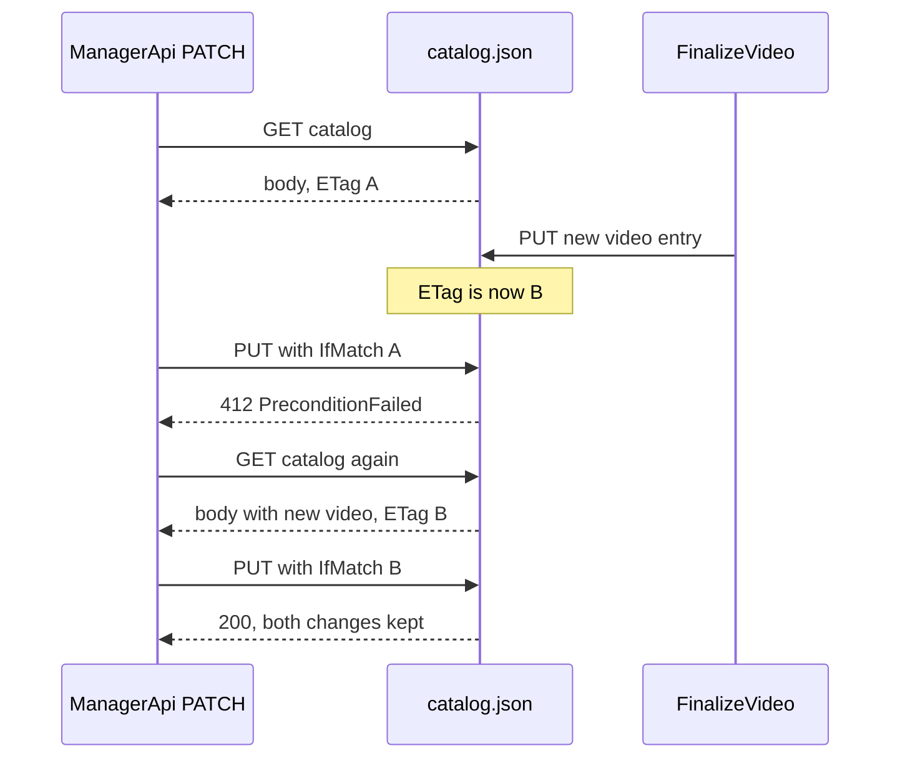

If three attempts all conflict, the API returns `409` and the UI asks for a retry. For one operator editing a handful of videos, that's plenty, and DynamoDB would be overkill. It becomes worth it when writes get frequent or viewers need queries beyond "newest first".

The fix isn't complete. `FinalizeVideo` still writes without a precondition, so in the race above it could overwrite a manager edit that landed between its own read and write. The window is small, and `CleanupVideos` and `ManagerApi` both guard their writes. The last writer still needs the same loop.

---

## The new role is the smallest one

`ManagerApiLambdaRole` has three statements on top of the basic logging policy. It can list the input bucket only under `recordings/`. It can get and put one object, the catalog file, by exact ARN. And it can invoke exactly two functions, `StartVideo` and `CleanupVideos`. It has no MediaConvert access, no `iam:PassRole`, and no delete permission anywhere.

Those limits hold because the API borrows the other roles' privileges instead of holding them. To start a job, it asks `StartVideo`, which holds the pass-role permission. To delete outputs, it asks `CleanupVideos`, which holds the delete permission. A stolen manager token can do what the page does and nothing more.

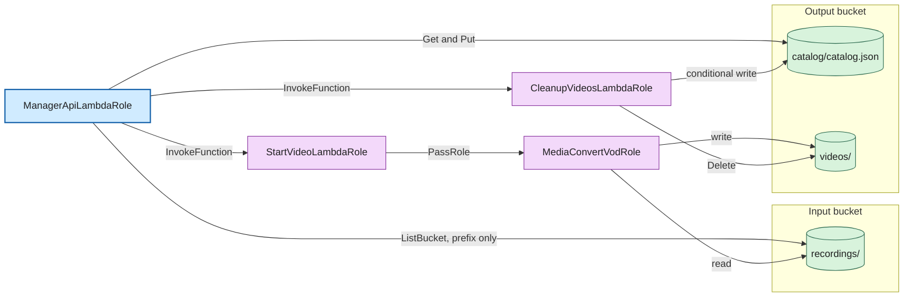

The other half of the wiring is a Lambda resource policy that lets `apigateway.amazonaws.com` invoke `ManagerApi`, scoped by source ARN to this one API. Without it, the authorizer passes and the integration fails with a permissions error that looks like a Lambda bug.

---

## CORS broke twice

CORS gave me more trouble than every other part of this project. The first failure happened on localhost while I built the first test player. The second happened weeks later on the public site, after I thought the first fix had settled it. They're the same class of problem with two very different causes.

### Round one, curl works and hls.js doesn't

The symptom was confusing. Opening the `master.m3u8` URL in a tab worked and returned `200`. The same URL loaded by hls.js failed with `net::ERR_FAILED 200 (OK)`. So the request succeeded, and the browser then refused to let JavaScript read the response.

The explanation is that a top-level navigation isn't a cross-origin read. When hls.js fetches the manifest from another origin, the browser needs an `Access-Control-Allow-Origin` header on the response before it hands the body to the script. Without a readable master playlist, hls.js can't find the renditions, so it finds no quality levels and never requests a segment.

It helps to split this into two separate questions, because each one has its own mechanism and they fail independently.

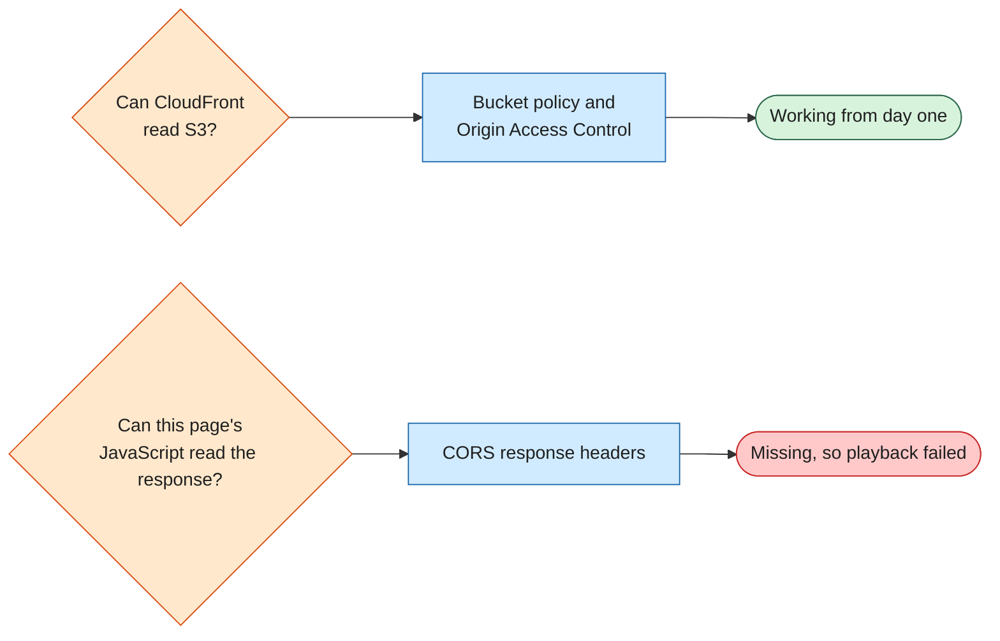

The first fix added an S3 CORS rule for `GET` and `HEAD` from any origin, plus the managed `CORS-S3Origin` origin request policy so CloudFront would forward `Origin` to S3. A bucket CORS rule doesn't make a bucket public. Block Public Access and Origin Access Control still decide who can read it. Playback on localhost started working, and I moved on.

### Round two, the cache remembered who asked first

On 2026-09-28 the public site started failing in a strange pattern. Some videos played and others didn't. A failing video failed every time, and a working one kept working. The browser console showed the familiar "No 'Access-Control-Allow-Origin' header" error, even once for `catalog.json`.

The root cause was the cache key. S3 CORS and the managed response policy only add CORS headers when the request carries an `Origin` header. The distribution used `Managed-CachingOptimized`, and **`Origin` is not part of that cache key**. Whoever requested an object first decided which headers were cached for everyone. A curl without `Origin`, a direct navigation, or a health check stored a copy without CORS headers, and browsers were then served that copy.

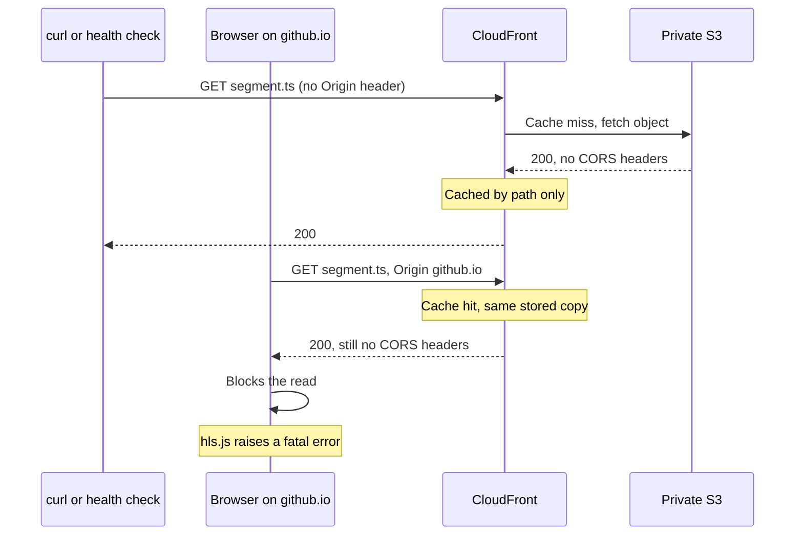

Each video has hundreds of files, including the master, the rendition playlists, and every segment. One bad cached object is enough to break a video, which is why failures looked random. The managed response policy should have patched the header on a cache hit, and on the failing objects it only did so for a bare curl with `Origin`. Adding any other request header, as every browser does, made the header disappear. I never isolated why.

That detail is also why the bug was hard to see. A `curl -H "Origin: ..."` crawl passed on about a thousand objects. The repo's own troubleshooting guide recommended that exact command. The diagnosis only moved once I stopped trusting curl and tested in a real browser.

```daisyui
{
  "component": "steps",
  "aria-label": "How the CORS incident was diagnosed",
  "orientation": "vertical",
  "items": [
    { "label": "Read the CloudFront and S3 configuration, which matched the docs" },
    { "label": "Crawled all six videos with curl and Origin, and every object passed" },
    { "label": "Fetched six files from six videos in a real browser, and many failed", "color": "warning", "marker": "!" },
    { "label": "Noticed a missing path returned a readable 403 while cached objects did not" },
    { "label": "Bisected curl headers until the CORS header disappeared", "color": "success", "marker": "✓" }
  ]
}
```

The fix makes the header constant instead of trying to vary the cache correctly. A viewer-response CloudFront Function runs on every response, cached or not, and sets the CORS headers without looking at the request.

```js
function handler(event) {
  var headers = event.response.headers;
  headers['access-control-allow-origin'] = { value: '*' };
  headers['access-control-allow-methods'] = { value: 'GET, HEAD' };
  headers['access-control-expose-headers'] = { value: 'ETag, Content-Length, Content-Range' };
  headers['access-control-max-age'] = { value: '3600' };
  return event.response;
}
```

I tried a response headers policy with these as custom headers first, and CloudFront rejected it because they're CORS headers. The policy's own CORS section depends on the request, which was the original problem. So a function was the only way to get unconditional headers. I removed both managed policies, invalidated `/videos/*` and `/catalog/*`, and 37 browser-loaded URLs that had mostly failed all loaded.

```daisyui
{
  "component": "callout",
  "variant": "information",
  "title": "The rule I took away",
  "content": "If a response varies by a request header, that header belongs in the cache key. The alternative is to make the response not vary at all. For public video, a constant Access-Control-Allow-Origin of * was the simpler choice."
}
```

---

## Making the bug unpublishable

Fixing the edge only covers today's configuration. If someone edits the distribution in the console next month, the same failure could come back quietly. The cheapest place to catch that is the moment before a video enters the catalog, so `FinalizeVideo` now checks what a browser would see before it publishes.

On a `COMPLETE` event, after it confirms `master.m3u8` exists, the function fetches through CloudFront. It reads the master, every rendition playlist, and the first and last segment of each rendition. The requests carry browser-like headers, including `Origin`, `Referer`, `Cache-Control`, and `Sec-Fetch-Mode`, because a bare `Origin` is the test that hid the bug. Any non-`200` response or missing CORS header fails the check.

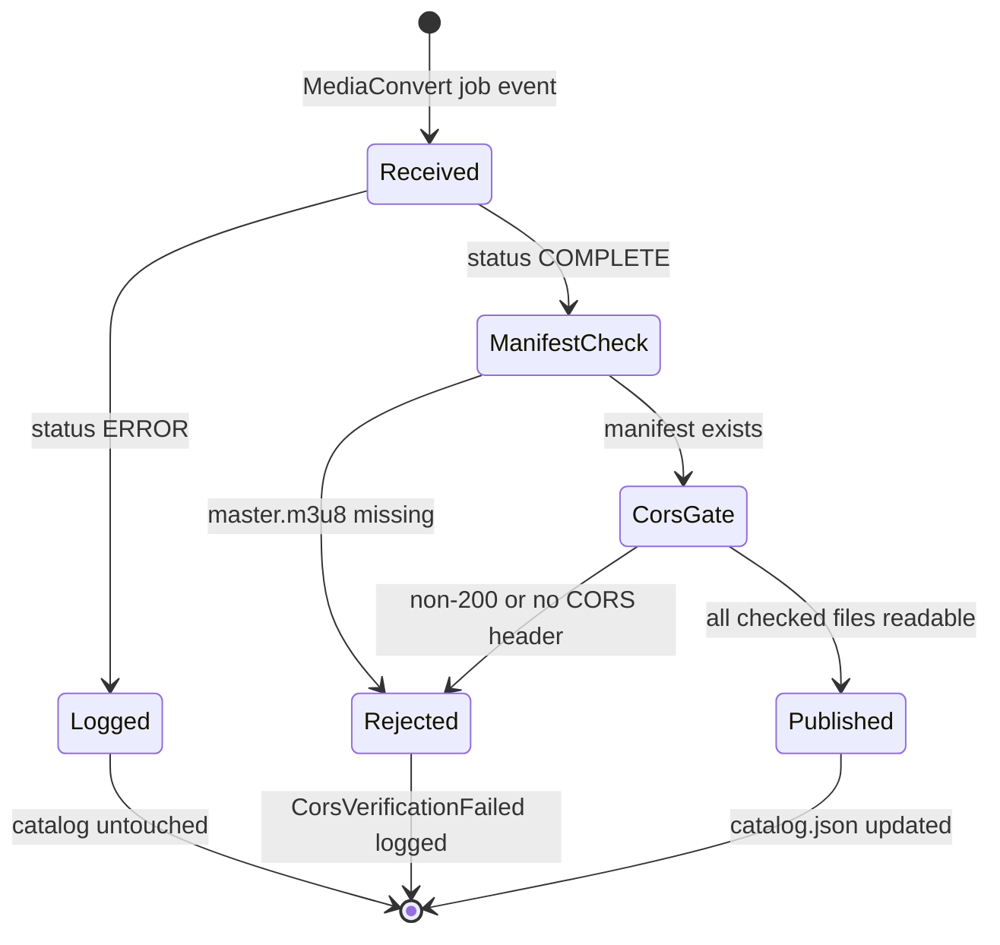

A failed gate logs `CorsVerificationFailed` with the offending URLs and raises, so the video never appears in the catalog. Once the edge is fixed, re-sending the same event publishes it. A `VERIFY_CORS=false` variable turns the gate off, and the check has its own unit tests. As a side effect, the gate's requests fill the cache with good copies before any viewer arrives.

The same crawl exists as `scripts/check-cors.sh` for the whole catalog. It sends the same kind of headers and fails loudly on the first bad object. For now I run it by hand, and scheduling it is on the open list below.

---

## StreamVault, the client part one only described

Part one had a client architecture diagram for a browser app that didn't exist yet. StreamVault is that app. It's a static site on GitHub Pages that lists my gameplay recordings, filters them by game and by online or offline play, and plays them with Video.js and hls.js.

<MockupBrowser url="https://duranalberto.github.io/stream-vault/" aria-label="StreamVault home page">
  <Picture
    src={streamvaultHome}
    alt="StreamVault home page with a welcome panel, game and mode filters, and a grid of six gameplay video cards"
    widths={[640, 960, 1280, 1476]}
    formats={["avif", "webp"]}
    sizes="(max-width: 1024px) 100vw, 960px"
    quality={80}
    loading="lazy"
    decoding="async"
    class="block h-auto w-full select-none"
    draggable={false}
  />
  <span slot="caption">Six videos from the catalog, filterable by game and mode.</span>
</MockupBrowser>

The stack is Vite, React 19, and TypeScript, with Chakra UI v3 for styling and react-router for two routes. The player route is lazy-loaded, so hls.js and Video.js only download when someone opens a video. Vitest and Testing Library cover the catalog parser and components, and oxlint handles linting. There's no server because the backend already publishes everything as static files.

<MockupBrowser url="https://duranalberto.github.io/stream-vault/video/..." aria-label="StreamVault video page">
  <Picture
    src={streamvaultVideo}
    alt="StreamVault video page playing a Splatoon 3 Turf War match with title, publish date, duration, and share buttons below"
    widths={[640, 960, 1280, 1476]}
    formats={["avif", "webp"]}
    sizes="(max-width: 1024px) 100vw, 960px"
    quality={80}
    loading="lazy"
    decoding="async"
    class="block h-auto w-full select-none"
    draggable={false}
  />
  <span slot="caption">The player route, with metadata and a share bar.</span>
</MockupBrowser>

### Loading the catalog without trusting it

The catalog loader expects failure. It fetches `catalog.json` with an eight-second timeout and runs the result through a strict parser that checks every field of every video. A missing `durationMs` or a malformed date rejects the whole payload instead of rendering half a card. On any failure, the app falls back to a copy of the catalog bundled at build time.

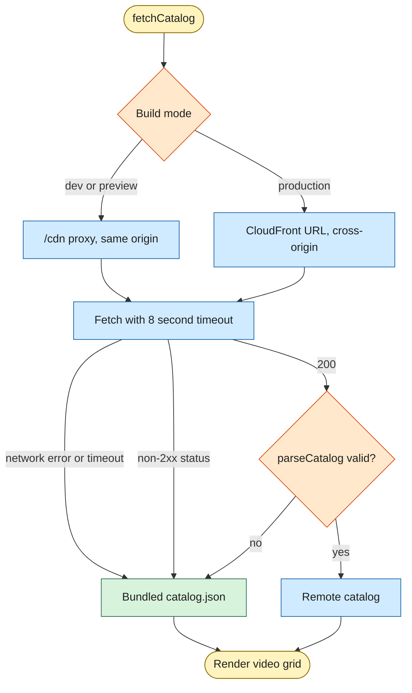

The fallback mattered during the incident. When `catalog.json` itself was served without CORS headers, the site still showed a grid instead of an error page. Playback was still broken for some videos, but the page stayed usable.

### The dev proxy that hid the bug

In development and `vite preview`, a proxy maps `/cdn/*` to CloudFront, and a small `toSameOrigin` helper rewrites CDN URLs to that path. Every request is same-origin, so CORS never comes into play. In production there is no proxy on GitHub Pages, and the app calls CloudFront directly.

That's convenient for local work, and it's also why round two only showed up in production. The dev server never made a cross-origin request, so it couldn't fail the way the published site did. A local mode that calls the real CDN origin directly would have exposed the problem before any viewer did.

### GitHub Pages quirks

GitHub Pages serves the site as a project site under `/stream-vault/`, so Vite's `base` is set to match. Pages has no SPA fallback, which means a cold load of `/stream-vault/video/some-id` hits GitHub's 404. A small `404.html` redirects to the home page. A hash router would avoid that, but I preferred clean URLs over zero-404 deep links.

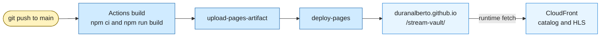

---

## Two clients, one catalog

The manager page and StreamVault have no code in common. What connects them to the publisher is the catalog JSON shape, and the table compares how each client uses it.

| Concern          | Manager page                          | StreamVault                          |
| :--------------- | :------------------------------------ | :----------------------------------- |
| Audience         | One operator                          | Anyone                               |
| Hosting          | Local Vite dev server                 | GitHub Pages                         |
| Authentication   | Cognito JWT                           | None                                 |
| Reads catalog    | Through the API, from S3              | From CloudFront                      |
| Writes catalog   | Metadata only, with ETag checks       | Never                                |
| CORS surface     | API Gateway, localhost only           | CloudFront function, any origin      |
| Player           | hls.js                                | Video.js with hls.js                 |

The shape is small enough to show in full. `FinalizeVideo` writes it, the manager edits four of its fields, and StreamVault validates all of them before trusting a single entry.

```json
{
  "version": 9,
  "updatedAt": "2026-09-26T20:09:22.190890Z",
  "videos": [
    {
      "id": "2026-07-02-11-47-26",
      "title": "Mario Tennis Fever - Extended Play - Rosalina vs Daisy",
      "description": "Gameplay of Mario Tennis Fever. Extended Play, Rosalina vs Daisy (I am Rosalina). Without fever rackets.",
      "publishedAt": "2026-09-25",
      "tags": ["gameplay", "Mario Tennis Fever"],
      "durationMs": 405750,
      "playbackUrl": "https://d2mcml34hdlt3o.cloudfront.net/videos/2026-07-02-11-47-26/master.m3u8"
    }
  ]
}
```

---

## What's still open

The system works end to end, and viewers can watch every published video. A few loose ends are still worth writing down before I forget them.

- A scheduled CORS crawl, as an EventBridge schedule plus a Lambda plus an alarm, would catch configuration drift between publishes. Today the check only runs when a video publishes or when I run the script.
- The CloudFront distribution is still changed by script and console. It should live in infrastructure as code with the rest of the resources.
- `FinalizeVideo` needs the same ETag loop the other two writers already use.
- The committed `StartVideo` policy still names `MediaConvertVideoRole` for `iam:PassRole` while the service role is `MediaConvertVodRole`, the mismatch part one pointed out. Jobs submit fine, so the deployed policy differs from the file, and the repo copy should be corrected.
- Hosting the manager page would need a new CORS origin on the API, new Cognito callback URLs, and MFA turned on.

---

## The core didn't move

S3, `StartVideo`, MediaConvert, EventBridge, and `FinalizeVideo` do the same jobs they did in part one, apart from the new publish check. Everything else went around them. The operator got a login and a small API, and viewers got a site to watch on. The part that cost me the most time had nothing to do with video. It was a CORS header that depended on `Origin` and a cache key that ignored it.
