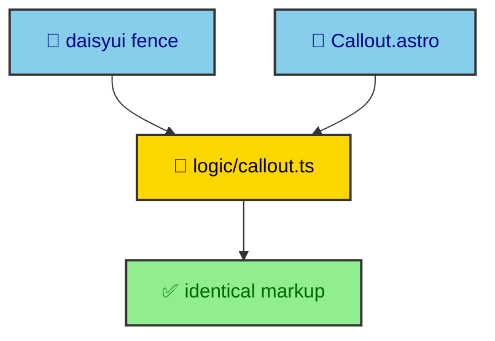

An author writing a page here does not import a `Callout` component and pass it children. They write a fenced code block tagged `daisyui` and describe the callout as data. That choice runs through the whole publishing system, and it is not obvious why a fence beats an import until you see what it buys and what it costs. This page is that explanation, with real fences.

---

## A fence instead of an import

Here is a callout as it actually appears in a publication on this site. It is a fenced block tagged `daisyui`, carrying a small JSON object.

```daisyui
{
  "component": "callout",
  "variant": "information",
  "ariaLabel": "Worked example",
  "content": [
    { "type": "paragraph", "text": "This chain has already produced a real publication on this site." },
    { "type": "link", "href": "/thejournal/is-oracle-stock-undervalued/", "label": "Read the worked example", "external": false }
  ]
}
```

That fence renders the same callout an imported component would, and the author wrote no import, no JSX, and no component props. They named a component and described its content. The `daisyui` fence covers eight components this way, including `callout`, `chat-bubble`, `list`, the three mockups, `section-header`, and `steps`. The `echart` fence does the same for charts, and the `mermaid` fence for diagrams.

---

## What the fence buys

Choosing a fence over an import is a deliberate trade, and the wins are concrete.

- **No imports.** A page needs no import line and no knowledge of a component's file path. The fence tag is the whole interface.
- **Build-time validation.** The fence body is parsed and validated during compilation, so a malformed callout fails the build with a message rather than rendering broken markup for a reader.
- **Data, not markup.** The content is a JSON object, which is easy to generate, diff, and reason about, and which cannot smuggle arbitrary markup into an article.
- **One component map.** Every fence of a given type resolves through one place, so the whole site stays consistent without an author choosing which component to import.

The cost is expressiveness, which the last section covers. For most content, the trade is worth it, because an author gets a validated, consistent component by describing it rather than constructing it.

---

## Parity is structural, not careful

The obvious worry about two ways to render a callout, a fence and a component, is that they drift. This site avoids that worry by construction rather than by discipline. The `daisyui` fence plugin lives in `bloomwright-mdx`, and the `Callout` component lives in `bloomwright-ui`, and both call the same pure function in `bloomwright-ui/logic/*` to shape the output.



So a callout written as a fence and a callout written as a component produce the same markup because the shaping happens in one shared function neither of them reimplements. Parity is a property of where the logic lives. The `bloomwright/ui_components` page argues this seam from the package side.

---

## When to reach for the component

A fence cannot express everything, and the honest answer is to switch to an imported component when it hits a wall. Three situations call for it.

Named slots are the first. When a component needs distinct regions filled with rich content, a flat JSON body cannot express that, and the component's slot API can. Raw children are the second. When the content is arbitrary MDX rather than a fixed shape of text, paragraphs, and links, an imported component that takes children is the right tool. The Astro image pipeline is the third. When a block needs an optimized, responsive image processed by Astro's asset handling, that runs through a component prop, not a JSON string.

The rule is simple to state. Prefer the fence for its validation and consistency, and drop to the component when the content genuinely needs something a data object cannot carry. Because both paths share the same logic, moving from one to the other changes how you author, not what the reader sees.
