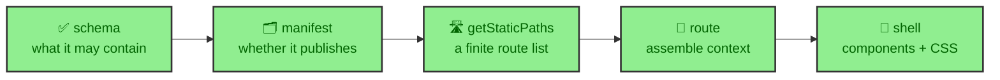

Writing a publication on this site feels like writing prose, but under it there is a small compiler. A candidate file enters, a schema decides what it may contain, a manifest decides whether and where it publishes, a route turns it into a page, and a component map renders it. Each stage owns one decision and hands the next stage a narrower thing. This section follows that compiler stage by stage, and this page is the map of it.

---

## Five stages, one direction

A journal page starts as an `.mdx` file under `src/thejournal/` and ends as HTML in the article shell. Between those two points sit five stages, each with a single job.

The ownership is strict, and that is the point. The schema decides content. The manifest decides policy. The route assembles. The components present. Runtime code may improve interaction later, but it never decides what the article is.

---

## Where the packages enter

Two of these stages now involve code from outside the app. The Markdown processor is Satteri, configured in `astro.config.mjs`, and `bloomwright-mdx` registers a fence stage into it that turns `daisyui`, `echart`, and `mermaid` fences into rendered output. So by the time MDX compiles, a fence has already become a component or inline HTML.

At the rendering stage, the route maps Markdown elements onto `bloomwright-ui` prose components. A `pre` becomes a `CodeBlock`, headings become `HeadingAnchor`, and a table becomes a `ProseTable`. The `authoring` compiler is still the app's, but two of its stages are now powered by packages, which is why this section and the `bloomwright/` section describe the same seams from different sides.

---

## What each page covers

The six pages walk the compiler in order.

- `content_model` is the schema. The nine frontmatter fields, what they accept, and one field the page never displays.
- `manifest_policy` is the manifest. Drafts, vault invariants, image inheritance, ordering, pagination, and the read-time formula.
- `fences` is the authoring API. Why an author writes a fence instead of importing a component, and when to do the opposite.
- `mdx_pipeline` is the processor. Satteri, integration order, the component map, dual-theme highlighting, and the minifier's protected tags.
- `routing` is the route. Static path generation and the article shell that surrounds every page.

Read `content_model` and `manifest_policy` first if you are publishing. Read `fences` if you are writing anything richer than prose. Read `mdx_pipeline` and `routing` if you want to know how the machinery fits together.

---

## Why the compiler framing helps

Treating publication as compilation gives maintenance a map. A frontmatter field that will not validate is a schema question. A page that publishes in the wrong place is a manifest question. A missing route is a static-paths question. A fence that renders wrong is a processor question. A misstyled callout is a component question.

This site can make that claim because it wrote the article you are reading through the same compiler. The claims in this vault can be checked against the pages delivering them, which is the useful constraint of documenting a system with itself.
