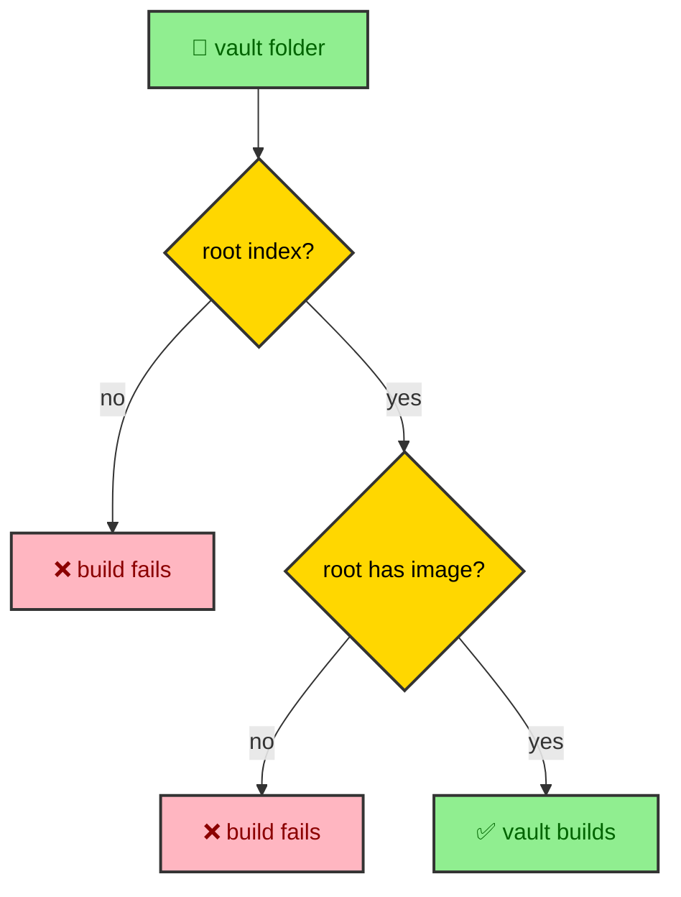

The schema decides what an article may contain. The manifest decides whether it publishes, where it sits, and what surrounds it. That is a different kind of authority, and it is the reason the manifest is the strongest piece of policy in the whole pipeline. It filters drafts, enforces the rules a vault must obey, inherits images, sorts entries, links them into a sequence, and computes each one's read time. This page walks those rules, all of which live in the manifest builder rather than in any page.

---

## Drafts scope more than themselves

The most powerful field the manifest reads is `draft`, and its power is that it scopes. A draft standalone article is hidden, which is expected. But a section index marked `draft: true` hides its entire subtree. Every entry underneath it disappears from the published set along with it.

That behavior is what makes the whole vault rewrite safe to stage. A half-written section can carry a draft index, and it stays invisible while its old counterpart remains published, until the moment the flag comes off. The filter that does this walks the entries, collects the draft index scopes, and removes both the drafts and anything that falls within a draft scope. The `interface/progressive_enhancement` work and this vault's own phased rollout both lean on that single rule.

---

## A vault has invariants

A vault is a folder with a root index and entries beneath it, and the manifest refuses to build one that breaks its rules. Two invariants are enforced hard enough to stop the build.

Every vault must have a root index. If a folder gathers entries but has no `index.mdx`, the manifest throws with a message telling the author to add one. And every vault root index must declare an image. A root without an image throws, because the vault's image is what its children inherit. These are not warnings that scroll past. They are build failures, which is the right severity for a rule that would otherwise produce a broken navigation tree or a missing social image.

---

## Images flow downhill

Because the root carries the required image, children do not have to. The manifest inherits the vault root's image for child entries that declare none, so a section index or a nested article can omit an image and still get a correct social preview. That is why most pages in this vault carry no `image` field. They inherit one.

This is a small convenience with a real payoff. An author writing a nested page thinks about the words, not about sourcing a unique image for a page that will inherit a perfectly good one. A standalone publication, which belongs to no vault, gets no inheritance and must declare its own.

---

## Order and sequence

Two different orderings shape how a vault reads. Within a section, the `order` field sorts entries, and the convention in this vault is that an index is 10 and its children ascend by ten. That gives an author room to insert a page between two others without renumbering everything.

The manifest also links entries into a sequence, computing a previous and next for each one by traversing the sorted tree. That traversal is what powers the pagination at the foot of every article and the position a reader holds inside a vault. Ordering decides the list. Linking turns the list into a path a reader can walk forward and back.

---

## Read time is a readout, not a target

Every entry gets a displayed read time, computed by one formula. The manifest strips the fenced code blocks out of the body, counts the remaining prose words and the code lines separately, and combines them as `ceil(proseWords / 200 + codeLines / 40)`, with a floor of one minute.

The important framing is that this number is a readout of density, not a target to engineer toward. There is no fixed reading-time band, because writing to a minute count produces padded, repetitive pages. A page should be as long as its material genuinely supports, and the read time should follow. The manifest measures the result rather than dictating it.
