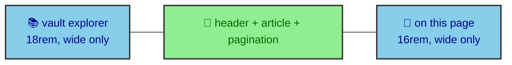

The last stage of the publication compiler turns a validated, published entry into a real page at a real URL. It does this with a single catch-all route that is deliberately thin. It asks the manifest for the list of pages to build, renders one entry's MDX, and wraps the result in a shell of navigation. Almost none of the article's identity lives in this file, which is the point. The route assembles prepared context rather than deciding anything, and this page traces how.

---

## A finite list from the manifest

Astro needs to know every page to build ahead of time, and the route provides that through `getStaticPaths`. It maps the manifest's published entries into route parameters, one page per entry.

```js
export async function getStaticPaths() {
  return publishedEntries.map((entry) => ({
    params: { slug: entry.id },
    props: { post: entry },
  }));
}
```

The important detail is that the list comes from `publishedEntries`, which the manifest has already filtered. Drafts and draft-scoped entries are gone before the route ever sees them, so an unpublished article never gets a route. The route does not re-decide what publishes. It trusts the manifest and builds exactly what it is handed.

---

## A thin catch-all

The route body is short. It renders the entry's MDX, looks the entry up in the manifest for its navigation context, and redirects to the 404 page if the lookup somehow fails. That guard is a safety net rather than a normal path, because a routed entry should always be in the manifest.

```js
const { post } = Astro.props;
const renderResult = await render(post);
const entry = entryManifest[post.id];
if (!entry) return Astro.redirect("/404");
```

From there the route gathers what the shell needs. The vault context for the sidebar, the previous and next entries for pagination, and the headings filtered to depth two and three for the table of contents. All of that is prepared data the manifest produced. The route is an assembler.

---

## The shell around the article

The article renders inside a shell that adapts to viewport width, and its pieces each have a home. The center column carries the publication header, the rendered MDX inside an `Article` wrapper, and pagination at the foot. Two sidebars flank it on wide screens, a left one at 18rem holding the vault explorer and a right one at 16rem holding the on-this-page navigation.



The rendered MDX is where the component map from the previous page applies, turning headings, tables, and fences into components. Everything around it is chrome the route assembled from the manifest, which is why the same shell fits every article without knowing anything specific about it.

---

## Navigation that collapses to a dock

On narrow screens the two sidebars would crowd the article off the page, so they collapse. The route swaps them for a bottom dock with two buttons, one opening the vault explorer and one opening the table of contents, each rendered into an overlay panel from `bloomwright-ui`. The overlays carry the same vault and heading content the sidebars hold on wide screens.

That responsive split is the reading experience the `interface/reading_navigation` page picks up in detail. From the routing side, the point is that the shell is one structure that presents itself two ways, sidebars when there is room and a dock when there is not, while the article in the center stays exactly the same. The route builds the page, and the interface decides how the reader moves through it.
