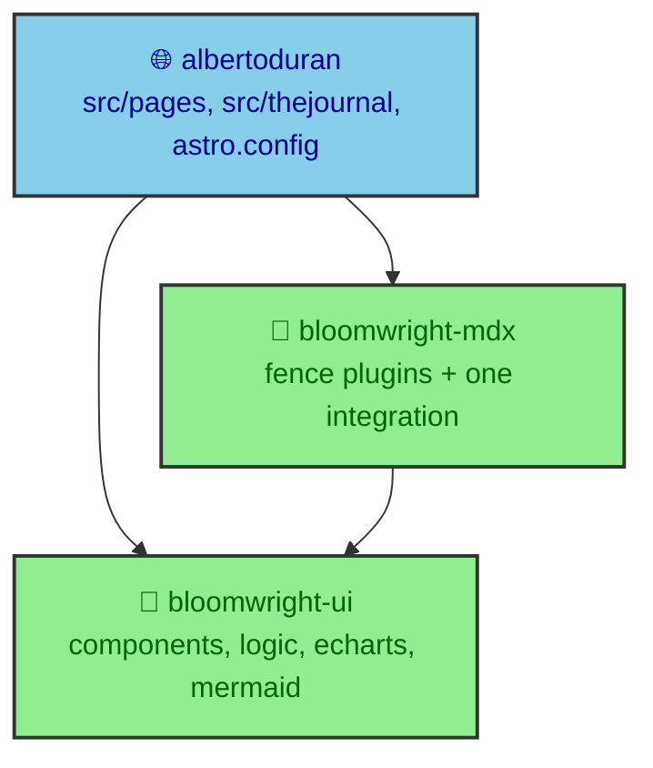

The integrations that render this site were written for this site, then turned out to be useful anywhere. A Mermaid pipeline, an ECharts server engine, a DaisyUI component kit, and a set of prose components. None of them knew anything about albertoduran specifically. When a second project needed the same behavior, the honest options were copy-paste or extraction. This section is about choosing extraction, and about what that choice actually costs.

---

## Two packages, one direction

The reusable code now lives in two repositories, consumed here as git dependencies rather than published npm releases.

- `bloomwright-ui` is the render core and the UI kit. It owns the ECharts server-side rendering engine, the Mermaid render pipeline, the component families, a pure logic layer, the client web components, and the shipped CSS. It sits at version `0.1.0`.
- `bloomwright-mdx` is extraction and Astro glue only. It turns `daisyui`, `echart`, and `mermaid` code fences into rendered output by driving `bloomwright-ui`. It also sits at `0.1.0` and lists `bloomwright-ui` as a peer dependency.

The dependency arrows never reverse. The site depends on both packages, `bloomwright-mdx` depends on `bloomwright-ui`, and neither package depends on the site. That single rule makes the boundary legible. If you ever have to import something from the app back into a package, the extraction was wrong.



---

## What each page in this section answers

Every page here answers the same three questions in order. What the thing is, why it exists, and how albertoduran actually consumes it. The app-side import sites are named on each page so a reader can open both halves of the seam.

- `ui_components` covers `bloomwright-ui` as a component kit. The four component families, the pure logic layer that guarantees a fence and a component emit identical markup, and the deliberate decision to ship icons as props rather than data.
- `ui_render_core` covers `bloomwright-ui` as a render core. The charter reversal from a dependency-free leaf into the package that owns build-time rendering, and the invariant that replaced the leaf rule.
- `mdx_layer` covers `bloomwright-mdx`. One integration instead of three, the three fence plugins, and why the Mermaid path no longer renders anything itself.
- `seams` covers the three inversions that made extraction possible. Each one names something a package refused to know.
- `costs` is the counterweight. Duplicated CSS, version coupling through git references, and two bugs that only the consuming app's real build could find.

---

## What each repository is allowed to know

The dependency direction is a rule about knowledge, not just imports. Each repository is allowed to know a specific amount about the others, and the guards enforce it.

`bloomwright-ui` knows nothing above itself. It cannot import the app, it cannot import `bloomwright-mdx`, and it cannot read environment variables, so it never learns which site is using it or how that site is deployed. `bloomwright-mdx` knows exactly one thing more. It knows `bloomwright-ui` exists and drives it, but it holds no rendering logic of its own. The app sits on top and is allowed to know everything, because it is the only place where this specific site is defined.

That gradient is why the extraction is legible. A reader can point at any file and say what layer it belongs to by asking what it is allowed to know. A file that reads a secret belongs to the app. A file that renders a chart belongs to the render core. A file that turns a fence into a component belongs to the mdx layer. The knowledge boundary and the code boundary are the same line, which is the property that makes the whole thing maintainable.

---

## How this project consumes them

The wiring lives in two files. `package.json` records both packages as `github:duranalberto/bloomwright-ui` and `github:duranalberto/bloomwright-mdx`, so the lockfile pins a commit rather than a semver range. `astro.config.mjs` registers the integrations and imports components and palettes from the package exports.

```js
// astro.config.mjs
import { bloomwrightMdx, createCodeBlockPlugin, createHeadingAnchorPlugin } from "bloomwright-mdx";
import { mermaidRenderer } from "bloomwright-ui/mermaid-renderer";
import { LIGHT_PALETTE, DARK_PALETTE } from "bloomwright-ui/mermaid";

integrations: [
  bloomwrightMdx({ selectSources: collectPublishableDocuments }),
  mermaidRenderer({ render, themes, selectSources, remoteCache }),
  mdx(),
  customHtmlMinifier(),
]
```

Neither package ships a build step. Both export raw `.astro` and `.ts` files, and Astro and Vite compile them straight from `node_modules`. That keeps the setup simple and pushes a real cost onto every consumer, which the `costs` page examines rather than hides.

---

## The migration that got here

Moving live code out of a running site is risky, so the migration was staged. Each phase was one commit on a `migration/bloomwright` branch, and `master` stayed untouched until the real production build came back green. The stages swapped the integrations, then the prose plugins and their components, then the primitive and display components, then the runtime shells, deleting the local originals only after their replacements proved out.

The branch discipline mattered because two problems surfaced only at the end. Both were bugs in `bloomwright-ui` that a fixture build could not reveal, because they depended on how a real consumer bundles a source-shipped package. The `costs` page describes them, since finding them is part of the honest story of extraction. The point of this section is that the packages exist because of this site, and the section's job is to show how this site consumes them.
