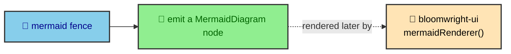

`bloomwright-mdx` is the smaller of the two packages, and its restraint is the point. It does not render charts, it does not create diagram SVG, and it owns no visual logic. Its whole job is to notice a code fence, hand the content to `bloomwright-ui`, and emit whatever that returns. When a package this thin still earns its own repository, it is worth asking what it holds that the app could not, and the answer is the seam between an author's Markdown and the render core.

---

## One integration, not three

An earlier design had three separate integrations, one each for DaisyUI, ECharts, and Mermaid. That looked tidy and behaved badly. A consumer had to register three things in the right order and keep their options in sync. The package collapsed them into one. `bloomwrightMdx()` is the single integration a consumer registers, and it wires all three fence plugins in a single pass.

The plugins themselves stay separate inside the package, at `bloomwright-mdx/src/{daisyui,echarts,mermaid}/satteri-plugin.ts`. Satteri is the Markdown processor this project uses, and these are HAST plugins that run during Markdown compilation. Splitting the plugins by fence type keeps each one small. Collapsing the integration keeps the consumer's config honest.

---

## Why it registers before mdx

Order matters in the Astro config, and it is not arbitrary. `bloomwrightMdx()` has to run before `mdx()` because its `config:setup` hook augments the Markdown processor that `mdx()` then uses. Register it after, and the fence plugins never attach.

```js
// astro.config.mjs
integrations: [
  bloomwrightMdx({ selectSources: collectPublishableDocuments }),
  mermaidRenderer({ render, themes, selectSources, remoteCache }),
  mdx(),
  customHtmlMinifier(),
]
```

The package also ships two prose plugins the app registers directly on its Satteri processor, `createCodeBlockPlugin` and `createHeadingAnchorPlugin`. They wrap highlighted code and tag headings with anchors, and they draw on the same `bloomwright-ui` logic layer the components use, so a fence and a component produce the same anchors and the same code wrappers.

---

## The inversion that emptied the Mermaid path

The most important thing about `bloomwright-mdx` is a job it gave away. In an earlier version it rendered Mermaid diagrams itself. It scanned the fences, called a renderer, and baked the SVG into the output. That made it responsible for network access, caching, and the render port, none of which is extraction work.

So Mermaid creation moved out into `bloomwright-ui`'s `mermaidRenderer()` integration. Now the `mermaid` fence in `bloomwright-mdx` does one small thing. It emits a `MermaidDiagram` component carrying the raw fence code, and it is entirely unaware of who renders the SVG or how.



The other two fences did not move. `daisyui` and `echart` still resolve synchronously during Markdown compilation, emitting a `Fragment` with rendered HTML on the spot, because they need no network and no cache. Only Mermaid did, so only Mermaid left.

---

## How a synchronous fence becomes output

The `daisyui` and `echart` fences do their work during Markdown compilation, and it helps to see the shape of that work. Each fence plugin parses the fence body into a definition, hands the definition to `bloomwright-ui` to produce markup, and swaps the fence node for a `Fragment` carrying that markup as raw HTML. It happens inline, in one pass, because neither fence needs anything a compiler cannot supply on the spot.

Inside the package this is split into small files per fence. The `daisyui` plugin pairs a `definition.ts` that reads the fence with a `markup.ts` that renders it, and the `echart` plugin follows the same split. The plugin is the thin adapter between Satteri's HAST tree and the render core's pure functions. That is why the package can claim to be glue. It moves data from a fence node into a `bloomwright-ui` function and back into the tree, and it holds no rendering logic of its own.

The Mermaid fence is the odd one out, and now you can see why. It cannot resolve synchronously because rendering a diagram means a network call and a cache. So instead of emitting HTML, it emits a `MermaidDiagram` component and lets `bloomwright-ui`'s renderer fill it later. Same adapter role, different timing, which is the whole reason Mermaid creation had to leave.

---

## The prose plugins share the logic layer

Two more plugins ship from this package, and they run on the app's Satteri processor rather than through the integration. `createCodeBlockPlugin` wraps highlighted code in the same structure `CodeBlock` produces, and `createHeadingAnchorPlugin` tags headings with the anchors `HeadingAnchor` produces.

The reason they exist here rather than in the render core is subtle. They are extraction glue, mapping Satteri's HAST tree onto shaped output, so they belong with the other adapters. But they draw their shaping from `bloomwright-ui`'s logic layer, the same functions the components use. So a heading anchor written by the plugin and a heading anchor rendered by the component agree by construction, and the app gets the same result whether a heading passes through Markdown compilation or a component map.

---

## guard:host, the mirror invariant

`bloomwright-ui` has `guard:leaf`. `bloomwright-mdx` has `guard:host`, the mirror. Where the render core is forbidden from importing anything above it, the mdx layer is checked so it stays extraction and glue rather than quietly reabsorbing render logic. The two guards describe the boundary from both sides, which is why neither package can drift into the other's job without a check failing in CI.

This is also why `bloomwright-mdx` lists `bloomwright-ui` as a peer dependency rather than bundling it. The mdx layer drives the render core, so the consumer installs one shared copy of `bloomwright-ui` that both the app and the mdx layer use.

---

## How this project uses it

The app registers `bloomwrightMdx({ selectSources: collectPublishableDocuments })`, so the same publish rule that decides which journal entries render also decides which documents the fence plugins scan. The `seams` page covers that shared selection function in full.

The Mermaid half needs one more line, in the journal route's component map. Because the `mermaid` fence emits a `MermaidDiagram` rather than baked HTML, the route has to map that component name so MDX can resolve it.

```js
// src/pages/thejournal/[...slug].astro
const components = {
  pre: CodeBlock,
  h2: HeadingAnchor,
  h3: HeadingAnchor,
  table: ProseTable,
  MermaidDiagram,
};
```

That single entry is the visible edge of the whole inversion. The fence emits a component, the render core fills it with SVG during the build, and the route only has to name it. The author writing the fence sees none of that machinery, which is the outcome the extraction was built to reach.
