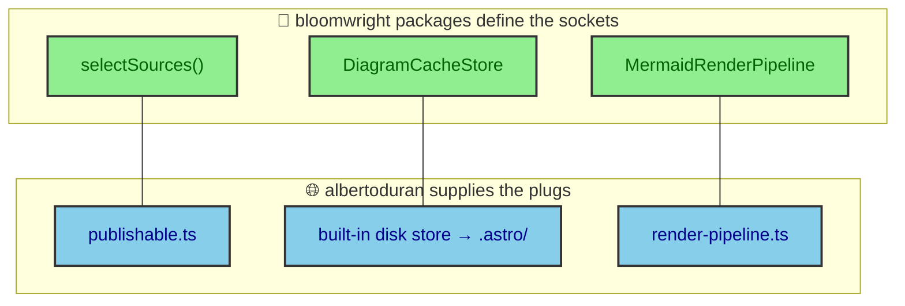
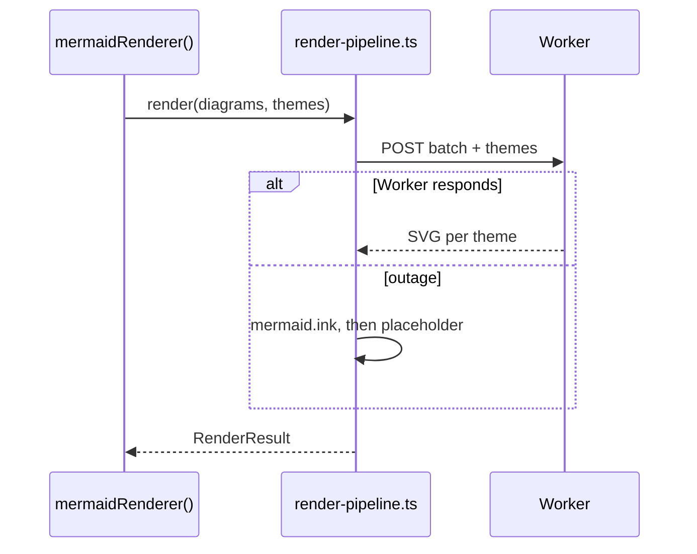

Extraction is usually described by what moves out. The more useful description is what the packages refused to keep. Three decisions could not travel into a reusable package without dragging this site's specifics along, so each one became a seam. The package defines a socket, the app supplies a plug, and the two only make sense together. This page shows both halves of all three, because a seam is invisible until you can see the port and the thing filling it.

---

## A seam is a refusal made concrete

When a package refuses to know something, that refusal has to take a shape in the code. It becomes a function type the caller implements, or an interface the caller satisfies. The refusal is the design, and the type is its fingerprint.

The three refusals are which documents publish, where cached bytes live, and who talks to the renderer. None of them belong in a package that wants to serve more than one site. All three are answered by albertoduran in files that survived the deletion of the old local integrations, precisely because they encode this site rather than the packages.

---

## Seam one, what publishes

The packages scan `src/**` for fences and diagram definitions, but they must not decide which of those results ship. Drafts exist, and a draft's diagrams should never reach the network or the output. So both integrations take a `selectSources` function. The socket is a simple contract. Given a list of `SourceDocument` values, each carrying a `filePath` and its `content`, return the subset whose output should render.

The app's plug lives in `src/content/processors/publishable.ts` as `collectPublishableDocuments`. Its rule is specific to this site. Render every non-journal source, such as project pages, and for anything under `src/thejournal/` render only published entries, reusing the same `filterPublishedJournalEntries` model the content pipeline uses. One function feeds both `bloomwrightMdx()` and `mermaidRenderer()`, so a fence and a diagram agree on what counts as published.

That agreement is why a draft article never leaks a rendered diagram into `dist`. The publish rule is enforced once, in the app, at the seam the packages left open.

---

## Seam two, where bytes are cached

Rendering a diagram is expensive, so the result is cached. But a package cannot decide where a consumer's cache lives. A serverless build might want object storage, a laptop wants a folder. So caching splits along a clean line. `bloomwright-ui` owns addressing through its `DiagramCacheStore` port at `bloomwright-ui/cache`, and the caller owns storage.

Addressing means the key. The package computes it from a namespace, a renderer version, and a stable id for the diagram, so a change to the renderer invalidates old entries automatically. Storage means the bytes. albertoduran omits a custom store, which selects the built-in disk adapter that writes into `.astro/`. The renderer version is pinned there too, currently `v4.9`, so the write path and the read path address the same entries.

The subtle part is that two module instances share this store. The build hook writes the cache, and the component render reads it, and they only cohere because they resolve the same addressing over the same folder. Get the version or the namespace wrong and the reader misses everything the writer stored. The `rendering/mermaid_pipeline` page traces that coherence in detail.

---

## Seam three, who renders

The third refusal is the sharpest. `bloomwright-ui` ships no real renderer. It defines the port and provides only an offline fixture renderer for its own tests. The production renderer is the caller's job, because talking to a specific Cloudflare Worker with a specific secret is the definition of site-specific.

The socket is a function type. A `MermaidRenderPipeline` takes diagrams and themes and returns a `RenderResult`. The app's plug is `src/mermaid/render-pipeline.ts`, which turns diagram text into themed SVG and nothing else. Its provider chain tries the batched Cloudflare Worker first, falls back to a serialized mermaid.ink call, and falls back again to a placeholder SVG, so a render outage never crashes a build. It imports the `RenderService` and theme helpers it needs from `bloomwright-ui/mermaid`.

The app injects that plug through `mermaidRenderer({ render })`. When the deterministic build sets its fixture flag, the app passes no render function at all, and the package falls back to its offline fixtures. So the same seam that lets a real Worker render also lets the test suite stay offline, which is exactly the flexibility a hard-coded renderer would have destroyed.

---

## The contracts are small and typed

None of these seams is a sprawling interface. Each is a compact type the app satisfies, which is what keeps a seam usable rather than a second framework. `selectSources` is a function from a list of `SourceDocument` to a shorter list. The cache is a `DiagramCacheStore` with a handful of methods. The renderer is a single function type, `MermaidRenderPipeline`, that takes diagrams and themes and returns a `RenderResult`.

The `RenderResult` shape is worth naming because it carries more than SVG. It reports which service produced the render, drawn from a small `RenderService` set, so the pipeline can record whether a diagram came from the Worker, the fallback, or a fixture. That identity is how the build can log its own render provenance without the package knowing anything about Cloudflare. The package defines the vocabulary, the app fills it with a real service, and the result speaks in terms both understand.

Batching lives at the seam too. The renderer integration groups diagrams into chunks and spaces the chunks out, using the package's own defaults rather than anything the app hard-codes. Those defaults exist because the downstream renderer has limits, and pushing them into configuration would have leaked the renderer's shape into the package. Instead the package owns the batching policy and the app owns the render call, and the two meet only through the typed port.

---

## Why the plugs had to survive deletion

The migration deleted the old local integrations wholesale. What is striking is that these three files did not go with them. `publishable.ts` and `render-pipeline.ts` were carved out of the integrations precisely because they were the parts that could not be reused. They encode this site's publish rule and this site's renderer, so they stayed in the app while everything generic left for the packages.

That is the clearest test of whether an extraction found the right boundary. The reusable code left cleanly, and the site-specific code stayed put, and the seam is exactly the line between them. If deleting the integrations had forced app logic into a package, or left a package concern stranded in the app, the boundary would have been in the wrong place. It was not, and these three surviving files are the proof.

---

## Why three seams and not zero

A reusable package with zero seams is a fantasy. It would have to know every consumer's publish rules, storage, and renderer, which means it would only ever fit one consumer, the fantasy's author. The three seams are the honest count for this system. Each one names a decision that is genuinely the app's to make, hands the app a small typed contract, and keeps everything else inside the package. The reward is that a second project can answer the same three questions differently and reuse the rest unchanged.
