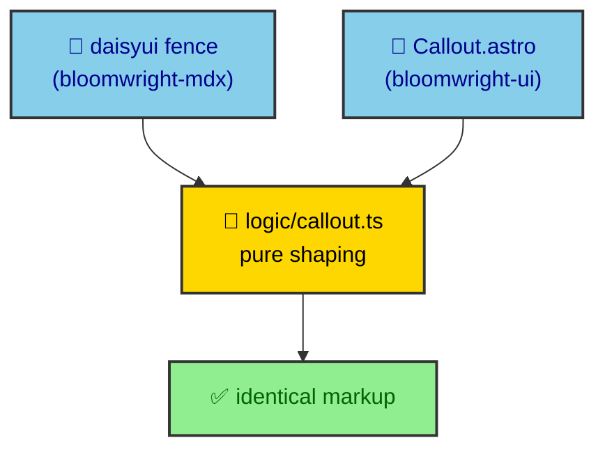

A component kit is easy to start and hard to keep honest. The trap is that the same visual, a callout say, ends up with two code paths. One for an author who imports a component, and one for an author who writes a fence. When those paths drift, the same source produces different markup depending on how you asked for it. `bloomwright-ui` avoids that by making both paths call the same pure function. This page walks the families it ships, that shared seam, and how albertoduran wires it in.

---

## Four families with clear jobs

The package groups components by role, and the export map mirrors the folders under `bloomwright-ui/src/components/`.

- **display** holds the editorial pieces. `Callout`, `ChatBubble`, `List`, `Steps`, the three mockups (`MockupBrowser`, `MockupPhone`, `MockupWindow`), and `SectionHeader`. These are what a fence like `daisyui` produces.
- **primitive** holds the small building blocks. `Button`, `SVGIcon`, `GlassPanel`, and `OverlayPanel`. Other components and app surfaces compose these.
- **prose** holds the article furniture. `CodeBlock`, `HeadingAnchor`, `ProseTable`, and `VideoPlayer`. The journal route maps Markdown elements onto these.
- **render** holds the build-time visuals. `EChart`, `MermaidDiagram`, and `MermaidDiagramWrapper`. The `rendering/` section covers the engines behind them.

Each family imports through a stable path such as `bloomwright-ui/components/display/Callout.astro`. The paths are part of the package contract, so a consumer never reaches into internal file structure that could move.

---

## The logic layer is the real seam

Underneath the components sits a folder of pure functions at `bloomwright-ui/logic/*`. There is one file per shaped component. `callout`, `chat`, `code-block`, `heading-anchor`, `list`, `section-header`, and `steps`. These functions take raw input and return the resolved classes, tags, and structure a component needs. They touch no Astro APIs and no DOM.

That indirection looks like overhead until you remember the fence problem. The `daisyui` fence in `bloomwright-mdx` and the imported `Callout.astro` component both call the same `callout` logic function. Neither reimplements the shaping. So a callout written as a fence and a callout written as a component resolve to identical markup by construction, not by careful duplication that someone has to keep in sync.

The `authoring/fences` page argues the fence side of this from an author's point of view. Here the point is narrower. Parity is a property of where the logic lives, so it survives refactors that pure prose discipline would not.

---

## The DaisyUI parts it depends on

`bloomwright-ui` is a DaisyUI kit, but it does not force DaisyUI on you. It ships no `@plugin` block of its own, because injecting one would fight a consumer's own Tailwind setup. Instead it ships a preset file at `bloomwright-ui/daisyui-preset.css` that documents the exact `include` list its components rely on, and asks the consumer to copy that list into their own DaisyUI plugin block.

The list is small on purpose. Eleven DaisyUI parts cover the whole kit.

- `button` backs `Button`, list and section-header calls to action, and overlay close buttons.
- `card` backs `Callout`. `badge` backs the status pills in `List`. `mockup` backs the three mockups and `CodeBlock`.
- `steps` backs `Steps`, `chat` backs `ChatBubble`, `list` backs `List`, and `modal` backs `OverlayPanel`.
- `table` backs `ProseTable`, `input` backs the mockup address field, and `select` backs the video quality control.

Keeping the include list explicit is what lets the package stay honest about its footprint. A consumer can read exactly which DaisyUI parts they are opting into, rather than pulling the entire library because one callout needed a card.

---

## not-prose keeps components out of the article flow

A component kit that renders inside Markdown faces a specific hazard. The article's prose styles, the typographic rules that make paragraphs readable, will bleed into a callout or a mockup and wreck its layout. The kit guards against that with DaisyUI's `not-prose` isolation.

Most display and prose components wrap their output in `not-prose`, including `Callout`, `Steps`, the three mockups, `ChatBubble`, `List`, `CodeBlock`, `VideoPlayer`, and the Mermaid wrapper. Inside that boundary the component owns its own spacing and type, and the surrounding article typography stops at the edge. This is why a fence-generated callout looks the same whether it sits in a dense article or a sparse one. The component decides its own presentation, and the page cannot override it by accident.

---

## Icons are props, not data

Icons raise a design question, and extraction forced a sharp answer to it. `SVGIcon` and `Button` accept an icon through a typed prop, and the package ships no icon library of its own. It defines the shape of an icon, not the catalog.

That split is deliberate. Icon data is brand. The check mark and link glyphs on a heading, the social glyphs in the footer, the ribbon marks on a project card, those belong to albertoduran, so they stay in the app. The site keeps its icon data in `src/data/icons.ts` and generates the ribbon marks in `src/utils/ribbon.ts`, then passes them into the package components as props.

Three icon paths coexist in the app because of this. Typed `Icon` props flow into `bloomwright-ui` components, `src/data/icons.ts` holds the reusable glyph data, and `src/utils/ribbon.ts` builds the generated marks. The package owns none of them. It owns only the contract that says an icon arrives from the caller, which is why the same components can carry a different brand in a different project.

The contract is small and typed. The package defines an `Icon` shape and a `RibbonIcon` shape in `bloomwright-ui/src/types/icon.ts`, and that is the entire vocabulary a caller has to satisfy. `SVGIcon` accepts one, `Button` accepts one alongside its own typed variants. `ButtonVariant` and `ButtonSize` are DaisyUI class unions, so a `Button` takes `btn-xs` through `btn-lg` and variants that include `btn-outline`, and TypeScript rejects a size the source never uses. The types are the seam. A consumer fills in the data, the compiler enforces the shape, and no brand asset ever lives in the package.

---

## What the package deliberately excludes

A kit is defined as much by what it refuses as by what it ships. `bloomwright-ui` leaves out two categories on purpose. It ships no brand components, so anything that reads as albertoduran specifically stays local. And it ships no icon data, for the reason above.

The app keeps a short list of components that never moved. `StripBackground`, `VideoPlayer`, `ThemeToggle`, `AlbertoDuran`, and `SocialTire` live in `src/components/ui/`. Some are brand. `VideoPlayer` stays local because it drives HLS media the package version does not, which is a small honest divergence rather than a clean story. The rest of the display, primitive, and prose surface comes from the package.

---

## How this project uses it

The consumption is broad and easy to count from the import sites. `SectionHeader` appears in nine files, `SVGIcon` in eight, `Callout` in seven, `Button` and `Steps` in six each, with the mockups, `List`, `GlassPanel`, and `OverlayPanel` filling in the rest. The pattern is that page-level surfaces compose primitives while content surfaces reach for display components.

The journal route is the densest single consumer. It maps `pre` to `CodeBlock`, both `h2` and `h3` to `HeadingAnchor`, and `table` to `ProseTable`, all imported from `bloomwright-ui/components/prose/*`. Project pages import display components directly to build their landing sections, and `ProjectVaultSection` renders a whole journal vault through `List` and `SectionHeader`. One kit, several very different surfaces, and the logic layer keeping every rendering of a given component honest.
