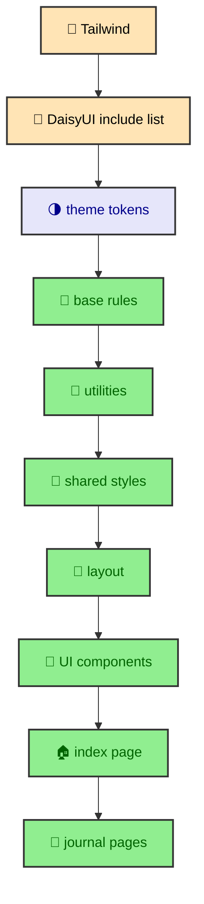

`global.css` is a manifest, not a dumping ground. Its job is to import CSS in an order that makes tokens available before components need them and keeps page-specific rules after shared foundations. That order matters because CSS uses the cascade, where later and more specific rules can override earlier ones. The file is short because the architecture is in the ordering. Each imported partial has a clear reason to exist.

---

## The root entry point

`BaseLayout.astro` imports `src/styles/global.css` once for the site. That makes `global.css` the root CSS entry point for pages, components, and MDX output. The file begins with a comment that describes the load order and explicitly says not to add rules directly there.

That comment is not decoration. It protects the role of the file. If `global.css` becomes a place for random overrides, the cascade becomes harder to understand. A rule added at the root can accidentally outrank a component partial only because of import order. Keeping the root as a manifest makes every rule justify its home.

The manifest order is:

The sequence turns CSS into a dependency graph. Frameworks load first. Tokens load before rules. Shared rules load before page rules. Page-specific rules get the final word only inside their own domain.

---

## Framework layer

The file starts with Tailwind through `@import "tailwindcss"`. Tailwind provides utility classes and reads the theme variables defined later through the Tailwind v4 theme layer. Immediately after that, DaisyUI is registered as a plugin with `themes: light, dark` and a project-specific include list.

The include list is important because it limits the generated component CSS. The site opts into buttons, cards, navbar, swap, badge, menu, dropdown, timeline, mockup, footer, modal, join, alert, link, table, and textrotate. It does not ask DaisyUI to produce every component the library offers.

This keeps the CSS output smaller and keeps the design vocabulary tighter. A future component can use known primitives without importing a new visual universe. The framework layer gives the site useful tools, but it does not let the framework define the whole design system.

---

## Token layer

After the framework layer, `global.css` imports `_tailwind-theme.css` and `_daisyui-themes.css`. This is where the project's visual vocabulary enters the cascade.

`_tailwind-theme.css` defines font roles, radii, selector sizing, border width, depth, noise, easing, and shadow variables. It maps the Astro font configuration into `--font-sans`, `--font-display`, `--font-reading`, and `--font-mono`. Those variables let components choose semantic typography roles instead of hardcoded font stacks.

`_daisyui-themes.css` defines custom light and dark themes in OKLCH. It provides base surfaces, content colors, primary, secondary, accent, neutral, status colors, border color, glass fallback, and shadow opacity. DaisyUI components and utility classes can then draw from those values.

The order matters. Component and page rules should be able to assume tokens already exist. A partial should not need to import theme files privately or duplicate variables.

---

## Base and utility layer

The base layer imports normalization and transitions. `_normalize.css` gives the site a stable starting point across browsers. `_transitions.css` owns the view transition and reduced motion policy. Keeping transitions near the base layer makes motion a shared behavior instead of a page-by-page trick.

The utility layer imports JavaScript state helpers, GPU helpers, touch hover behavior, and miscellaneous utilities. These files hold rules that multiple components can use without tying them to one page. For example, a `no-js` state or touch-specific hover adjustment is not a journal-only concern. It belongs to the shared browser environment.

Utilities are placed before shared component styles because they are lower-level building blocks. Component partials can depend on them. Page partials can depend on both utilities and shared components.

---

## Shared and layout layer

The shared layer imports DaisyUI overrides, glass treatment, and hero rules. These are site-wide visual patterns. A glass panel on the homepage and a panel inside another section should feel related because they draw from the same shared treatment.

The layout layer imports `_parallax.css`. Parallax is a layout-level effect because it defines a section structure, an absolute background wrapper, scroll timeline behavior, and reduced motion fallback. It is not a one-off component rule hidden inside the homepage.

This separation helps future visual work. If a rule describes a reusable treatment, it belongs in shared. If it describes a structural layout pattern, it belongs in layout. If it describes a specific UI primitive, it belongs in UI. The file path should tell the next maintainer what kind of rule they are reading.

---

## UI layer

The UI layer imports strip background, panel primitives, heading anchors, code blocks, and prose tables. These partials map closely to reusable visual behaviors.

`_strip-background.css` supports decorative icon ribbons. `_panel.css` supports primitive panel surfaces. `_heading-anchor.css` gives article headings their link affordance. `_code-block.css` styles Shiki output, line numbers, code wrappers, inline code, and copy-related structure. `_prose-table.css` handles table readability in article content.

This layer is where MDX and UI meet. A code fence in an article becomes highlighted HTML from Astro and Shiki. The CSS partial makes that generated structure feel native to the site. A heading in MDX receives an anchor wrapper through rendering overrides. The CSS partial makes the anchor visible and usable without forcing authors to write custom markup.

---

## Page layers

The last imports are page-specific. The index page partials cover the homepage hero panel and Atlas note. The journal partials cover article layout, article navigation, mobile dock, publication header, typography, and diagrams.

These files come last because they specialize the shared system for a page family. The journal has distinct layout needs. It has sidebars, a content column, heading navigation, breadcrumbs, publication metadata, diagram wrappers, code blocks, and responsive dock behavior. Those rules should not be mixed into global shared styles because they are not universal.

The page layer should still use tokens and shared primitives. It can specialize spacing, grid behavior, and article presentation, but it should not invent a separate color system or component grammar. Page-specific does not mean isolated.

---

## Where MDX enters the cascade

MDX content enters the system after Astro renders it into HTML. Headings, paragraphs, code fences, tables, and Mermaid diagrams become real elements inside the article layout. The CSS architecture has to support that generated structure without asking every author to write custom classes.

That is why the UI layer includes MDX partials. Heading anchors, code blocks, and prose tables are not normal hand-authored components, but they still need a consistent visual treatment. The renderer and component overrides create predictable markup. The partials style that markup.

The journal layer then adds article-specific context. A code block inside a publication lives inside the article column. A Mermaid diagram may also have a runtime shell and standalone asset link. A table may need horizontal overflow. These rules belong near the journal article styles because they are part of the reading experience.

The build pipeline and CSS pipeline meet here. Astro and MDX produce structure. CSS gives that structure a stable reading form.

---

## Why the manifest helps CSS

The CSS architecture also benefits from the journal manifest. Because vault roots, child entries, section indexes, and standalone entries share route context, the article layout can render predictable regions. Sidebars, mobile docks, breadcrumbs, pagination, headings, and publication headers appear through known components.

Predictable regions make CSS easier. The stylesheet can describe `.journal-main-content`, sidebar visibility, dock behavior, article typography, and diagram wrappers because the layout is not assembled differently by every page. The content can vary while the structural classes remain stable.

This is a subtle but important point. Good CSS architecture is not only about CSS files. It also depends on consistent markup. The content manifest, layouts, and components give CSS a stable surface to style.

---

## Avoiding specificity fights

The import order reduces the need for high specificity. Shared rules load before page rules. Page rules can specialize without using long selectors or `!important` as a normal tool. Utility classes can still handle local layout in markup, while partials handle repeated patterns.

The project should prefer clear placement over selector escalation. If a page-specific rule needs to override a shared primitive, it should do that from the page layer with a focused selector. If many pages need the same override, the shared primitive probably needs to change.

This discipline keeps the cascade useful. CSS is supposed to cascade. The problem is not the cascade itself. The problem is a cascade whose order has no meaning. This architecture gives the order meaning.

---

## The build lesson

The CSS architecture keeps the design system understandable by making import order carry meaning. Tailwind and DaisyUI supply the framework layer. Theme files define tokens. Base and utility files create the browser foundation. Shared files define site-wide treatments. Layout and UI files define reusable structures. Page files specialize the final presentation.

That shape lets the site grow without turning CSS into a pile of overrides. When a new rule is needed, the first question is where it belongs in the manifest. Answering that question keeps the cascade intentional.
