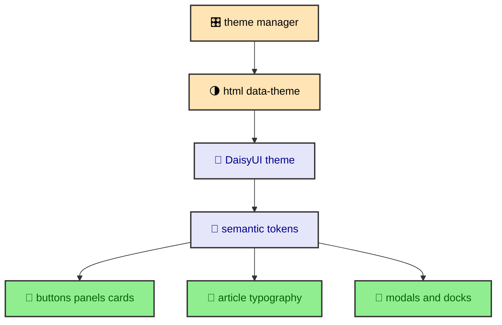

The site uses DaisyUI themes as the semantic color layer. Tailwind utilities still do most of the layout work, and Astro components still own markup, but component colors should come from shared theme tokens. That keeps light and dark mode from turning into two separate designs maintained by hand. The runtime changes one document attribute. The CSS token system handles the visual change.

---

## Why DaisyUI is the theme layer

DaisyUI already understands component states, semantic color names, and `data-theme`. That makes it a good place to define the site's light and dark palettes. Instead of writing custom CSS variables for every button, badge, panel, and modal, the site defines DaisyUI theme tokens and lets components use semantic classes. OKLCH is the color format used for those values because it makes perceived lightness easier to tune than raw hex.

The theme plugin appears in `_daisyui-themes.css` twice, once for `dark` and once for `light`. Each block names a theme, sets `color-scheme`, and defines the colors DaisyUI expects. The values use OKLCH, which makes perceptual lightness easier to reason about than raw hex values.

The theme manager does not need to know any OKLCH values. It sets `data-theme`. DaisyUI and CSS take over from there.

---

## Theme tokens

The dark theme defines base surfaces, base content, primary, secondary, accent, neutral, info, success, warning, error, border, glass fallback, and shadow opacity. The light theme defines the same vocabulary with different values. That symmetry is the important part.

Components can use `base-100`, `base-200`, `base-300`, `base-content`, `primary`, `secondary`, `accent`, and status tokens without asking which theme is active. A panel can use a base surface. A button can use primary. A warning can use warning. The meaning stays stable while the color values change.

The project also defines `--glass-bg-fallback` and shadow opacity values. These are not standard DaisyUI color names, but they belong near the theme because they change with the palette. A glass surface in dark mode needs a different fallback feel than a glass surface in light mode. A shadow that looks subtle on a light background can feel muddy on a dark one.

Using OKLCH helps keep lightness and contrast relationships intentional. The light and dark themes are not mirrored values. They are designed to feel related while meeting different background conditions.

---

## Tailwind bridge

`_tailwind-theme.css` defines the Tailwind v4 `@theme` block. It maps Astro font variables into Tailwind font roles, defines radius and size tokens, sets the standard easing curve, and defines shadow variables.

This bridge lets Tailwind utilities participate in the same design system as DaisyUI components. A component can use Tailwind for spacing, grid behavior, responsive constraints, and font roles while using DaisyUI for color semantics and component primitives.

The font mapping is especially useful. Astro registers Inter, Montserrat, and Fira Code. Tailwind receives those as `--font-sans`, `--font-display`, `--font-reading`, and `--font-mono`. Article typography, hero headings, code blocks, buttons, and metadata can choose a role rather than a font source.

The radius values also matter. `--radius-field` is tighter than `--radius-box`, and the selector radius is separate. That gives controls, panels, and selector-like elements their own geometry without hardcoding border radius values in every component.

---

## Component rule

The main component rule is simple. Use semantic DaisyUI tokens before raw colors. A component should usually reach for `bg-base-100`, `text-base-content`, `border-base-300`, `btn-primary`, `badge`, or a shared panel class. Raw hex or OKLCH values should live in the theme files or in a narrow SVG context where the markup itself requires them.

This rule prevents theme drift. Hardcoded colors often look acceptable in one theme and wrong in the other. They also make future palette changes harder because the color is no longer in the token system. The more components speak through tokens, the easier it is to tune the palette.

The same rule applies to opacity. A token-aware surface can use base colors with controlled opacity or shared glass treatment. A random translucent value inside a component can become unreadable against a different background. Shared treatment belongs in shared CSS.

The component rule is strict because the site already has several visual contexts. Homepage sections, journal articles, code blocks, diagrams, overlays, cards, docks, and navigation bars all need to feel related.

---

## Runtime connection

The runtime theme manager sets `html[data-theme]` to `light` or `dark`. DaisyUI reads that attribute. The CSS variables update. Components repaint through CSS. This is why the theme manager can stay small.

The manager also sets the browser `color-scheme` property. That lets browser-rendered UI align with the active theme. It updates the theme color meta tag so mobile browser chrome can follow the palette. During Astro route swaps, it applies the theme to the incoming document before the swap appears.

The theme files and runtime manager therefore form one system. CSS defines the visual vocabulary. JavaScript chooses the active vocabulary at the right time. Components do not need to carry conditional theme logic.

---

## Reading comfort

The journal makes theme quality visible because long articles expose weak contrast quickly. Paragraph text, inline code, code blocks, tables, Mermaid diagrams, sidebars, and pagination all appear in one reading session. If a token is too faint or too loud, the article surface reveals it.

That is why the base and content tokens matter as much as the accent colors. The primary color may carry identity, but the base surfaces carry the reading experience. A good theme lets readers stay with the article without noticing the theme mechanics.

---

## Theme and Mermaid

Mermaid diagrams have their own rendering pipeline, but they still participate in the theme system. The integration receives light and dark palettes from `astro.config.mjs`. It creates theme-specific SVG output. The runtime Mermaid shell watches `html[data-theme]` and updates the Open SVG link to the matching asset.

This is a good example of the document attribute acting as a shared contract. DaisyUI themes, Tailwind-aware CSS, browser chrome, and Mermaid asset links all respond to the same theme state. That keeps the site from having multiple competing definitions of light and dark.

Inline Mermaid SVGs and page CSS still need careful handling, which the Mermaid section explains in detail. The design point is simpler. Diagrams are part of the visual system, so they need theme-aware colors too.

---

## Surfaces and depth

The theme files define more than brand colors. They describe surfaces. `base-100`, `base-200`, and `base-300` give the site levels of background and separation. `base-content` gives text a stable foreground. Border tokens and shadow opacity help panels, cards, and modals sit on those surfaces without inventing new values.

This matters because the site has layered UI. The homepage has hero panels and Atlas glass cards. The journal has sidebars, docks, code blocks, diagram wrappers, and pagination cards. Overlays sit above the page. Each of those surfaces needs to feel related while still having enough separation to be usable.

The dark theme uses darker base values and stronger shadow opacity. The light theme uses lighter base values and different fallback glass behavior. The point is not to copy a color from one theme into another. The point is to preserve hierarchy.

---

## Status colors

The themes also define info, success, warning, and error colors. Even if the current site does not use every status token heavily, keeping them in the palette matters. Alerts, badges, validation messages, and future state indicators should not invent their own status colors.

Status colors need content colors too. A warning surface needs warning content. An error surface needs error content. DaisyUI's token model encourages that pairing. It keeps the foreground and background relationship visible at the theme level.

This is another reason OKLCH is useful. Status colors can be tuned for perceptual contrast rather than only for brand preference. A warning should stand out in both light and dark contexts, but it should not overpower the whole page.

---

## Avoiding local palettes

A local palette is tempting when building a one-off component. It feels faster to choose a color that looks good in the current viewport. The problem appears later when theme changes, surrounding surfaces, or reused components expose the mismatch.

The site avoids that by treating the theme as the place where color decisions belong. If a component needs a new recurring visual role, the right question is whether the token system needs a new value or whether an existing token already expresses the role. If the need is truly local, the rule should still be narrow and documented by its file placement.

That habit keeps the design system flexible. A future palette adjustment can happen in theme files instead of through a search across every Astro component.

---

## The build lesson

DaisyUI gives the site a semantic component color layer. Tailwind gives it utility composition and font roles. OKLCH tokens give the palettes controlled lightness. Astro fonts feed the Tailwind theme. The runtime manager activates the theme through one document attribute.

That stack keeps the authoring experience direct. Components can use familiar classes without carrying palette logic. The visual system can evolve by changing tokens. Light and dark mode stay connected because they share the same semantic vocabulary.
