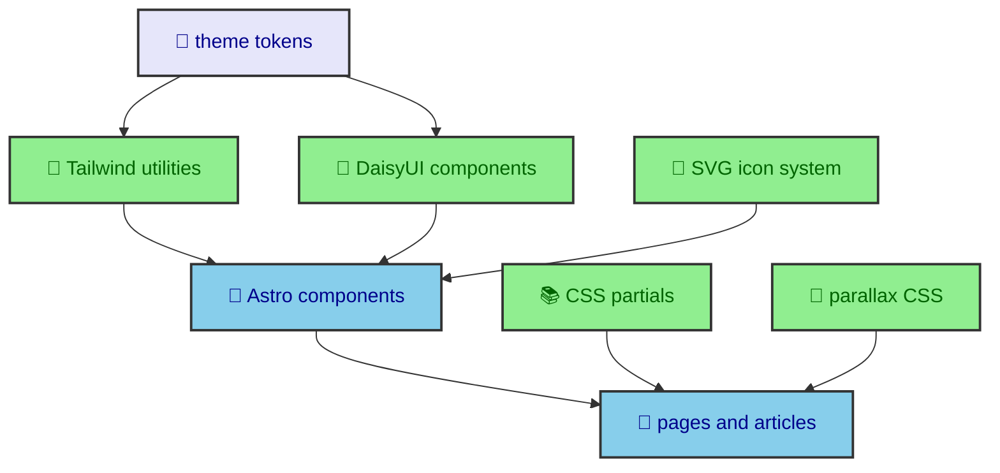

The design system is not one file or one framework. It is the agreement between Tailwind tokens, DaisyUI themes, ordered CSS partials, Astro components, SVG helpers, parallax layout, and publication typography. This section explains how those pieces work together so the site can feel visually consistent without turning every component into a private design island.

---

## The design stack

The site uses Tailwind 4 for utility-driven layout, DaisyUI 5 for a constrained component vocabulary, custom DaisyUI themes for semantic color, Astro components for reusable structure, and CSS partials for the rules that should not be repeated in markup. Each layer has a different job.

Tailwind is strongest at spacing, layout, responsive behavior, and quick component composition. DaisyUI is strongest at recognizable interface primitives such as buttons, cards, badges, menus, modals, swaps, tables, and links. The custom theme files define the visual meaning behind those components. Astro components hold markup contracts. CSS partials provide shared rules for article typography, code blocks, panels, diagrams, parallax, and page-specific layout.

The diagram matters because it shows that the design system is layered, not flat. A button is not only a class string. It is DaisyUI behavior, theme tokens, utility layout, component markup, focus state, and runtime context when it opens an overlay. A journal article is not only MDX content. It is rendered typography, heading anchors, code blocks, diagrams, sidebars, mobile docks, and responsive width rules.

---

## Tokens first

The core design rule is to use semantic tokens before local overrides. The project defines light and dark DaisyUI themes in OKLCH. Those themes provide base surfaces, content colors, primary, secondary, accent, neutral, status colors, borders, glass fallback, and shadow values. Tailwind-facing variables then map fonts, radii, sizing, easing, and shadow behavior.

This keeps components from hardcoding colors. A component should usually say that it needs a base surface, primary action, secondary accent, border, muted content, or reading font. It should not usually decide that a specific hex value belongs in one isolated file. The theme is the shared vocabulary. Components speak that vocabulary through utilities and DaisyUI classes.

Tokens are also what make light and dark mode feel like one design instead of two separate sites. The runtime manager switches `html[data-theme]`, DaisyUI applies the correct theme, and components continue using the same semantic names. A card does not need a light version and a dark version. It needs to use the right token.

The same rule applies to typography. Astro's font configuration registers Inter, Montserrat, and Fira Code. `_tailwind-theme.css` maps those sources into `--font-sans`, `--font-display`, `--font-reading`, and `--font-mono`. Components choose the role. The font source remains centralized.

---

## CSS as an ordered manifest

`global.css` is intentionally an import manifest. It starts with Tailwind, includes DaisyUI's selected components, imports theme tokens, then loads base rules, utilities, shared styles, layout styles, UI styles, and page-specific styles. The order is part of the design system.

Theme tokens have to exist before components reference them. Base and transition rules have to be available before page-specific styling. Utility classes and JavaScript state helpers need to be shared before individual layouts use them. Journal article rules should come after shared UI partials because article pages specialize typography, navigation, diagrams, and docks.

This ordering prevents a common CSS problem where the newest file wins only because it was imported last by accident. The site still uses the cascade, but it makes the cascade legible. If a rule belongs to the journal article layout, it goes under the journal article partials. If a rule belongs to all panels, it belongs in a shared or primitive partial. If a rule is a one-off page treatment, it should stay near that page's partial.

The CSS architecture article expands this import order and explains the main partial groups.

---

## Component vocabulary

The component vocabulary is intentionally modest. DaisyUI is configured with an include list instead of loading everything. The list includes components the site actually uses, such as buttons, cards, navbar, swap, badge, menu, dropdown, timeline, mockup, footer, modal, join, alert, link, table, and textrotate.

That list affects visual consistency. If every component library primitive were available, new UI work could drift into a different style without much friction. A constrained list nudges the site toward familiar shapes. Buttons look like buttons. Modals share a pattern. Badges, menus, and cards use the same token system.

Astro components add the project-specific vocabulary on top. `OverlayPanel.astro` defines reusable dialog structure. `SVGIcon.astro` renders local icons. `ParallaxHero.astro` defines a scroll-linked visual section. Journal article components handle sidebars, mobile docks, publication headers, breadcrumbs, and pagination. The components should feel like local building blocks, not wrappers around every possible style option.

That restraint is a design decision and a maintenance decision. A smaller vocabulary is easier to theme, easier to test visually, and easier for future writing to reuse.

---

## SVG and imagery

The site avoids an icon font and keeps SVG control local. `src/data/icons.ts` gathers skill icons loaded from disk, inline UI icons, and social icons. `SVGIcon.astro` renders them with accessible titles when the icon has text and `aria-hidden` when it is decorative. The ribbon helper can compress repeated SVG content, scope IDs, and generate pattern data for decorative strips.

This matters because the icons are not only small UI symbols. They appear in skill sections, social links, article metadata, dock buttons, and decorative ribbon backgrounds. Keeping the source local makes those uses inspectable and lets the site reuse SVG markup in more than one visual context.

Images follow a similar principle. Astro's image service prepares transformed assets, but components decide meaning and loading priority. Publication images carry article identity. Journal cards preview entries. The Atlas background is decorative and crop-sensitive. The design system does not treat all images as interchangeable rectangles.

The SVG icon article and image performance article explain those asset choices from different angles.

---

## Motion with restraint

Motion exists, but it is scoped. `ParallaxHero.astro` and `_parallax.css` provide CSS scroll-timeline parallax for sections where depth is part of the composition. The effect is decorative. It is guarded by `@supports` and `prefers-reduced-motion`, and it does not require JavaScript.

That is the general motion rule. Movement should support orientation or visual depth. It should not become the main content. Astro page transitions use a quiet fade on the main region. Theme switching suppresses transitions during route swaps so colors do not animate accidentally. Overlay panels focus on clarity, not spectacle.

The parallax article explains how the CSS timeline is built and why the effect belongs in layout CSS instead of a runtime scroll handler.

---

## MDX as a design surface

The journal is one of the main reasons the design system has to be disciplined. MDX authors should be able to write normal headings, code fences, tables, block content, and Mermaid diagrams. The build and CSS layers then turn those plain structures into the site's visual language.

That is why article typography, heading anchors, code blocks, prose tables, and diagram wrappers live in shared MDX or journal partials. They are not left to each article. A publication about deployment and a publication about CSS should both receive the same reading rhythm. Their diagrams should share the same wrapper behavior. Their code blocks should use the same line number and theme treatment.

This keeps writing and design separate in a healthy way. The author chooses structure and meaning. The site chooses presentation. When the design changes, the articles can improve together because they share the same rendering path.

---

## What makes it local

The design system borrows from Tailwind and DaisyUI, but the final result is local to this site. The OKLCH palette, Atlas section, icon ribbons, publication header, article sidebars, mobile dock, Mermaid shell, and glass panels are project choices. The frameworks provide tools. The site defines taste and behavior.

That distinction matters for future work. Adding a new feature should not mean adding an unrelated visual language. It should mean asking how the feature fits the local stack. Does it use existing tokens? Does it reuse an existing component? Does it belong in a shared partial or a page partial? Does the motion need JavaScript, or can CSS own it?

Those questions keep the design system from becoming a wrapper around frameworks. It remains a set of decisions about this website.

---

## Reading path

The design section has five focused articles.

`css_architecture` explains why `global.css` is an ordered manifest and how the partial groups relate to each other.

`daisy_theming` explains DaisyUI 5 themes, OKLCH token choices, Tailwind variable mapping, and why semantic tokens keep light and dark mode consistent.

`svg_icons` explains the local SVG system, the accessible icon primitive, file-loaded skill icons, inline UI icons, and compressed ribbon backgrounds.

`parallax_css` explains how CSS scroll timelines create depth without a JavaScript scroll loop.

`ui_style_guide` explains the implementation rules that keep new UI work aligned with the existing system.

Together, those pages describe a design system that is practical rather than ornamental. It is built from tokens, components, partials, and asset rules that keep the site readable, flexible, and recognizably itself.
