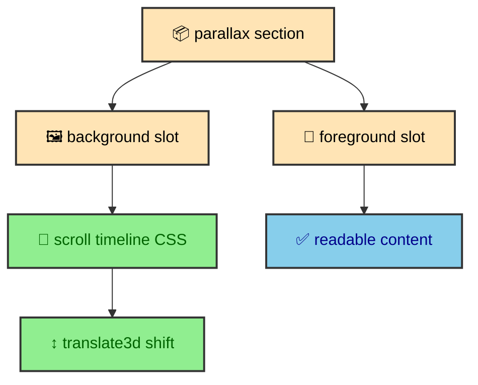

The parallax system uses CSS instead of JavaScript. That choice keeps motion close to layout, lets the browser own scroll timing, and gives the design a clear fallback path. The effect is decorative, so it must disappear gracefully when the platform or reader preference asks for less motion. The content should still read as a composed section even when the background does not move.

---

## Component shape

`ParallaxHero.astro` is intentionally small. It renders a section with `parallax-container`, an absolutely positioned background wrapper, a `parallax-bg-content` element that receives the background slot, and a foreground content container constrained to the site's wide layout.

The component does not import a runtime module. It does not watch scroll events. It does not calculate transforms in JavaScript. It only provides the markup structure that `_parallax.css` expects.

The component is a good example of the project's layout philosophy. Astro defines structure. CSS defines visual behavior. JavaScript only appears when the behavior genuinely needs browser state beyond what CSS can express.

---

## CSS timeline

`_parallax.css` gives `.parallax-container` a `view-timeline-name` and `view-timeline-axis`. The background wrapper is absolute, fills the section, disables pointer events, and hides overflow. The background content is positioned with `top: -10%` and `height: 120%`, giving it enough extra area to move without exposing empty space.

When the browser supports scroll timelines and the reader has not requested reduced motion, `.parallax-bg-content` receives a linear animation named `parallax-shift`. The animation uses `animation-timeline: --parallax` and `animation-range: cover 0% cover 100%`. The keyframes move from `translate3d(0, -10%, 0)` to `translate3d(0, 10%, 0)`.

The important detail is that the animation is tied to the element's view timeline. The browser connects scroll progress to animation progress. There is no custom scroll listener, no throttling, no manual requestAnimationFrame loop, and no runtime state to clean up during Astro route swaps.

`translate3d` and `will-change: transform` are used only inside the supported, no-reduced-motion branch. The CSS asks for compositor-friendly motion where the feature exists and avoids carrying motion hints when motion is disabled.

---

## Fallbacks

The parallax behavior is guarded by `@supports (view-timeline-name: --x)`. Browsers without scroll timeline support still render the section with its background and foreground content. They simply do not receive the scroll-linked movement.

Reduced motion has its own branch. Under `prefers-reduced-motion: reduce`, `.parallax-bg-content` disables animation, sets `top: 0`, restores `height: 100%`, clears transforms, and removes `will-change`. The background becomes a normal static layer.

That fallback is not a compromise. It is the correct behavior because parallax is decorative. The site should not require motion to communicate the section. The Atlas widget still shows the match data. The foreground content still sits above the background. The page still has a visual identity.

This is the pattern motion should follow throughout the site. Motion can enrich layout, but it should not become a dependency for reading or navigation.

---

## Atlas usage

The Atlas homepage section is the most visible use of the parallax component. `AtlasStats.astro` passes a responsive `<picture>` into the background slot. It generates mobile and desktop AVIF and WebP variants with `getImage()`, then lets the picture fill the parallax background layer.

The content slot contains the Atlas logo, metric panels, match details, and modal trigger. Those elements sit in the foreground container with a maximum width and responsive spacing. The parallax background adds depth behind them without affecting the data structure.

This division keeps the component flexible. The parallax wrapper does not know about soccer data, glass panels, or images. The Atlas component does not know about scroll timelines. It only passes the right content into the right slots.

The background image uses empty alt text and `aria-hidden="true"` because it is decorative. That detail matters. The image participates in mood and layout, not in the information hierarchy. The match data and logo carry the meaningful content.

---

## Decorative icon backgrounds

The same layout idea appears in icon ribbon backgrounds. The project can generate decorative SVG strips from local icons and place them as visual texture behind foreground content. Those backgrounds should follow the same rule as parallax images. They can add depth and identity, but they should not carry essential information.

Because the icon ribbon helper scopes IDs and compresses SVG content, the site can reuse icons as decoration without turning every strip into a heavy asset. The visual system stays connected to the same source icons used in UI, but the accessibility role changes.

This is one of the reasons the design system keeps SVG local. Decorative motion, masked strips, and accessible UI icons can share source material while being rendered with different contracts.

---

## Relationship to performance

The parallax effect is designed so it does not add a runtime script. That keeps the performance story consistent with the rest of the site. Images are optimized during the build. CSS owns the scroll-linked movement. The browser can skip the animation entirely when support or preference says it should.

The section still needs sensible image choices. A huge background file would make the CSS approach less valuable. That is why the Atlas section prepares responsive AVIF and WebP sources and marks the decorative background as lazy with low fetch priority. The visual effect and asset strategy work together.

---

## Relationship to content

Parallax should never be the only thing making a section meaningful. In the Atlas section, the content is the logo, match data, location, and story trigger. The background supports that content emotionally. The foreground still works if the background is static, late, or simplified.

This rule keeps the effect honest. The website can use motion for depth, but the publication and interface layers still carry the message.

---

## Why CSS owns this

Scroll-linked visual effects can become expensive when implemented as JavaScript. A script has to listen to scroll, read positions, calculate progress, write transforms, and clean up across page transitions. CSS scroll timelines let the browser own that relationship declaratively.

CSS is also closer to the rest of the layout rules. The parallax container, background wrapper, overflow behavior, object fit, object position, reduced motion branch, and keyframes all live in one partial. A maintainer can understand the entire effect without jumping between component markup and runtime code.

The result is a smaller runtime and a clearer design system. Motion belongs to layout CSS when it is purely visual. Runtime code remains available for interactions that CSS cannot own, such as focus traps, theme persistence, or scroll-aware article navigation.

---

## Background geometry

The oversized background content is the trick that makes the movement safe. The element starts at `top: -10%` with `height: 120%`. The animation moves it from negative ten percent to positive ten percent. Because the content is taller than the visible section, it can move without exposing blank edges.

The wrapper hides overflow, so the reader only sees the section frame. The background content fills the width and height of the oversized area. Images inside a picture use `object-fit: cover` and centered object position. That gives the component a predictable visual crop while still allowing the movement.

This geometry also explains why the component should receive decorative backgrounds. If an image contains essential information near the edges, parallax movement and cover cropping could hide it. The foreground slot should carry the real content. The background slot should carry atmosphere.

---

## Authoring contract

`ParallaxHero.astro` has two slots. The `background` slot is for a visual layer. The default slot is for readable foreground content. That contract keeps authors from mixing content into the moving layer.

In the Atlas section, the background slot receives a responsive picture. The default slot receives the logo, stats, teams, stadium, and modal trigger. The reader can understand the section from the foreground content even if the background is static or absent.

Future parallax sections should follow the same pattern. The background can be a generated image, a responsive picture, or a decorative SVG treatment. The foreground should contain the heading, text, controls, and data. If the foreground depends on the background to be understandable, the section is using parallax for the wrong job.

---

## Interaction boundaries

The parallax wrapper sets `pointer-events: none` on the background layer. This prevents the decorative layer from intercepting clicks, taps, or text selection. Foreground content remains the interactive surface.

The section also uses `isolation: isolate`, which helps keep stacking behavior contained. The background sits at a lower layer, and the foreground content sits above it. That matters when the page contains panels, buttons, modal triggers, and other interactive elements.

These details make the effect feel simple to use. The reader does not need to know the background is moving. Links and buttons behave like normal foreground controls. The decorative layer stays decorative in both visual and interaction terms.

---

## Keep content outside motion

Parallax on this site is a progressive visual layer. Astro provides a slot-based section. CSS defines the scroll timeline and fallback behavior. Image components provide optimized background assets. Reduced motion removes the movement cleanly. The browser gets a composed section whether or not the animation runs.

That balance is the point. The site can have depth and personality without making motion a runtime burden or an accessibility requirement.
