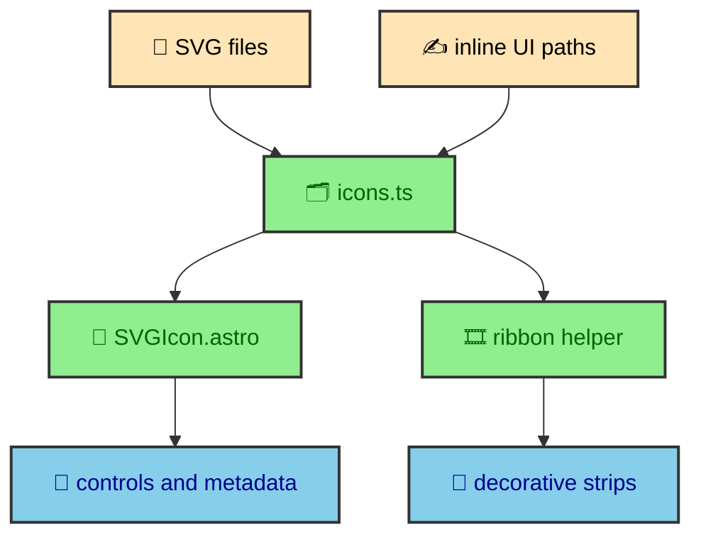

The project avoids icon fonts and a general-purpose icon package. SVG, or Scalable Vector Graphics, stores shapes as markup instead of pixels, which makes it useful for icons, diagrams, masks, and decorative patterns. Icons are loaded from disk or defined inline, then rendered through a small Astro primitive. That keeps the system inspectable and gives the site control over accessibility, sizing, stroke behavior, repeated patterns, and decorative backgrounds.

---

## Icon data

`src/data/icons.ts` is the source map. It exports skill icons, UI icons, and social icons. Skill icons are loaded from SVG files in `src/assets/icons` with a helper that reads the file, extracts the inner SVG content, and stores it with a label and viewBox. UI icons are defined inline because they are small and project-specific. Social icons are also defined as SVG content.

This structure keeps components from reaching into the filesystem directly. A component imports an icon definition and passes it to `SVGIcon.astro`. The data file owns where the SVG came from. The primitive owns how it is rendered.

The split also makes it clear which icons are content-like and which are decorative. A skill icon has a label such as JavaScript, Astro, TypeScript, Docker, or Python. A chevron used only as a visual control can be hidden from assistive technology if the surrounding button already has a label.

---

## The SVG primitive

`SVGIcon.astro` accepts an `Icon` object and optional overrides for ID, class, width, height, stroke, label, and stroke width. It chooses width and height from overrides first, then from the icon definition, then defaults to 24. It chooses fill, stroke, line cap, and line join from the icon definition or sensible defaults.

The accessibility behavior is built into the primitive. If the icon has text or an explicit label, the SVG receives `role="img"` and a `<title>`. If there is no text, the SVG receives `aria-hidden`. That means decorative icons stay quiet, while meaningful icons announce themselves.

The primitive renders the inner SVG through `set:html`. That is why the data file stores the extracted inner content. The wrapper controls the outer SVG attributes, while the icon definition controls the paths, groups, and shapes inside.

This gives components a stable rendering path. They do not need to remember how to set `viewBox`, how to hide decorative icons, or how to title meaningful ones. They pass an icon and choose the local size or class they need.

---

## File-loaded skill icons

Skill icons come from disk because they are larger and more likely to be maintained as individual SVG assets. The helper reads the file, extracts the content between `<svg>` and `</svg>`, and stores it in the `skills` map with a label and viewBox.

The result is a local asset pipeline without a sprite generator. The build can import the data file, Node can read the source SVG files, and Astro can render the content where needed. The icons remain easy to inspect in the repository.

This approach also keeps the project independent from icon font loading. Icon fonts are convenient, but they are the wrong shape for a site that already uses SVG as an expressive material. SVG can carry fills, strokes, gradients, masks, and viewBoxes directly. It can be used as an accessible image, an inline control symbol, or a repeated decorative pattern.

The data file logs a clear error if an SVG file cannot be read and returns empty content. The important design point is that components still rely on the icon map rather than making their own file reads.

---

## Inline UI icons

UI icons are small enough to define inline in `icons.ts`. The map includes sun, moon, folder, external link, menu, calendar, tag, back arrow, clock, toggle arrows, vault, On This Page, link, and check icons. Many of these are simple paths or lines with `currentColor`.

Using `currentColor` lets icons inherit text color from the surrounding component. That keeps the theme system in charge. A button icon, metadata icon, dock icon, or heading anchor icon can follow the same token-driven color as the label around it.

Some icons include stroke width, line cap, line join, fill, width, or height defaults. Those properties belong in the icon definition when they describe the icon's natural drawing style. Components can override them when a local context needs a different size.

The inline map also makes UI icons discoverable. A contributor can see the available project vocabulary in one place instead of searching installed packages.

---

## Ribbons and decorative backgrounds

`generateRibbonSVGData()` turns icon definitions into repeated SVG pattern content. It calculates total width and height from icon size, gap, and vertical padding. It creates a short random instance ID, scopes inner IDs, rewrites URL references, and compresses SVG content before returning `innerContent`, `svgWidth`, and `svgHeight`.

The ID scoping is important because repeated SVGs can contain gradients, masks, clip paths, or other references. If several copies share the same ID, references can collide. The helper prefixes IDs for each icon instance and rewrites references such as `url(#id)`, `xlink:href="#id"`, and `href="#id"`.

The compression step removes comments, rounds decimal numbers to a small precision, collapses whitespace, and trims content. This is not a universal SVG optimizer. It is a targeted helper for a known use case. Decorative icon ribbons should be compact, repeatable, and safe from ID collisions.

`StripBackground.astro` can then use the generated data for animated or masked icon strips. This is why keeping SVG local is useful. The same icon source can serve UI meaning in one place and decorative rhythm in another.

---

## Accessibility rule

The icon system separates meaning from decoration. If an icon communicates meaning by itself, it needs a label. If it only supports a labeled button or decorative background, it should be hidden from assistive technology.

`SVGIcon.astro` makes that rule easy, but components still need to choose labels thoughtfully. A menu button should have an accessible button label. The icon inside can be decorative. A social icon link can use the icon label if the icon is the visible name. A repeated ribbon should be hidden because it is visual texture.

This keeps icons from adding noise to the accessibility tree. It also keeps visual affordances available to sighted users without making screen reader users listen to every decorative symbol.

---

## Why no icon package

An icon package would make it easy to import many symbols, but the site does not need a large icon catalog. It needs a small set of icons that match the local UI and can also become decorative material. A package would add another dependency and another naming vocabulary while most of the project-specific value still lives in how the icons are rendered.

Local SVG also keeps visual changes explicit. If a UI icon needs a different stroke width, label, viewBox, or default size, that decision lives in `icons.ts`. If a skill icon asset changes, the source SVG changes in `src/assets/icons`. The design system does not depend on a package update to understand its own symbols.

This does not mean external icons are always wrong. It means this site has a small enough icon surface that local ownership is simpler and more expressive.

---

## Icons as build input

Because `icons.ts` reads SVG files with Node APIs, the icon map is part of the build-time environment. Astro can import the data and render SVG content into pages. The source assets remain files, but components receive normalized icon objects.

That makes icons similar to other build inputs. MDX becomes article HTML. Mermaid fences become SVG diagrams. Image files become transformed assets. SVG icon files become icon definitions that the design system can render, label, or repeat.

This model gives the site a single place to evolve icon behavior. If the primitive needs a new accessibility rule or default, it can change once. If decorative ribbons need a different compression precision or ID scoping pattern, the helper can change once. Components remain focused on where the icon appears.

---

## Theme behavior

Most UI icons use `currentColor`, which means they follow the text color of their container. That is the simplest way to make icons theme-aware. A button icon follows the button content color. A metadata icon follows muted text. A heading anchor follows the article link treatment.

Full-color skill icons are different. They represent technology logos, so they keep more of their original SVG identity. The icon system can support both styles because the icon definition controls fill and stroke defaults while the primitive controls the wrapper.

This lets the design use icons as both semantic UI and recognizable brand imagery without forcing one rendering rule onto every SVG.

---

## The build lesson

The SVG system is small because it is local. Icons live in a typed data map. A primitive renders them consistently. File-loaded skill icons and inline UI icons share one shape. Ribbon helpers reuse the same source material for decorative backgrounds while scoping IDs and compressing content.

That gives the site enough control to make icons feel integrated. They follow theme color through `currentColor`, carry labels when meaningful, stay quiet when decorative, and remain useful beyond simple buttons.
