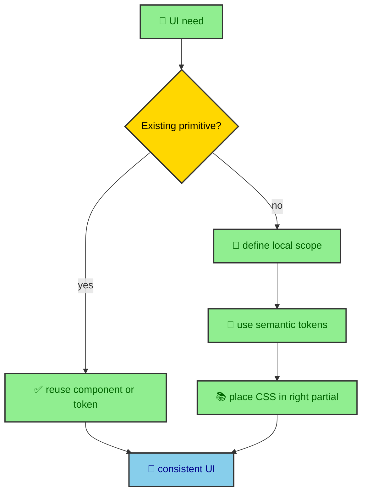

The style guide is less about taste and more about keeping the system coherent. A site with themes, view transitions, overlays, responsive sidebars, MDX content, Mermaid diagrams, code blocks, and visual homepage sections can drift quickly if every component invents its own rules. This page describes the implementation habits that keep new UI work aligned with the way the site is built.

---

## Start from the existing system

New UI should begin with the existing vocabulary. Use Tailwind utilities for layout and spacing. Use DaisyUI primitives when the site already includes the component type. Use theme tokens for color. Use Astro components such as `OverlayPanel`, `SVGIcon`, `GlassPanel`, and `ParallaxHero` when the interaction or structure matches.

The goal is not to force every element into a prebuilt shape. The goal is to avoid accidental forks of the design system. A second modal pattern, a second icon renderer, a second panel style, or a hardcoded color palette creates long-term work. A local component should earn its uniqueness.

This is how the site stays personal without becoming inconsistent. The visual system can evolve, but it evolves through shared pieces.

---

## Color and typography

Prefer semantic DaisyUI tokens over raw colors. Components should usually express surfaces, content, borders, primary actions, secondary accents, and status states through token-backed classes. Raw colors belong in theme files or in narrow SVG contexts where the markup requires them.

Typography should use the font roles exposed through Tailwind. Body and interface text use the sans or reading roles. Headings and display moments can use the display role. Code uses the mono role. Components should not hardcode font family strings when the theme already provides variables.

Spacing should follow the surrounding component language. A compact dock control should not use hero-scale type. A dense article sidebar should not use card-like marketing spacing. A homepage section can breathe more than a code block toolbar. The same tokens can support different densities when the component context is respected.

This rule helps the journal most. Articles need calm reading rhythm. Code blocks need dense clarity. Navigation panels need quick scanning. The homepage can be more expressive. A shared design system does not mean every region has the same density.

---

## Responsive behavior

Responsive behavior should follow existing breakpoints and content constraints. The journal layout waits until the content column can remain readable before showing sidebars. The mobile dock appears when the sidebars are hidden. The Atlas section changes from stacked content to wide layout at larger widths. The profile skills grid waits until desktop width before using three columns.

New UI should respect that pattern. Do not add a sidebar, panel, or grid that steals width from the article column at awkward breakpoints. Do not rely on text shrinking with viewport width. Do not let buttons or labels overflow their containers. Use stable dimensions, grid tracks, wrapping rules, and max widths so UI elements keep their shape.

The site uses responsive design to protect reading, not only to rearrange decoration. A breakpoint should make the content easier to use at that size. If a component becomes cramped, it should simplify, stack, hide a secondary surface, or move into an overlay.

This is why article navigation has both desktop and mobile forms. The same content can be a sidebar on wide screens and an overlay panel on smaller screens. The content contract stays the same while the layout changes.

---

## CSS placement

Do not add one-off rules to `global.css`. That file is the import manifest. New CSS should live in the partial that matches its responsibility.

Shared treatments belong under `src/styles/shared/`. Layout-level patterns belong under `src/styles/layout/`. Reusable UI primitives belong under `src/styles/ui/`. MDX-specific rules belong under `src/styles/ui/mdx/`. Journal article rules belong under `src/styles/thejournal/article/`. Page-specific rules belong under that page's style folder.

This placement rule keeps the cascade readable. A future maintainer should be able to find a rule by asking what kind of thing it styles. If a rule is hard to place, the design may need a clearer component boundary before it needs new CSS.

CSS should also stay token-aware. A partial can define layout, spacing, borders, focus states, and typography, but it should still draw color from the theme system. Page-specific CSS should specialize the shared system, not bypass it.

---

## Icons and controls

Use `SVGIcon.astro` for local icons that need consistent rendering. Pick labels intentionally. If the icon is the only visible name, give it a label. If the surrounding button or link already has a clear label, hide the icon from assistive technology. Decorative SVG ribbons should stay hidden.

Controls should use recognizable symbols where a symbol is the standard interaction. A close button can use a close icon. A menu button can use the menu icon. A heading anchor can use the link icon. The visible text around a control should match the action and avoid explaining implementation details.

Buttons should be reserved for actions. Links should be used for navigation. Label-based controls in overlays need keyboard activation through the overlay runtime. Toggle inputs should stay synchronized with document state when they represent global behavior, as the theme toggle does.

This keeps interaction language consistent. A reader should not have to learn a different control grammar on each page.

---

## Overlays and layers

Use `OverlayPanel` for dialogs and mobile article panels. It provides the required label contract, DaisyUI modal structure, close controls, scroll region, and runtime enhancement. Avoid ad hoc modals unless the existing primitive truly cannot express the design.

Layering should stay predictable. Header, mobile dock, overlays, article content, and parallax backgrounds each have a role. Overlays render outside `<main>` through the layout slot so they are not trapped inside the page transition region. Parallax backgrounds are pointer-disabled and decorative. Article sidebars should not cover the reading column.

Focus states need to be visible. Keyboard users should be able to open, use, and close interactive surfaces. Runtime behavior can trap focus in a dialog, but the component still needs semantic controls and labels. CSS should not remove focus indicators without replacing them with an equally clear treatment.

---

## MDX content rules

MDX content should stay author-friendly. Authors write headings, paragraphs, code fences, tables, and Mermaid diagrams. The rendering pipeline and CSS partials turn those into the site's visual system. Authors should not need to hand-code article layout wrappers for normal publication content.

Code fences should use language tags where possible so Shiki can highlight them and the CodeBlock wrapper can present them consistently. Tables should be ordinary markdown tables and let the prose table partial handle overflow. Mermaid diagrams should remain Mermaid code fences so the build integration can render and wrap them.

This keeps publication content portable. The more article-specific HTML an author writes, the more the article depends on current component internals. MDX should be expressive, but the system should do the repetitive presentation work.

---

## Component boundaries

A component should own markup and local composition. It should not own global theme policy, unrelated CSS resets, or page-wide runtime state. `ThemeToggle.astro` renders the control while `theme_manager.ts` owns persistence. `OverlayPanel.astro` renders the dialog structure while `overlay-panel.ts` owns focus and scroll behavior. `ParallaxHero.astro` renders slots while `_parallax.css` owns motion.

Those boundaries keep components readable. When a component starts importing many unrelated helpers, defining global CSS, and handling document events, it is probably crossing responsibilities. The site works best when structure, style, and runtime state have clear homes.

---

## New UI checklist

Before adding a new UI pattern, walk through the same set of questions. Can an existing component express it? Can DaisyUI provide the base primitive? Which semantic tokens describe the color? Which CSS partial owns repeated styling? Does the feature need runtime behavior, or can HTML and CSS handle it? What happens on mobile? What does keyboard focus do? Is the icon meaningful or decorative?

The checklist is not ceremony. It is how the site keeps future work from becoming accidental one-offs. Each answer points to an existing layer of the system. When no layer fits, that is a sign the design system may need a new primitive rather than another local exception.

---

## Review a new surface

The UI style guide is the practical face of the design system. Use semantic tokens. Reuse local primitives. Put CSS in the right partial. Respect responsive reading constraints. Keep icons accessible. Use overlays through the shared component. Let MDX authors write content while the build and style system handle presentation.

Those habits keep the site coherent as it grows. They also make the codebase easier to teach, because the visual rules are tied to the way the website is actually built.
