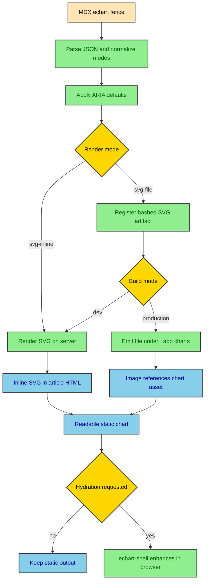

The ECharts implementation is deliberately smaller than the Mermaid one. It does not need a remote browser renderer because ECharts can render SVG on the server. The hard part is not getting pixels onto the page. The hard part is keeping charts static by default, accessible in MDX, cacheable when needed, and interactive only when the article asks for it.

---

## The fence boundary

The `echart` code fence is the author-facing boundary. A publication passes strict JSON with a chart type, data, dimensions, text metadata, and optional render or hydration preferences. The integration normalizes those values before anything reaches the renderer.

````md
```echart
{
  "type": "line",
  "figure": {
    "title": "Quarterly revenue",
    "caption": "USD, trailing four quarters",
    "description": "Line chart showing quarterly revenue rising from Q1 to Q4."
  },
  "size": { "width": 760, "height": 420 },
  "data": {
    "x": ["Q1", "Q2", "Q3", "Q4"],
    "y": [12.4, 14.2, 16.1, 18.7],
    "name": "Revenue"
  }
}
```
````

The important fields are the same ones the publication guide calls out. `type` and `figure.description` are required. `size.width` and `size.height` stay explicit when an article needs non-default dimensions. `figure.title`, `figure.caption`, and `figure.description` keep the figure readable and accessible. `render` chooses inline SVG or a file artifact. `hydrate` decides whether the browser should enhance the static output.

---

## Static rendering flow

The flow starts in MDX and ends with either inline SVG or an SVG file reference. The chart is content before it is interaction.



The diagram is simpler than Mermaid because ECharts already owns its SVG renderer. The project does not have to batch remote requests or merge light and dark SVG variants. It has to decide where the SVG lives and whether the browser should replace it with a live chart instance.

---

## Server-side SVG

`src/integrations/echarts/server.ts` renders the SVG. It validates positive dimensions, registers ECharts modules, initializes ECharts with the SVG renderer and `ssr: true`, sets the option, calls `renderToSVGString()`, and disposes the chart instance.

```ts
const chart = echarts.init(null, theme ?? null, {
  renderer: "svg",
  ssr: true,
  width,
  height,
});

try {
  chart.setOption(option);
  return chart.renderToSVGString();
} finally {
  chart.dispose();
}
```

The module registry in `registry.ts` keeps the bundle intentional. It registers line, bar, boxplot, pie, scatter, candlestick, heatmap, treemap, Sankey, custom series, the components those charts need, and the SVG renderer. The site does not import the entire ECharts surface for every chart.

`withChartAriaDefaults()` also lives beside the server renderer. It turns the MDX description into ECharts ARIA metadata while still letting the prop-level `aria` override win. That makes accessibility part of rendering instead of an afterthought on the wrapper.

---

## Inline SVG and file artifacts

Inline SVG is the default because article charts are usually part of the immediate explanation. The generated SVG sits inside `.echart-surface` with `role="img"` and an accessible label. A no-JS reader still gets the chart.

File artifacts use `src/integrations/echarts/artifacts.ts`. The artifact hash includes the render kind, renderer version, ECharts package version, option, dimensions, theme, and optional cache key. The output path is `/_app/charts/{hash}.svg`.

During development, `registerEChartSvgArtifact()` returns inline SVG even when the component asks for `svg-file`. That keeps local authoring smooth because the developer does not need a full artifact pass to see a chart. During `astro build`, `echartsIntegration()` enables build mode, collects registered assets, and emits them at `astro:build:done`.

This is the main reason ECharts has an Astro integration at all. The component can render inline SVG by itself, but file artifacts need build-scoped collection and emission.

---

## Hydration rules

Hydration is handled by `src/integrations/echarts/component.ts` and `src/runtime/elements/echart-shell.ts`. The component normalizes the mode first, then the custom element schedules enhancement in the browser.

The supported modes are practical.

| Mode      | Behavior                                                      |
| --------- | ------------------------------------------------------------- |
| `none`    | Keep the static SVG and ship no chart client behavior.        |
| `load`    | Enhance as soon as the shell connects.                        |
| `idle`    | Wait for `requestIdleCallback` when available.                |
| `visible` | Wait for an intersection observer with a `200px` root margin. |
| `media`   | Wait until the supplied media query matches.                  |

The deferred modes are explicit too. `render="png-file"` and `hydrate="light"` throw clear errors because the project is not carrying those workflows yet. That is better than accepting props that look supported but produce incomplete output.

---

## Client option safety

Enhanced charts need their options serialized into HTML data attributes. That means `clientOption` has stricter rules than the static server option. It must be JSON-compatible, with finite numbers, plain objects, arrays, strings, booleans, and null values. Functions, symbols, `BigInt`, `undefined`, circular references, and non-finite numbers are rejected.

This is why the component accepts `optionClientPreset`. Some useful browser formatters are functions, but functions cannot safely cross the MDX-to-data-attribute boundary. The preset system rebuilds known callbacks on the client for currency, percent, and finance OHLC tooltips.

The split is intentional. Static rendering can accept richer ECharts options because it runs inside the build. Browser enhancement needs a serializable contract because the option travels through markup.

---

## Runtime enhancement

`echart-shell` does not render the first chart the reader sees. The build already did that. The shell only replaces the static surface when enhancement is requested and succeeds.

When enhancement starts, the shell parses the serialized option and theme, imports `@integrations/echarts/client`, and calls `enhanceEChart()`. The client module registers ECharts modules, creates a responsive mount, initializes ECharts with the SVG renderer, applies any client preset, and observes size changes through `ResizeObserver`.

If enhancement fails, the shell marks `data-enhanced="failed"` and leaves the static chart in place. That failure mode is part of the progressive enhancement contract. A live chart can improve inspection, but it should never be the only way to read the data.

---

## Styling contract

The chart CSS lives in `src/styles/ui/mdx/_echart.css` and enters the site through `global.css`. The wrapper uses the local article surface, border, caption, and overflow rules. The chart surface scrolls horizontally when needed, which matters on narrow screens.

The CSS also gives enhanced charts a stable aspect ratio through custom properties from the component. Static SVG, file-backed images, and enhanced charts share the same visible frame, so changing render mode should not change the article layout.

That is a small detail with a large reader effect. A chart should not jump, collapse, or stretch oddly because the author chose `svg-file` or `hydrate="visible"`.

---

## Tests and fixtures

The unit tests in `tests/unit/echarts.test.ts` cover mode normalization, SSR rendering, ARIA defaults, stable hashing, artifact emission, serialization guards, client presets, option builders, histogram bins, and finance indicator math.

Playwright covers the browser contract through `/fixtures/charts/` when `ALBERTODURAN_TEST_MODE=true`. It verifies static SVG without JavaScript, external SVG artifacts, opt-in enhancement, and media-query hydration. The dummy gallery under `src/thejournal/dummy_gallery.mdx` gives humans a full article-shaped chart bench.

Those tests protect the same idea from different angles. Vitest checks the build logic. Playwright checks browser behavior. The gallery makes the visual range easy to inspect.

---

## Keep the static chart useful

ECharts fits the site because it follows the same rule as the rest of the journal. Prepare the durable output before the browser arrives. Keep authoring close to the article. Add runtime behavior only when it improves the already readable page.

That makes charts feel native to the publishing system. They are not screenshots, embeds, or client-only widgets. They are MDX content that the build turns into static SVG, with optional interaction waiting behind an explicit prop.
