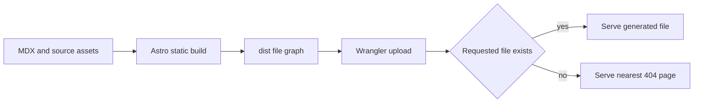

Deploying this site does not start an application server. It hands Cloudflare a directory. That sounds almost too plain after a build has compiled MDX, assembled vault navigation, rendered diagrams, emitted charts, transformed images, and minified HTML. The plain handoff is the point. This page follows that file graph into Cloudflare and separates repository configuration from platform capability.

---

## The artifact boundary

`astro.config.mjs` sets `output` to `static`, so Astro writes complete routes and assets under `dist/`. The catch-all journal route looks dynamic in source, but `getStaticPaths()` resolves its slugs during the build. Production receives generated HTML rather than a request-time MDX renderer.

The output also contains files created outside Astro's ordinary page compiler. Mermaid emits light and dark SVG assets under `/_app/mermaid/`. ECharts can emit hashed SVG files under `/_app/charts/`. Vite writes JavaScript and CSS bundles, while Astro's image service writes transformed images and registered fonts.

```text
dist/
├── _app/
│   ├── charts/
│   └── mermaid/
├── thejournal/
│   └── building_albertoduran/
├── 404.html
└── index.html
```

That trimmed tree is the deployment contract. If a route or asset is absent, the host cannot reconstruct it from source intent. The build owns creation, and the deployment layer owns serving the result.

---

## What Wrangler configures

`wrangler.json` points Cloudflare Workers Static Assets at the generated directory and selects static 404 behavior.

```json
{
  "name": "albertoduran",
  "compatibility_date": "2026-04-10",
  "assets": {
    "directory": "dist",
    "not_found_handling": "404-page"
  }
}
```

The `directory` value is verified in this repository. It tells Wrangler which files to upload. The `404-page` setting asks the platform to use the nearest `404.html` for unmatched paths, following Cloudflare's [static site generation routing behavior](https://developers.cloudflare.com/workers/static-assets/routing/static-site-generation/).

Astro also uses trailing slashes. That keeps published URLs consistent with directory-style static output, including nested vault entries. The journal manifest must still publish every valid slug before Astro builds. The 404 setting handles missing paths; it does not create omitted routes.

---

## Build, deploy, request, fallback

The sequence stays short because earlier layers have already made the content decisions.



This arrangement keeps the request path independent from journal rules. Cloudflare does not know what a vault is, how read time works, or why one SVG has two theme variants. It serves files that the build has already connected through URLs.

The generated filenames also help cacheability. Vite bundles, transformed images, Mermaid assets, and chart files change names when their inputs change. That property supports long-lived caching, but the repository alone does not prove the headers or account rules used by the deployed site.

---

## Platform capability and observed behavior

Cloudflare documents asset serving and routing in its [Workers Static Assets documentation](https://developers.cloudflare.com/workers/static-assets/). Those documents describe platform capabilities such as asset delivery and static 404 handling. They do not prove the production account's DNS, certificate, compression, cache rules, or response headers.

> Repository evidence stops at `wrangler.json` and the generated artifact. Claims about cache hits, compression ratios, SSL configuration, or global delivery need deployed response headers and account configuration captured at a stated date.

That distinction matters in a hiring case study. Configuration shows the intended deployment model. Operational evidence shows what production did. Treating one as the other would turn a sound design explanation into an unsupported success claim.

---

## What to verify after deployment

A release check should visit representative HTML routes, open one hashed build asset, request a Mermaid SVG pair, and inspect an emitted chart when present. It should also request a missing nested URL and confirm that the expected static 404 page appears.

Response headers would close several current evidence gaps. Capture the status, content type, cache control, content encoding, and any Cloudflare cache status for both HTML and hashed assets. That snapshot would support production claims that source code and a local build cannot establish.

The build budget belongs in the same review. The deterministic audit checks that built JavaScript files stay under the 500 KiB raw per-file limit and reports larger asset classes separately. Static hosting does not make client chunks free, so deployment verification should still include which routes request optional ECharts hydration.

---

## Preserve the handoff

Changes to deployment should preserve one clear boundary. The repository must produce a self-contained `dist` tree, and Cloudflare must serve that tree according to explicit routing rules. A feature that needs request-time computation would change the architecture and deserves a separate decision rather than a quiet edit to Wrangler configuration.

The same rule guides debugging. A missing route starts with the manifest and `getStaticPaths()`. A missing generated SVG starts with its integration and asset registry. A wrong 404 response starts with built files and Workers Static Assets routing. The file graph tells a contributor where to look before the platform becomes a convenient suspect.
