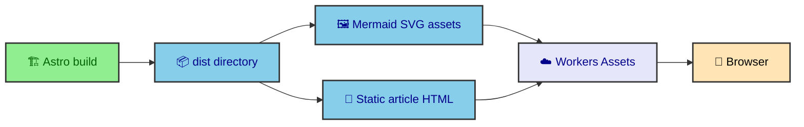

The production deployment is intentionally quiet. Astro writes static files to `dist/`, and Cloudflare Workers Assets serves them from Cloudflare's edge network. Workers Assets is the static-file side of the Cloudflare Workers platform, which makes it a good fit for a site that wants finished HTML, CSS, JavaScript, images, fonts, and generated SVGs ready before any reader requests a page.

---

## The static contract

`astro.config.mjs` sets `output: "static"`, so the site does not rely on request-time server work. The production artifact is a directory of HTML, CSS, JavaScript, images, fonts, and generated SVG files.

`wrangler.json` keeps the deployment target small.

```json
{
  "name": "albertoduran",
  "compatibility_date": "2026-04-10",
  "assets": {
    "directory": "dist",
    "not_found_handling": "404-page"
  }
}
```

Cloudflare provides edge delivery, asset serving, compression, cache behavior, DNS, SSL, and static 404 handling. The site provides complete files. That division is the deployment contract.

### What Astro gives Cloudflare

The build output is already shaped for direct serving. Journal entries become static routes. The home page and profile page become static HTML. Optimized images live under the configured asset output. Runtime JavaScript is bundled by Vite. Fonts and generated assets are part of the same `dist/` tree.

That means the Cloudflare side does not need to know what a vault is, how MDX rendering works, or why a diagram has light and dark variants. Those decisions are baked into the files before deploy.

---

## Mermaid assets on the edge

Mermaid diagrams are part of the static artifact. The build emits standalone SVG pairs under `/_app/mermaid/`, with light and dark variants keyed by diagram source and renderer version. Article pages also include inline SVG so readers get diagrams even without JavaScript.



That asset strategy matters because Mermaid rendering requires browser-like layout work. The production site should serve the result, not ask every reader to render diagrams in their browser. Cloudflare becomes the delivery layer for work the build has already coordinated.

### Immutable asset thinking

The generated Mermaid filenames include a stable diagram ID and cache key. When the diagram source or renderer version changes, the asset URL changes too. That is a natural fit for edge caching because unchanged assets can stay cached while changed assets receive new names.

The same idea applies beyond Mermaid. Static deployment rewards content-addressed or versioned assets because the host can serve files aggressively without guessing whether a request needs fresh computation.

---

## 404 handling and route expectations

The site uses `trailingSlash: "always"` in Astro. Generated preferred URLs include trailing slashes, and directory-style output lines up with static hosting. The journal catch-all route still generates specific pages during the build, so the deployed site serves concrete files rather than dynamic slug handlers.

`not_found_handling: "404-page"` tells Workers Assets to use the static 404 page when a path does not exist. That keeps the deployment model aligned with the rest of the site. Known pages are static output. Unknown pages receive static not-found output.

This setup makes the manifest builder important. If a journal page should exist, it needs to appear in `publishedEntries` before the build. Cloudflare will not invent a route for content that the build did not generate.

---

## Why the deployment stays simple

The deployment model works because complexity has named homes before deploy. MDX policy lives in `src/content/`. Mermaid rendering lives in `src/integrations/mermaid/`. HTML minification lives in the custom minifier integration. Runtime enhancements live under `src/runtime/`. CSS tokens and page styles live under `src/styles/`.

Cloudflare only receives the finished artifact. That keeps the production request path understandable. A browser asks for a URL, Workers Assets finds the static file, and the page loads with any small runtime enhancements attached.

The tradeoff is that build quality matters. If output generation changes, the deploy artifact changes. That is why the quality section of this vault treats checks, fixture builds, and browser coverage as part of architecture rather than ceremony.

---

## What reaches Cloudflare

Cloudflare receives generated output, not source intent. By the time deployment happens, Astro has created static routes, the journal manifest has prepared publication context, MDX has rendered into HTML, Mermaid diagrams have become SVG output, images have been transformed, fonts have been registered, CSS has been bundled, and the custom HTML minifier has processed final documents.

That means Cloudflare does not need to understand the journal vault. It does not need to render Mermaid. It does not need to fetch Atlas data. It does not need to calculate reading time or pagination. Those decisions have already been made by the build.

This is the main deployment principle. The edge should deliver the site, not invent it.

---

## Static routes and trailing slashes

`astro.config.mjs` sets the site URL, static output, and trailing slash behavior. Static output means every generated route becomes a file path in the build output. Trailing slashes keep route shape consistent for article URLs and nested vault entries.

The dynamic journal route still feels dynamic in source because it accepts a slug parameter, but it is static in output because `getStaticPaths()` provides all published paths. That is the key difference. The route is dynamic as a template, not dynamic as a production request handler.

Cloudflare Pages is a good fit for that model. It can serve the generated route files directly and let the browser navigate through them as normal URLs.

---

## Assets directory

The Astro build writes assets under the configured assets directory. Cloudflare serves those built files with the generated HTML. Mermaid standalone SVGs, JavaScript modules, CSS, images, and font output all become part of the static asset surface.

The Mermaid section explains why diagram assets matter. The deployment point is simpler. If the build emits an asset and the HTML links to it, Cloudflare needs to serve it as a file. The static host does not need to know why the asset exists.

This keeps deployment predictable. The build defines the file graph. The host serves the file graph.

---

## Fallback behavior

`wrangler.json` includes not-found handling for Workers Assets. That setting belongs to the deployment environment, but the site still relies primarily on generated static routes. The fallback is a delivery-level behavior for paths that are not generated, not a replacement for route generation.

The journal manifest and Astro route generation remain the source of truth for publication URLs. The deployment file records how Cloudflare should serve the output.

That division keeps route ownership clear. Source code decides which pages exist. Deployment decides how built files are exposed.

---

## Why Cloudflare fits the site

Cloudflare Pages fits because the site values fast static delivery, simple hosting, and a build that can be inspected. A content-heavy personal site does not need a server to answer every article request. It needs reliable files, caching, compression, and global delivery.

This also keeps operational complexity low. The repo carries the deployment configuration. The build creates output. Cloudflare serves it. The site can still have rich build-time systems and careful runtime enhancements without adopting a server application model.

---

## Deployment as a final handoff

Deployment is the final handoff in the pipeline. Content files, source components, integrations, runtime modules, and styles all become a static artifact. Cloudflare receives that artifact and makes it available at the site URL.

Thinking of deployment as a handoff helps keep responsibilities clean. If a publication needs a route, the build must generate it. If a diagram needs a standalone asset, the Mermaid integration must emit it. If CSS needs to be available on every page, the build must include it in the output. Cloudflare should not need special knowledge of those systems.

This handoff model also makes the site easier to reason about after deployment. The production host is not holding hidden application state. The deployed files are the result of the repository and build.

---

## Cache-friendly output

Static hosting rewards stable assets. When filenames change only because content or build output changes, the edge can serve unchanged files efficiently. Mermaid asset names, built JavaScript, CSS, transformed images, and fonts all benefit from that model.

This is another reason build-time work matters. The build can produce file names and asset references that are stable until the source changes. The host can then focus on delivery speed. The architecture does not depend on per-request computation to keep pages current.

For a journal, that is a good fit. Publications change when the repository changes. Deployment publishes the new artifact. Readers receive static files that are already prepared.

---

## The deployment promise

The deployment promise is that production receives finished work. Routes, metadata, diagrams, images, CSS, JavaScript, and minified HTML all leave the build as files. Cloudflare serves those files with edge delivery.

That promise keeps the deployment architecture easy to teach. The build creates the website. The host delivers it.

The more the build can settle ahead of time, the simpler production remains. That is the reason Cloudflare deployment belongs in the foundation layer rather than at the end of the story.
