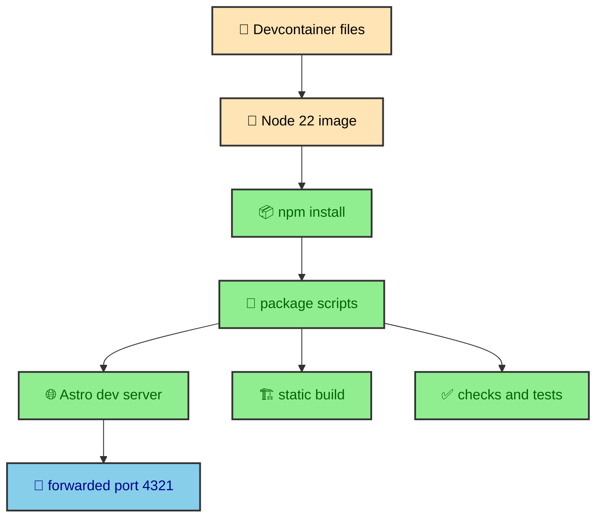

The project treats the local environment as part of the build story. A devcontainer is a versioned development container configuration that tells VS Code which image, user, tools, ports, and setup commands the workspace expects. Here it turns Node version, shell behavior, editor expectations, dependency installation, and port forwarding into committed files. That matters because the site has custom integrations, local fonts, MDX content, fixture-driven builds, and browser tooling.

---

## The container image

The container starts from `mcr.microsoft.com/devcontainers/javascript-node:22`. That base image gives the project a known Node 22 environment, which matches the modern Astro, Vite, TypeScript, and tooling stack used by the repository.

The Dockerfile switches to the `node` user and sets `/workspace` as the working directory. It also installs Powerlevel10k and a pair of zsh plugins for autosuggestions and syntax highlighting.

```dockerfile
FROM mcr.microsoft.com/devcontainers/javascript-node:22

USER node
WORKDIR /workspace
```

The shell setup is not required for production output. It is included because the devcontainer is also a working editor environment. A project with long command names, nested source folders, and frequent Git work benefits from a terminal that makes current path and repository state visible.

### Zsh as executable preference

The Dockerfile writes a `.zshrc` that selects the Powerlevel10k theme, enables Git, autosuggestions, and syntax highlighting, and configures a compact prompt. That makes the terminal preference repeatable instead of personal.

The important idea is not the specific prompt theme. The important idea is that everyday development assumptions live in versioned files. The next workspace can recreate them without a checklist.

---

## The VS Code contract

`.devcontainer/devcontainer.json` describes how VS Code should open the project. It points to the Dockerfile, sets `remoteUser` to `node`, and exposes `LOCAL_WORKSPACE_FOLDER` for tools that need to know the host workspace path.

The container also installs the GitHub CLI feature, forwards Astro's default port `4321`, and labels that forwarded port as "Astro Preview" with HTTP behavior. That keeps the common local loop short. Start Astro, open the forwarded port, read the site.

```json
{
  "name": "albertoduran",
  "remoteUser": "node",
  "postCreateCommand": "npm install",
  "forwardPorts": [4321]
}
```

The `postCreateCommand` is the most important startup choice. A new container runs `npm install` automatically, so the checked-out repository becomes a usable project without relying on a remembered first step.

---

## Editor defaults

The VS Code settings choose zsh as the integrated terminal profile and configure Fira Code or a compatible Nerd Font for the editor and terminal. Those choices match the code and icon-heavy nature of the project.

The extension list mirrors the actual stack.

- Astro support for `.astro` files and route components.
- MDX support for the journal entries under `src/thejournal/`.
- Tailwind CSS support for utility-heavy component files.
- ESLint and Prettier support for source consistency.
- cSpell and Markdown linting support for long-form writing.
- Git tools for branch history, blame, and pull request work.
- File tree extraction support for architecture mapping.

The setup is practical rather than minimal. It optimizes for a workspace that can edit content, inspect Astro components, review CSS tokens, and work with Git without extra setup.

---

## Project scripts as the workflow

The devcontainer does not invent a second workflow. It gives the normal `package.json` scripts a consistent place to run. `npm run dev` starts Astro development. `npm run build` creates production output. `npm run build:test` creates a deterministic static build with fixture flags for systems that otherwise reach outside the repository.

That distinction matters. The container describes the machine. The scripts describe the project workflow. Keeping those layers separate prevents the development environment from becoming a hidden build tool.

The project also keeps the default Astro development port visible through the devcontainer configuration. The editor can open the browser when the port is forwarded, but Astro remains the server doing the work.

The local loop is intentionally short, and the devcontainer makes each step explicit.



### Why this belongs in the architecture vault

The devcontainer is not a side note because the project is not a plain static folder. It has local fonts, custom Astro integrations, MDX processing, generated image variants, and runtime TypeScript. A consistent Node and editor environment reduces the number of variables around those systems.

This page documents that the project was built with reproducibility in mind. The same idea appears later in the content manifest, Mermaid cache, deterministic build flags, and Cloudflare static output.

---

## The tradeoff

The first startup is slower because dependencies install inside the container. That is the cost of making the environment explicit. The benefit is that the repository carries its local assumptions with it.

That tradeoff fits the site. The source tree is larger than the public route surface, and the build does more than compile pages. A slightly heavier local shell is reasonable when the payoff is a predictable place to run the static publishing pipeline.

---

## Why the container matters here

This site has more than one kind of build work. Astro compiles pages. Tailwind and DaisyUI generate CSS. Sharp transforms images. Mermaid rendering can involve renderer services and SVG transformations. Playwright needs browser dependencies. Cloudflare tooling expects a deployment-shaped output directory. A container gives those tools a shared home.

The benefit is not that every contributor must think about containers all day. The benefit is the opposite. The workspace starts with the expected Node and editor environment, so the contributor can focus on content, components, integrations, and styles.

The devcontainer also keeps the project honest about its runtime assumptions. If a build feature needs a system dependency, the environment file is the place to express that need. The setup does not live only in one person's shell history.

---

## Node and package scripts

The project is driven through npm scripts. `dev` starts Astro development. `build` creates production output. `build:test` creates deterministic production output with fixture flags. `preview` serves the built site. `check`, `test`, `test:e2e`, and `test:coverage` define the quality workflow. `format` and `lint` describe maintenance commands.

The container does not replace those scripts. It makes them easier to run in a known environment. That is an important distinction. The repository still teaches the workflow through `package.json`; the container only makes the workflow reproducible.

This is why the devcontainer article belongs in foundations. The build story is not only source code. It is the repeatable way the source code is run.

---

## Editor defaults as project defaults

The VS Code settings in the devcontainer are part of the authoring experience. Formatting, language support, and recommended extensions help keep Astro, MDX, TypeScript, CSS, and tests comfortable to edit. They also reduce avoidable churn from inconsistent editor behavior.

For a content-heavy site, editor defaults matter. The project contains long MDX articles, Mermaid fences, Astro components, TypeScript utilities, and CSS partials. A workspace that understands those file types makes the publishing system easier to maintain.

The editor configuration does not decide architecture, but it supports the people working inside that architecture. That makes it a real foundation.

---

## Container and deployment boundary

The devcontainer is for development. Cloudflare Pages is for deployment. Keeping those roles separate is useful. The container gives contributors the tools to build, preview, and validate the site. The deployment host receives static output.

That boundary mirrors the rest of the project. Build-time work happens before deployment. Runtime work happens in the browser. Development tooling helps create the source and output but does not become part of the served page.

The container is therefore a workspace foundation, not a production dependency.

---

## Reproducibility beyond install

Reproducibility is not only about installing dependencies. It is also about making the same project assumptions available every time the workspace opens. The shell, editor extensions, forwarded ports, and package scripts all shape how contributors experience the codebase.

That matters for MDX-heavy work. A publication author needs syntax support for long articles, code fences, frontmatter, and Mermaid diagrams. A component author needs Astro and Tailwind support. A quality pass needs Playwright and TypeScript to run in the same environment that the scripts expect.

The devcontainer turns those assumptions into repository files. It does not remove the need to understand the project, but it removes a layer of local setup mystery before that understanding can begin.

---

## How it supports the vault

This vault itself benefits from the container. The articles are MDX, they contain Mermaid diagrams, and they reference real project files. Editing them comfortably requires the same toolchain as editing the site. The environment is therefore part of the publishing workflow as well as application development.

That is why the devcontainer is documented next to architecture and deployment. It is one of the foundations that makes the rest of the build repeatable.

---

## The workspace promise

The workspace promise is simple. Opening the project should put the contributor close to the same tools the site expects. The container cannot explain the architecture by itself, but it can remove friction before the architecture is explored.

That promise matters for a vault about how the site was built. The environment is part of the build story because it shapes how the site can be changed.
