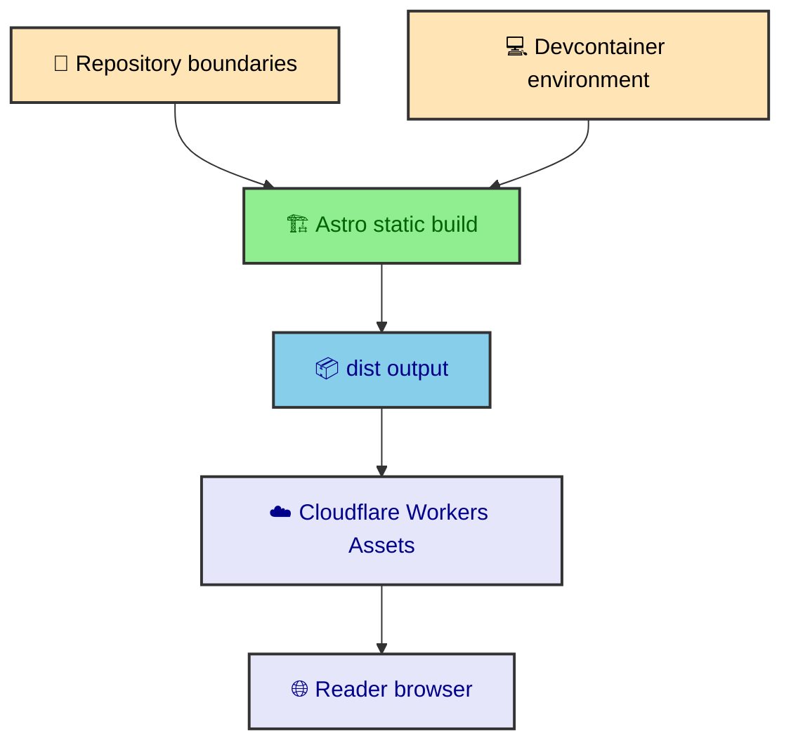

Before the MDX pipeline, Mermaid renderer, or browser enhancements make much sense, you need the ground rules. This section explains where the project keeps its source files, how the local environment is reproduced, and why the deployment target stays static. Read it first if you want the rest of the vault to feel like architecture instead of scattered implementation notes.

---

## What this section covers

The foundation pages connect the high-level architecture to concrete files. They do not explain every component. They explain the boundaries that make the rest of the vault readable.

- `project_architecture` walks through the repository, route surface, and shared Astro document shell.
- `devcontainer` explains the Node 22 VS Code environment and local workflow defaults.
- `cloudflare_deployment` explains why the production artifact is a static `dist/` directory served by Workers Assets.

The foundation layer is intentionally small. It answers three questions that keep coming back through the rest of the site. Where does this code live. What environment was it built in. What shape does production expect from the build.

### Repository map

The project shape is intentionally plain. Most directories own one class of work, which keeps content, runtime code, integrations, and styling from drifting into each other.

```text
albertoduran/
├─ .devcontainer/
├─ .github/workflows/
├─ docs/
├─ public/
├─ src/
│  ├─ assets/
│  ├─ components/
│  ├─ content/
│  ├─ data/
│  ├─ integrations/
│  ├─ layouts/
│  ├─ pages/
│  ├─ runtime/
│  ├─ styles/
│  ├─ thejournal/
│  ├─ types/
│  └─ utils/
├─ astro.config.mjs
├─ package.json
├─ playwright.config.ts
├─ vitest.config.ts
└─ wrangler.json
```

That tree is the shortest useful explanation of the site. `src/pages/` owns routes. `src/thejournal/` owns publication source. `src/content/` owns content processing. `src/integrations/` owns build-time behavior that Astro does not provide by default.

---

## The three foundation decisions

The first decision is architectural. The site keeps route files, layouts, components, content processors, integrations, runtime modules, and CSS partials in separate folders. That is why a journal article can be changed without touching the Mermaid renderer, and a runtime overlay can be changed without rewriting route generation.

The second decision is environmental. The devcontainer describes the machine that was used to build and maintain the project. Node 22, zsh, VS Code extensions, local fonts, and dependency installation are all described in files rather than remembered as setup lore.

The third decision is deployment-oriented. Astro builds static output. Cloudflare Workers Assets serves that output. There is no application server assembling article pages per request. That makes build-time integrations more important because the deployment host expects finished files.



These decisions are not glamorous. They are what make the more specialized systems possible. Mermaid rendering, manifest generation, page transitions, image optimization, and overlay behavior all sit on top of this foundation.

---

## How to read next

Start with repository architecture if you need to locate code. It explains which folder owns each part of the site and why the route surface is smaller than the source tree.

Start with the devcontainer if you are booting the project fresh or trying to understand how local development mirrors the project assumptions. The page explains how the container, shell, editor defaults, and dependency installation fit together.

Start with Cloudflare deployment if you want to understand why so much work happens during the build. The production host serves static files, so content structure, diagrams, images, and minification all settle before deploy.

The rest of the vault assumes you know these three answers. Where the code lives. How it runs locally. What the production host expects from the build.

---

## Static first as a foundation

The most important foundation decision is that the site is static-first. Astro builds pages ahead of time, the journal route receives static paths from the content manifest, and Cloudflare Pages serves generated files. That choice shapes the rest of the system.

Static-first does not mean the site has no dynamic qualities. Mermaid diagrams are generated during the build. The Atlas widget fetches data during the build. Theme state, overlays, article navigation, and timezone formatting run in the browser. The distinction is timing. Durable content and structure are prepared before deployment. Browser behavior handles the reader's current context.

That timing gives the site a clear mental model. If something describes the publication, it belongs in content, manifest, layout, or integration code. If something describes the current browser session, it belongs in runtime code. The foundation section teaches that boundary before the later sections add detail.

---

## Repository shape as a foundation

The repository is organized so that major responsibilities have homes. Pages live under `src/pages`. Journal content lives under `src/thejournal`. Content schema and loaders live in `src/content.config.ts` and related utilities. Integrations live under `src/integrations`. Runtime modules live under `src/runtime`. Styles live under `src/styles`. Tests live under `tests`.

That organization matters because the project uses several kinds of code. An Astro page route is not the same as a content loader. A Mermaid integration is not the same as a runtime custom element. A CSS partial is not the same as a component. The folder structure helps those boundaries stay visible.

The foundation articles do not try to explain every file. They explain the ownership map so later articles can move quickly. When the Mermaid section mentions `src/integrations/mermaid`, the reader already knows integrations are build-time code. When the runtime section mentions `src/runtime`, the reader already knows that code enhances pages in the browser.

---

## Environment as a foundation

The devcontainer is part of the foundation because it makes the workspace predictable. Node, npm, editor extensions, formatting defaults, and shell environment all influence how the site is built. A reproducible container keeps those choices close to the repository.

This is especially useful for a site with build-time rendering and browser tests. The environment needs to support Astro, TypeScript, Sharp image transforms, Mermaid rendering paths, Playwright, and Cloudflare-related tooling. The container does not make the website more complex. It makes the complexity easier to run consistently.

The same philosophy appears in package scripts. The project scripts describe the normal development path, production build, deterministic build, preview, checks, unit tests, browser tests, and formatting. The foundation is not only code layout. It is the workflow that keeps the code usable.

---

## Deployment as a foundation

Cloudflare Pages is the deployment target because it matches the static output model. Astro writes a `dist/` directory. The deployment serves files. `wrangler.json` records the project name, compatibility date, assets directory, and fallback behavior. The deploy target does not need to assemble journal pages on demand.

This keeps production close to the build. If the build prepares routes, diagrams, images, styles, and HTML, deployment can focus on delivery. That is the same architectural split used throughout the site. Each layer does the job it is best positioned to do.

---

## Why foundations come first

The rest of the vault depends on these decisions. Publications depend on the content collection and route architecture. Mermaid depends on build integrations. Performance depends on static output and asset processing. Runtime depends on Astro transitions and progressive enhancement. Design depends on the shared layout and style entry point. Quality depends on deterministic builds and production preview.

That is why this section comes before the more specialized articles. It gives the reader the map, then the rest of the vault fills in the rooms.

---

## Foundation contracts

Each foundation page describes a contract. `project_architecture` describes the code ownership contract. Routes, layouts, content processors, integrations, runtime modules, and styles each have a home. That contract keeps later changes from becoming a search across the whole repository.

`devcontainer` describes the workspace contract. The project can assume a Node-based environment with the editor support needed for Astro, MDX, TypeScript, CSS, Mermaid, and browser tests. That contract keeps local development close to the way the site is built.

`cloudflare_deployment` describes the production contract. The build must emit a complete static artifact, and Cloudflare serves that artifact. That contract explains why the build pipeline does so much work before deployment.

These contracts are simple, but they are the reason the rest of the site can be ambitious without becoming shapeless.

---

## How this guides new work

When new work enters the site, the foundation answers the first placement question. A new publication belongs in the content tree. A new route belongs in `src/pages`. A new build transformation belongs in `src/integrations`. A new browser enhancement belongs in `src/runtime`. A new repeated visual rule belongs in the appropriate CSS partial.

This is not only tidy organization. It keeps the static build readable. Each feature enters through the layer that owns its timing and responsibility. The build stays capable because the boundaries stay visible.

---

## The simple rule

The simple rule is to place work where its information exists. The filesystem knows content. The build knows routes and assets. CSS knows visual tokens and layout. The browser knows the current session. Deployment knows how to serve finished files.

The rest of the vault repeats that rule in more specific forms. This foundation section gives it the first shape.
