A static site can still become hard to reason about when content, runtime scripts, styles, and build hooks blur together. This repository avoids that by treating folders as ownership boundaries. Once you know what each directory owns, most changes become a routing problem, a content problem, a runtime problem, or a build problem. That distinction is the map.

---

## Top-level ownership

The root folders set the first boundary. `.devcontainer/` describes the development machine. `.github/workflows/` owns the quality workflow. `docs/` keeps internal project notes. `public/` holds static files served as-is. Most product code lives under `src/`.

Inside `src/`, the division is tighter.

- `pages/` owns Astro file-based routes.
- `layouts/` owns document shells and shared page structure.
- `components/` owns Astro UI by feature area.
- `content/` owns journal processors and manifest logic.
- `integrations/` owns build-time extensions such as Mermaid and HTML minification.
- `runtime/` owns browser-side progressive enhancement modules.
- `styles/` owns CSS partials, tokens, utilities, and page styles.
- `thejournal/` owns MDX source files and vault structure.
- `data/`, `types/`, and `utils/` hold shared constants, contracts, and helpers.

This layout is not clever. That is the point. The folder name should usually tell you whether you are changing rendering, content policy, runtime interaction, or generated output.

### Ownership as a design tool

The folder split keeps cross-cutting behavior visible. The Mermaid system lives in `src/integrations/mermaid/` because it changes the build. The diagram shell lives in `src/runtime/elements/` because it improves the rendered SVG in the browser. The article wrapper and MDX overrides live in components and styles because they shape the HTML readers see.

That separation lets the same feature have multiple layers without mixing them. A Mermaid diagram starts as MDX, becomes SVG during the build, receives article wrapper UI through an Astro component, and gains expansion behavior through a runtime custom element.

---

## Route surface

The public routes are small compared with the source tree. Astro owns routing through `src/pages/`, and the journal catch-all handles standalone posts, vault roots, and nested vault entries.

| Route                                | Source file                                        | Purpose                                          |
| ------------------------------------ | -------------------------------------------------- | ------------------------------------------------ |
| `/`                                  | `src/pages/index.astro`                            | Home page.                                       |
| `/profile/`                          | `src/pages/profile.astro`                          | Professional profile.                            |
| `/projects/`                         | `src/pages/projects/index.astro`                   | Project catalog.                                 |
| `/projects/albertoduran/`            | `src/pages/projects/albertoduran.astro`            | This site's project case study.                  |
| `/projects/equity-valuation-engine/` | `src/pages/projects/equity-valuation-engine.astro` | Equity valuation project.                        |
| `/projects/mlscraper/`               | `src/pages/projects/mlscraper.astro`               | ML scraper project.                              |
| `/projects/sin-pluma/`               | `src/pages/projects/sin-pluma.astro`               | Sin Pluma project.                               |
| `/thejournal/`                       | `src/pages/thejournal.astro`                       | Journal catalog.                                 |
| `/thejournal/[...slug]/`             | `src/pages/thejournal/[...slug].astro`             | Articles, vault roots, and nested entries.       |
| `/fixtures/[fixture]/`               | `src/pages/fixtures/[fixture].astro`               | Generated test fixtures, not an editorial route. |
| `/404/`                              | `src/pages/404.astro`                              | Static not-found page.                           |

The catch-all route gets its paths from `publishedEntries`. That means journal source files do not become public pages until they pass collection loading, draft filtering, manifest building, and static path generation.

```mermaid
flowchart LR
    Source[📝 MDX source] --> Collection[📚 content collection]
    Collection --> Manifest[🧭 journal manifest]
    Manifest --> Paths[📍 static paths]
    Paths --> Route[📄 catch-all route]
    Route --> Html[🌐 static article HTML]

    classDef source fill:#FFE4B5,stroke:#333,stroke-width:2px,color:black
    classDef build fill:#90EE90,stroke:#333,stroke-width:2px,color:darkgreen
    classDef route fill:#87CEEB,stroke:#333,stroke-width:2px,color:darkblue
    classDef output fill:#E6E6FA,stroke:#333,stroke-width:2px,color:darkblue

    class Source source
    class Collection,Manifest,Paths build
    class Route route
    class Html output
```



The route file stays focused on page assembly. It receives a `post`, renders the MDX with `render(post)`, looks up manifest context, and composes the article shell. It does not decide which drafts exist or how nested vaults sort.

---

## Shared document shell

`BaseLayout.astro` is the shared document shell. It owns metadata, preferred page URLs, Open Graph image generation, font registration, the inline theme bootstrap, Astro `ClientRouter`, global CSS, header, footer, and overlay slot.

The layout also imports `@styles/global.css`, which makes the CSS import graph a project-wide dependency of the document shell. Every page gets the same theme tokens, utilities, component styles, and article styles from that entry point.

The central page content renders inside a shared `main` element.

```astro
<main
  id="main-content"
  class="grow outline-none"
  transition:name="page-main"
  transition:animate="fade"
>
  <slot />
</main>
```

That `main` element is where Astro view transitions apply. The header, footer, and overlay slot live outside it, which lets navigation chrome and dialogs behave like shell UI rather than article content.

### Metadata and fonts

The layout receives a `siteManifest` and optional image. It computes preferred URLs from `Astro.url.pathname`, creates an optimized social image with `getImage()`, and registers Open Graph and Twitter metadata. One mismatch remains. Open Graph receives `siteManifest.description`, while the standard description meta tag receives `siteManifest.pageTitle`.

That mismatch is visible engineering debt, not an intended metadata strategy. A contributor changing the layout should send the description to both description fields and add a generated-page assertion so search metadata cannot drift from the article summary again.

Fonts are also handled here. Inter, Montserrat, and Fira Code are registered through Astro's font support. Inter and Montserrat get selected preloads because they shape the first read. Fira Code is available for code blocks without becoming the main loading priority.

---

## Static output as the organizing constraint

Because the site builds static output, route files and build integrations carry more responsibility than they would in a request-time app. The generated HTML needs to contain enough information for readers, crawlers, and no-JS users before runtime modules run.

That constraint explains several architecture choices.

- Article headings are rendered into HTML and separately exposed to navigation components.
- Mermaid diagrams are rendered to inline SVG and standalone assets during the build.
- Journal navigation comes from a manifest rather than client-side filesystem discovery.
- HTML minification happens after Astro has generated the complete `dist/` tree.
- Runtime modules bind to generated markup instead of owning the initial render.

The repository architecture is built around those choices. The static output is the product. The source tree is the factory that shapes it.

---

## How the folders work together

The boundaries are useful because they meet at explicit contracts. `src/content/` exports `entryManifest`, `vaultsManifest`, and `publishedEntries`. `src/pages/thejournal/[...slug].astro` consumes those values. `src/components/ui/mdx/` provides the MDX override components. `src/styles/ui/mdx/` and `src/styles/thejournal/article/` style the rendered result.

The same pattern appears elsewhere. `src/data/icons.ts` prepares icon data. `SVGIcon.astro` renders it. `src/utils/ribbon.ts` generates compressed SVG patterns. `StripBackground.astro` uses those patterns in the design system.

That is the main architectural habit of the project. Data preparation, rendering, styling, and runtime behavior each get a home. The site feels cohesive because those homes connect through small, named contracts rather than hidden side effects.

---

## Content and route ownership

The journal content is not colocated with page routes because content and routing have different jobs. MDX files under `src/thejournal` describe publications. The dynamic route under `src/pages/thejournal/[...slug].astro` decides how those publications become URLs. The manifest sits between them and prepares the route context.

That separation lets the content tree act like a vault while the route layer stays thin. A new nested article can live near related entries. The manifest can decide whether it publishes, what image it inherits, what siblings it has, and how it appears in pagination. The route can receive that prepared context and render a page.

This is also why frontmatter matters. It is not only metadata for a card. It feeds the content collection, route generation, article header, reading time, publication order, and vault structure. The schema gives the content tree a contract the route layer can trust.

---

## Build integrations as architecture

The integrations folder contains behavior that runs while the site is being built. The Mermaid integration is the clearest example. It finds Mermaid code fences, renders diagrams through available services, transforms SVG output, emits assets, and injects inline results into article pages. The custom HTML minifier runs after Astro writes HTML files and reduces final output while preserving code-oriented fragments.

These integrations belong outside components because they are not visual widgets. They change generated output. A component can display a diagram wrapper, but the integration is what turns Mermaid source into SVG before the reader arrives. A layout can include global CSS, but the minifier is what rewrites generated HTML after the build.

Keeping integrations in their own folder makes the build pipeline visible. The site is static, but the build is active.

---

## Runtime as a narrow layer

Runtime code lives under `src/runtime` because browser behavior has a different lifecycle than build code. Theme management, overlay focus, On This Page tracking, Mermaid popovers, and Atlas timezone formatting all depend on the current document or reader environment.

The architecture keeps that layer narrow. Runtime modules do not decide which articles exist. They do not parse MDX. They do not render Mermaid source. They enhance the HTML that the build already prepared.

That boundary is what lets the site feel interactive without becoming a browser-rendered app. The output is still static pages. The browser layer makes those pages more comfortable to use.

---

## Style as architecture

The styles folder is part of the architecture because it encodes the visual system. `global.css` imports Tailwind, DaisyUI, theme tokens, base rules, utilities, shared treatments, layout rules, UI partials, and page-specific styles in a deliberate order.

That order gives components and MDX output a stable visual language. A code block rendered by the MDX pipeline receives styling from the UI MDX partials. A journal article receives layout and typography from the journal partials. A homepage parallax section receives layout behavior from the parallax partial.

The result is a project where content, routes, integrations, runtime code, and CSS all have visible ownership. That is the real architecture of the site.

---

## Why the architecture stays teachable

The architecture stays teachable because each layer has a name and a folder. A reader can move from an article file to the content schema, from the content schema to the manifest, from the manifest to the route, from the route to the layout, and from the layout to runtime and style hooks. The path is long, but it is not hidden.

That is the point of this vault. The codebase is easier to change when its boundaries can be explained in prose and verified in files.
