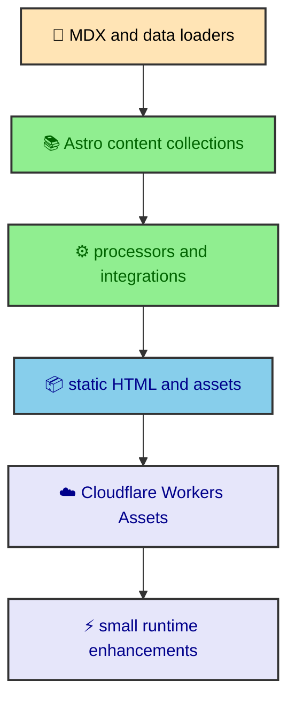

The easiest way to misunderstand this site is to treat it like a portfolio with a blog attached. The useful version is stranger. It is a static publishing system where MDX, navigation, diagrams, images, route data, and the expensive work settle before the browser gets involved. This vault maps how those decisions fit together so the site reads like a built thing, not a pile of pages.

---

## The project shape

albertoduran.com is a static-first portfolio and long-form journal built with **Astro 6**, a framework that turns components and content into static pages. Tailwind 4 handles utility CSS, DaisyUI 5 supplies themed UI primitives, MDX lets Markdown include components, and Cloudflare Workers Assets serves the finished files. The public route surface is small, but the source behind it acts like a publishing engine with a portfolio folded into it.

The guiding rule is simple. When the build knows enough to resolve something, the build should resolve it. Content collections load the writing. Manifest code turns folders into vaults. Integrations render Mermaid diagrams and minify HTML. Astro writes static pages. Runtime scripts handle interaction after the readable page already exists.

The main path from source to deployed page looks like this.

That path explains why many files that look like content are also part of the application design. A Mermaid code fence can create standalone SVG assets. A folder index can create a vault. A frontmatter field can affect route generation, sidebar structure, pagination, and card metadata.

### Static first does not mean plain

The site still has runtime behavior. Theme state persists across navigation. Article sidebars update as the reader scrolls. Overlays manage focus and scroll lock. Mermaid diagrams expand into popovers. The Atlas widget localizes match time in the browser.

The difference is that those scripts do not carry the article. If JavaScript arrives late, the reader still gets rendered HTML, headings, code blocks, inline Mermaid SVG, images, and navigation landmarks. Runtime code improves the page that the build already produced.

That order gives the project a clear shape. Build-time code owns content, routes, diagrams, assets, and output weight. Runtime code owns reversible interaction. CSS owns the visual language and responsive behavior.

---

## What a vault means

A vault is a first-level folder under `src/thejournal/` with an `index.md` or `index.mdx`. Nested folders can become sections when they also contain an index file. The manifest builder reads that directory shape and turns it into breadcrumbs, sidebar groups, previous and next links, and generated routes.

This vault uses that rule deliberately. Each top-level folder covers one ownership boundary in the site. The sections are not topic buckets chosen after the fact. They mirror the architecture that makes the project work.

| Section         | What it owns                                                                                        |
| --------------- | --------------------------------------------------------------------------------------------------- |
| `foundations/`  | Repository shape, development environment, and Cloudflare deployment.                               |
| `publications/` | MDX collections, manifest rules, static routes, rendering, and code blocks.                         |
| `mermaid/`      | Build-time diagram rendering, caching, renderer services, SVG transforms, and assets.               |
| `performance/`  | Perceived navigation speed, output size, image strategy, and font loading.                          |
| `runtime/`      | Browser-side enhancements for theme, article navigation, overlays, Mermaid shells, and Atlas data.  |
| `design/`       | Tailwind tokens, DaisyUI themes, CSS partials, SVG icons, parallax, and UI rules.                   |
| `quality/`      | The architecture around checks, deterministic builds, unit coverage, and browser behavior coverage. |

The vault is also a product of the system it documents. Its folder structure feeds the same manifest builder as every other journal section. The writing is content, but its placement is data.

### Why section indexes exist

Every section has an `index.mdx` because a folder without a landing page has no published explanation of its boundary. The section index tells readers why the folder exists, which child entries matter, and how the child pages relate.

That requirement also keeps navigation honest. A nested folder cannot silently appear in the vault explorer without a title and purpose. The index page becomes the human-readable label for the group.

---

## The source boundaries

The repository is organized around ownership rather than file type alone. Astro components live under `components/`, but content policy does not. Runtime TypeScript lives under `runtime/`, but build integrations do not. That separation is the main reason the project can grow without turning every change into a scavenger hunt.

The highest-value boundaries are these.

- `src/pages/` owns public routes and static path generation.
- `src/layouts/` owns document shells, shared page structure, and view transition placement.
- `src/content/` owns journal manifests and content processing.
- `src/integrations/` owns build extensions for Mermaid and HTML minification.
- `src/runtime/` owns browser-side custom elements and lifecycle modules.
- `src/styles/` owns global CSS, tokens, utilities, and page-specific partials.
- `src/thejournal/` owns the MDX source tree that becomes the journal.

Those folders also describe the mental model for editing. If the question is what pages exist, start with routes and content processors. If the question is what a page looks like, start with layouts, components, and styles. If the question is what the browser improves after load, start with runtime.

---

## Reading path

The best reading path follows the build from source to deployed behavior.

1. Start with `foundations/` to learn the repository shape, reproducible environment, and static Cloudflare target.
2. Read `publications/` to understand how MDX files become validated entries, manifests, routes, and rendered article pages.
3. Move to `mermaid/` for the deepest custom build-time integration, where code fences become themed SVG assets.
4. Use `performance/` to see how navigation feel, output weight, images, and fonts are treated as separate concerns.
5. Read `runtime/` to see how the browser enhances pages without becoming the rendering foundation.
6. Keep `design/` close when touching tokens, CSS partials, icons, parallax, or reusable UI rules.
7. Finish with `quality/` to understand how the project preserves behavior across its custom systems.

This is not an Astro beginner tutorial. It explains how one static site is built, why its boundaries exist, and which tradeoffs make the system feel fast and maintainable.

---

## The build philosophy

The project keeps a plain bias. Prefer files over hidden configuration. Prefer static output over request-time work. Prefer small runtime modules over a client app. Prefer typed content context over page-level guessing. Prefer CSS tokens over hardcoded color decisions.

That bias is visible in the main systems. The journal manifest turns folder structure into data. The Mermaid integration turns diagrams into cacheable assets. The HTML minifier runs after the static build. The runtime overlay and navigation modules bind to generated HTML instead of owning it.

The result is a site that behaves like a polished application in the browser while still deploying as static files. That tension is the heart of the build. The pages are static, but the system that creates them is carefully assembled.

> The site is fast because the build does the heavy work, and the browser only carries the parts that need to remain interactive.

That principle is the thread through the rest of this vault. Every page explains a piece of that arrangement from the file tree outward.

---

## Why this vault exists

This vault exists because the website is more than its final pages. It is a set of decisions that are easy to miss when looking only at the rendered result. A static site can look simple while still having a content manifest, MDX rendering rules, code block wrappers, diagram renderers, runtime modules, image strategies, and deployment constraints behind it.

Writing those decisions down makes the site easier to extend. If a future article needs a diagram, the Mermaid section explains how that diagram enters the build. If a new page needs an overlay, the runtime section explains the existing panel contract. If a new UI surface needs color, the design section explains the token system. The vault turns hidden architecture into shared language.

The entries are also meant to teach by following the actual code. They describe the shape of `src/content.config.ts`, `src/thejournal`, `src/integrations`, `src/runtime`, `src/styles`, and the deployment files. The goal is not an abstract guide to Astro. It is a guided tour of this Astro site.

---

## How the sections connect

The sections build on each other. Foundations explain the environment and static deployment model. Publications explain how MDX becomes routed journal pages. Mermaid explains one of the richest build-time transformations. Performance explains why the generated output stays light. Runtime explains the browser layer that enhances static pages. Design explains the visual system that keeps all those pages coherent. Quality explains how the custom rules stay dependable.

That order is intentional. The reader first learns where the site lives and how it is deployed. Then they learn how content becomes pages. Then they learn about specialized systems such as diagrams, performance, runtime, design, and quality. Each section adds a layer without undoing the static-first premise.

---

## The reader promise

The site should be understandable as a build, not only as a product. Every page in this vault should answer a practical question about construction. Where does this data come from? When is this rendered? Which layer owns this behavior? What does the browser receive? What does the build prepare first?

That promise is why the articles stay focused on construction. The audience here wants to understand how the site was made. The entries focus on architecture, data flow, rendering boundaries, and design rules because those are the decisions that make the final website possible.
