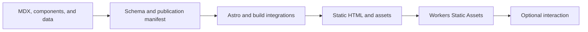

I started albertoduran.com after I was laid off. Applying for work kept exposing the same limitation: a résumé could summarize my experience, but it could not show much of how I approach a problem, and an interview rarely left enough time to explain the projects properly. I wanted a place where people could meet me through the work itself.

The first version was simply a personal site. It grew into a portfolio, a collection of project case studies, and a place for writing about technology, work, and anything else I want to explore. That growth created a new engineering problem: articles, diagrams, charts, navigation, and profile pages all had to remain readable without turning every visit into a client-rendered application. This vault follows the decisions, compromises, and unfinished work behind the system that emerged.

---

## The reader experience

The public result is a portfolio and long-form journal. Articles have vault navigation, previous and next links, anchored headings, highlighted code, themed Mermaid diagrams, static ECharts figures, responsive images, and optional browser interaction. The same system publishes this case study, which gives the documentation a useful constraint. Its claims can be checked against the page delivering them.

The journal does more than describe projects. It lets an experienced developer inspect implementation boundaries, gives a newer developer enough context to learn unfamiliar terms, and shows a hiring team how I reason about ownership, tradeoffs, failure modes, and verification. Those readers do not need the same route through the material.

---

## Why the site starts with static output

Astro compiles the site to files. MDX becomes HTML, the content manifest turns folders into publication policy, Mermaid fences become themed SVG, ECharts options become static figures, and images become responsive assets. Cloudflare Workers Static Assets receives the resulting `dist` directory.

Static output is an organizing constraint, not a performance result by itself. It removes request-time page assembly and gives every route a readable baseline before JavaScript runs. The repository has no recorded Lighthouse or Web Vitals baseline, and the current deterministic build warns about some JavaScript chunks above 500 kB. Those facts belong beside the design choice.

---

## One publication request

A journal page begins as an `.mdx` file under `src/thejournal/`. The content collection validates supported frontmatter. The manifest filters drafts, checks vault invariants, inherits images, calculates read time, orders entries, and assigns navigation. `getStaticPaths()` gives the catch-all route a finite list of pages, then the route renders MDX into the article shell.

That path exposes a useful ownership rule. The schema decides what an entry may contain. The manifest decides whether and where it publishes. The route assembles prepared context. Components and CSS present it. Runtime modules may improve interaction, but they do not decide what the article is.

Two metadata gaps show why tracing the whole path matters. The vault previously carried an unsupported `author` field, so this rewrite removes it. `updatePubDate` enters the schema and manifest but never reaches the article header. The standard description meta tag also receives the page title instead of the article description, although Open Graph receives the right value.

---

## Where the browser is allowed to help

The browser knows facts the build cannot know, including the reader's theme preference, viewport, current scroll position, focus location, and local timezone. Small runtime modules own those concerns. They preserve theme across Astro swaps, track the active heading, control overlays, expand finished Mermaid SVGs, hydrate selected charts, and localize the Atlas match time.

The readable content remains in static HTML. A diagram arrives as SVG before its popover shell connects. A chart has a static figure before optional hydration. The Atlas widget has a Mexico City time before its inline custom element localizes it. This boundary keeps failures local and gives no-JavaScript tests something meaningful to verify.

---

## Eight ownership boundaries

The vault mirrors the repository rather than grouping articles by fashionable topics.

| Section         | Decision it explains                                                                       |
| --------------- | ------------------------------------------------------------------------------------------ |
| `foundations/`  | Repository ownership, workspace repeatability, and the static deployment contract.         |
| `publications/` | The path from MDX candidate to policy, route, and rendered article.                        |
| `mermaid/`      | Remote rendering, caching, SVG transforms, theming, and generated diagram assets.          |
| `echarts/`      | The boundary between quantitative charts, static SVG, and optional hydration.              |
| `performance/`  | Build work, artifact weight, navigation behavior, images, fonts, and missing measurements. |
| `runtime/`      | Browser-only state, focus, scroll, local time, and progressive enhancement.                |
| `design/`       | Semantic tokens, CSS ordering, icons, editorial components, and motion.                    |
| `quality/`      | Evidence matched to content rules, transforms, builds, and Chromium behavior.              |

The sections meet through explicit contracts. That has a practical payoff during maintenance. A wrong publication order points to the manifest, while a missing route points to static path generation. A malformed SVG points to the transform layer, and a broken popover points to the runtime shell. The codebase still has leaks, but the intended ownership is visible.

---

## Verified facts and honest limits

This vault was audited against the repository on 2026-06-20. `npm run check` passed across 130 files. Vitest passed 97 tests in 14 files. The deterministic build produced 75 pages, 73 Mermaid asset pairs, and two ECharts SVG assets. Playwright is configured for Chromium only.

The same audit found boundaries the writing must respect. The external Mermaid Worker's source and telemetry are absent, so its internals remain unverified. Cloudflare caching, compression, DNS, certificates, and global delivery are platform capabilities until deployed configuration and response headers are captured. The browser suite checks selected accessibility behaviors but runs no Axe ruleset and documents no screen-reader audit.

The content itself needed repair. More than half the previous pages claimed the same eight-minute read, 29 descriptions began with "How," and 23 entries ended with the same lesson heading. The rewrite keeps useful implementation evidence but stops treating repeated length and structure as quality signals.

---

## Choose a route through the case study

Experienced developers can begin with `publications/manifest_rules`, `mermaid/pipeline`, or `quality/testing_strategy`. Those pages contain the densest local decisions and show where framework behavior ends and project policy begins.

Developers newer to Astro should start with `foundations/project_architecture`, then read `publications/index` and `runtime/index`. Each section introduces the relevant term before following it into code, so prior knowledge of content collections, static generation, or custom elements is helpful but not required.

Hiring teams can read the three section indexes for foundations, performance, and quality. Together they show scope, deployment judgment, known performance debt, test strategy, and the limits of current evidence. The Mermaid renderer boundary is a useful fourth stop because it shows how I document a dependency I cannot fully verify from this repository.

Whichever route you take, the contributor boundary stays the same. Preserve readable static output, keep policy out of page assembly, label operational claims, and add evidence at the layer where a failure can occur. That is the engineering argument this site can defend today.
