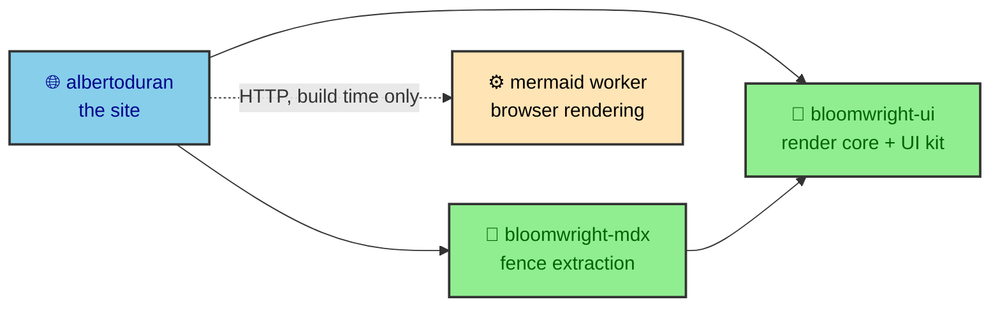

I started albertoduran.com after I was laid off. Applying for work kept exposing the same limitation. A résumé could summarize my experience, but it could not show much of how I approach a problem, and an interview rarely left enough time to explain the projects properly. I wanted a place where people could meet me through the work itself.

---

## One site became four repositories

The first version was a personal site. It grew into a portfolio, a set of project case studies, and a place for writing about technology and work. That growth created an engineering problem. Articles, diagrams, charts, navigation, and profile pages all had to stay readable without turning every visit into a client-rendered application.

The interesting part is what happened next. The pieces that solved that problem were project-shaped but generically useful, so a second project would have meant copy-paste. I pulled them out into their own packages. The site is now four repositories instead of one, and three of them hold most of the engineering worth reading about.

The dependency arrows only point one way. The site depends on both packages, `bloomwright-mdx` depends on `bloomwright-ui`, and nothing points back toward the site. That rule is the whole reason the extraction holds together, and the `bloomwright/` section explains what each repository is allowed to know about the others. The fourth repository is different in kind. It is a Cloudflare Worker that renders diagrams in a real browser, and the site talks to it over HTTP only at build time.

---

## The site is built ahead of time

Astro compiles the whole site to files before anyone visits. MDX becomes HTML, folders become publication policy, Mermaid fences become themed SVG, ECharts options become static figures, and images become responsive assets. Cloudflare serves the finished `dist` directory, and nothing assembles a page at request time.

Static output is an organizing constraint more than a performance boast. It removes request-time assembly and gives every route a readable baseline before a single line of JavaScript runs. The repository records no Lighthouse or Web Vitals numbers, and the build enforces a raw per-file JavaScript budget, so the honest claim is that the site is built to be fast rather than measured fast. Naming that plainly matters more than a tidy story.

---

## Content becomes a publication

Every article starts as an `.mdx` file in a folder, and a small pipeline decides its fate from there. A schema says what the file may contain, a manifest decides whether and where it publishes and works out its read time, static path generation turns it into a route, and the route renders it into the article shell. Folders become an ordered table of contents, and drafts stay invisible until they are ready.

That pipeline holds one clean rule in place. The schema owns content, the manifest owns policy, the route assembles the pieces, and components and CSS present them. Nothing downstream gets to redefine what an article is. The page you are reading went through that exact pipeline, which keeps the writing honest, because every claim can be checked against the page delivering it.

---

## Nothing renders in the reader's browser

Open the network tab on any article and there is no diagram library and no charting bundle. Both are gone before the page ships. A Mermaid flowchart arrives as a themed SVG file, an ECharts figure arrives as a static SVG, and the reader's browser draws neither. The work of turning source into pixels happens during the build, so a slow phone loads a picture instead of running a layout engine.

Keeping the reader's browser out of that work is a deliberate constraint, and it shapes the whole rendering path, from how a chart is hashed and cached to how a diagram survives a render outage. The `rendering/` section follows all of it.

---

## The browser adds the finishing touches

A few things only the browser can know. The reader's theme, viewport, scroll position, focus, and local timezone are facts the build never has, and small scripts own exactly those. They hold the theme across navigations, track the heading being read, open overlays, expand a finished diagram, wake a chart, and localize a match time.

Everything a reader actually needs is already in the static HTML. A diagram is an SVG before its expander connects, a chart is a figure before it hydrates, and an article is complete before any script loads. So a failed enhancement dims one small feature and never breaks the page, which is also what gives the no-JavaScript tests something real to check.

---

## The five sections

The vault follows the shape of the system rather than the `src/` folder tree. Five sections trace how the site is built, from the platform underneath to the interface a reader sees.

| Section         | Decision it explains                                                                    |
| --------------- | --------------------------------------------------------------------------------------- |
| `platform/`     | The four repositories, what stays in `src/`, the workspace, and the deployment target.  |
| `authoring/`    | The path from an MDX candidate to policy, route, and rendered article, fences included. |
| `bloomwright/`  | The two extracted packages, why they exist, and how this site consumes them.            |
| `rendering/`    | Build-time Mermaid and ECharts, the render Worker, caching, transforms, and fallbacks.  |
| `interface/`    | The visual system, theming, progressive enhancement, and reading navigation.            |

The sections meet through clear contracts, which pays off in maintenance. A wrong publication order points at the manifest, a missing route at path generation, a malformed diagram at the transform layer, and a broken overlay at a runtime script. The code still has leaks, but the intended ownership stays visible.

---

## Choose a route through the case study

Experienced developers can start with `authoring/fences`, `rendering/render_service`, or `bloomwright/seams`. Those pages hold the densest decisions and show where framework behavior ends and project policy begins.

Developers newer to Astro should start with `platform/index`, then `authoring/index` and `interface/index`. Each section introduces its terms before following them into code, so prior knowledge of content collections or static generation helps but is not required.

Hiring teams can read `platform/index` and `bloomwright/index` together for the scope and judgment behind the build, with the render Worker as a useful third stop for how I document a dependency that runs outside this repository.

Whichever route you take, the contributor rule is the same. Keep the static output readable, keep policy out of page assembly, label operational claims, and add proof at the layer where a failure can happen. That is the engineering argument this site can defend today.
