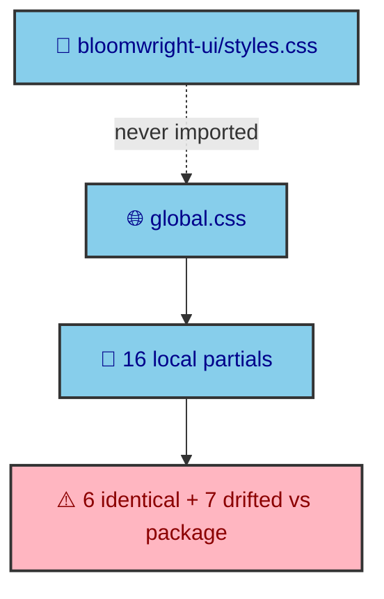

CSS breaks in ways that are hard to debug when the cascade order is accidental. This site avoids that by making the order explicit. A single `global.css` imports every partial in ten numbered stages, from the framework down to the article styles, so the cascade is a decision rather than a side effect of import order. That structure is also where the honest cost of extraction shows up, because the app keeps local copies of styles the package already ships. This page walks both.

---

## Ten numbered stages

The stylesheet reads top to bottom as a deliberate sequence, each stage commented with its number and name.

```text
1. FRAMEWORK        Tailwind + @source for the package
2. DAISYUI          the @plugin include list
3. THEME TOKENS     Tailwind theme + DaisyUI OKLCH themes
4. BASE             normalize, transitions
5. UTILITIES        js-states, gpu, touch-hover, misc
6. SHARED           daisyui-overrides, glass, hero
7. LAYOUT           page, parallax
8. UI               display, primitive, and mdx partials
9. INDEX            homepage-specific partials
10. THEJOURNAL      article layout, nav, dock, typography, diagram
```

The order encodes the cascade. The framework and tokens come first so everything downstream can use them, base and utilities set the ground rules, and the more specific a partial is, the later it loads. An article typography rule can safely override a shared default because it is stage ten and the default is stage six. Nothing depends on the accident of which file was imported first.

---

## Telling Tailwind about the package

Stage one carries a line that only exists because of extraction. Tailwind scans the app source for classes but ignores `node_modules`, so any class used only inside a `bloomwright-ui` component would be purged and that component would render unstyled.

```css
@source "../../node_modules/bloomwright-ui/src";
```

Stage two is the DaisyUI plugin, and its include list is short by design. The site opts into eleven DaisyUI parts, `button`, `card`, `badge`, `mockup`, `steps`, `chat`, `list`, `modal`, `table`, `input`, and `select`, which is exactly what the kit's components need and nothing more. Keeping that list explicit means the site pulls in the DaisyUI it uses rather than the whole library.

---

## The duplication the extraction left

Here is the uncomfortable part. `bloomwright-ui` ships a complete stylesheet, and the app never imports it. Instead stages six through ten import local partials, and many of them duplicate what the package already contains.

Six partials are byte-for-byte identical to their package versions, including the callout, chat, list, steps, and two mockup styles. Seven more have drifted by a handful of lines each, which is arguably worse, because now the app and the package disagree about the same component. The code-block and DaisyUI-override partials diverge the most, by around sixteen lines each.



---

## Why name it rather than hide it

This duplication is a real, current cost, and the honest move is to state it. The styles were extracted into the package, the app kept its own copies while other work took priority, and the divergences are small local tweaks that were never pushed upstream. A clean story would say the app imports the package stylesheet. That story would be false.

The fix is known and unglamorous. Adopt the package stylesheet, push the app's genuine tweaks upstream, and delete the local duplicates. Until that happens, the duplication stays on the record here, because a maintainer editing a callout style needs to know there are two files and only one of them ships. The ordered manifest is a strength. The duplicated partials inside it are debt, and both are true at once.
