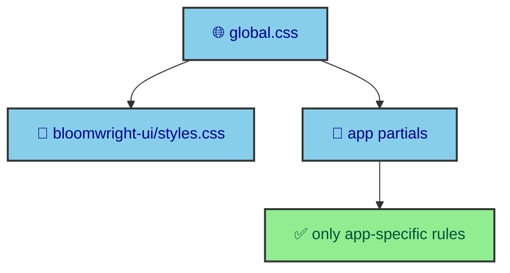

CSS breaks in ways that are hard to debug when the cascade order is accidental. This site avoids that by making the order explicit. A single `global.css` imports every partial in eleven numbered stages, from the framework down to the article styles, so the cascade is a decision rather than a side effect of import order. That structure is also where the extraction left its biggest mess: for a while the app kept local copies of styles the package already shipped. This page walks the order and how the copies were retired.

---

## Eleven numbered stages

The stylesheet reads top to bottom as a deliberate sequence, each stage commented with its number and name.

```text
1. FRAMEWORK        Tailwind + @source for the package
2. DAISYUI          the @plugin include list
3. THEME TOKENS     Tailwind theme + DaisyUI OKLCH themes
4. BASE             normalize, transitions
5. UTILITIES        js-states, gpu, touch-hover, misc
6. BLOOMWRIGHT-UI   the package stylesheet
7. SHARED           profile timeline, hero
8. LAYOUT           page, parallax
9. UI               ribbon, project media, code font
10. INDEX           homepage-specific partials
11. THEJOURNAL      article layout, nav, dock, header, typography
```

The order encodes the cascade. The framework and tokens come first so everything downstream can use them, base and utilities set the ground rules, the package's component styles come next, and the more specific a partial is, the later it loads. An article typography rule can safely override a package default because it is stage eleven and the package is stage six. Nothing depends on the accident of which file was imported first.

---

## Telling Tailwind about the package

Stage one carries a line that only exists because of extraction. Tailwind scans the app source for classes but ignores `node_modules`, so any class used only inside a `bloomwright-ui` component would be purged and that component would render unstyled.

```css
@source "../../node_modules/bloomwright-ui/src";
```

Stage two is the DaisyUI plugin, and its include list is explicit. The site opts into nineteen DaisyUI parts, from `button`, `card` and `navbar` through `mockup`, `steps`, `chat`, `list`, `modal`, `table` and `input`, which covers what the app and the kit's components use and nothing more. Keeping that list explicit means the site pulls in the DaisyUI it uses rather than the whole library.

---

## The duplication the extraction left

For a while, stage six did not exist. `bloomwright-ui` shipped a complete stylesheet and the app never imported it. Instead the later stages imported sixteen local partials, most of which repeated what the package already contained.

Measured line by line, the copies looked worse than they were. Eight were byte-for-byte identical to their package versions: the callout, chat, list, steps, and four mockup styles. Seven of the eight that "drifted" differed only in their header comments. The rules underneath were the same. Only two files held anything the app actually needed: one rule that sets the monospace font for code in articles, and the profile page's timeline column widths, which the package had deliberately left out because they are app-specific.


```mermaid
flowchart TD
    App["🌐 global.css"] --> Pkg["🧱 bloomwright-ui/styles.css"]
    App --> Local["📄 app partials"]
    Local --> Own["✅ only app-specific rules"]

    classDef a fill:#87CEEB,stroke:#333,stroke-width:2px,color:darkblue
    classDef b fill:#90EE90,stroke:#333,stroke-width:2px,color:#064E3B
    class Pkg,App,Local a
    class Own b
```

---

## How the copies were retired

The fix went in small steps, each one checked against the previous build. First, each identical or comment-only copy was swapped for a path import of the package file in the same position, and the built CSS came out byte-for-byte identical, down to its hashed file name. The two real app rules moved into files named after what they style. Then the fifteen package imports collapsed into the single `@import "bloomwright-ui/styles.css"` at stage six.

That last step could not be byte-identical, because the package orders its partials differently from how the app had interleaved them. So it was checked another way. The new CSS has the same 1,786 rules in the same cascade layers, a scan found no property set on the same selector by both a package rule and an app rule, and the full-page screenshots of every page type, in both themes, matched pixel for pixel.

The app's stylesheets now hold only what the app owns. A maintainer editing a callout style edits the package, and there is one file to change.
