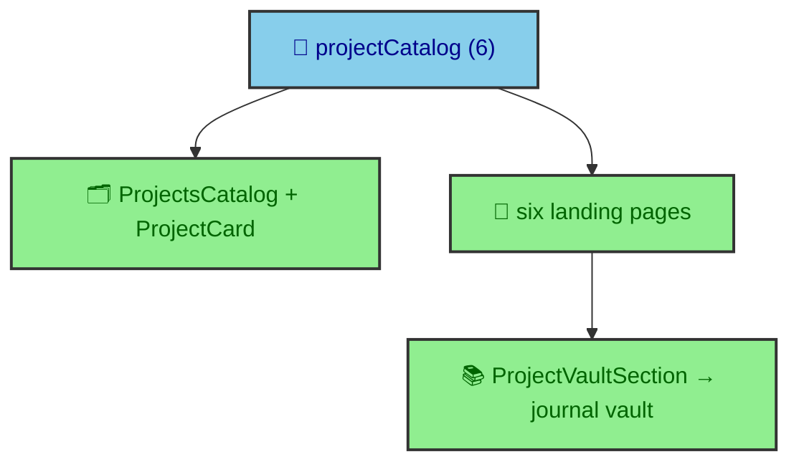

The journal is not the only thing this site publishes. There are project landing pages and a recruiter-facing profile, and they are the surfaces a hiring reader hits first. One of them is also the canonical front door for the vault you are reading right now. This page covers how project pages are built, how they connect to journal vaults, and how the profile assembles a résumé from typed data.

---

## A landing page in front of a vault

A project like this one has two faces. There is the journal vault, the long-form case study, and there is a landing page that introduces it. The landing page at `/projects/albertoduran/` is the canonical front door for the `building_albertoduran` vault, and that link is not hand-written. A data file maps the vault id to its landing route.

```ts
// src/data/project_pages.ts
export const PROJECT_LANDING_ROUTES = {
  building_albertoduran: "/projects/albertoduran/",
  equity_valuation_engine: "/projects/equity-valuation-engine/",
  mlscraper: "/projects/mlscraper/",
  sin_pluma: "/projects/sin-pluma/",
};
```

This is why the vault's top-level folder name is load-bearing. A helper resolves a vault's canonical destination through this map, so the project page becomes the front door for its vault. Rename the folder without updating this file and the front door points nowhere, which is why the `platform` section treats `building_albertoduran` as a fixed name.

---

## The pieces of a project page

A project landing page is assembled from a small set of components on a shared layout. `ProjectLayout` provides the shell, `ProjectHero` opens it, `ProjectVaultSection` lists the vault's publications, and `ProjectJournalCTA` invites the reader into the case study. The catalog of all projects renders through `ProjectsCatalog` and `ProjectCard` on the projects index.

`ProjectVaultSection` is the interesting one, because it is where a portfolio surface meets a journal vault. It renders the vault's entries through the `bloomwright-ui` list and section-header components, the same components an article uses, so the project page shows a live view of the vault built from the same manifest data. The six project landing pages under `src/pages/projects/` each follow this pattern, and `docs/content/PROJECT_PAGE_GUIDE.md` is the contract they hold to.

---

## Six projects, one catalog

The projects are defined once, in a typed catalog, and everything else reads from it. The catalog currently holds six entries, each a summary with a title, a description, and a landing route.



Defining the projects once means the catalog grid, the landing pages, and the vault front-door resolution all agree by construction. It also means a stale assumption about the count is a real bug, which is exactly the kind of drift a typed single source of truth is supposed to prevent.

---

## The profile is data, not prose

The profile page is the most résumé-like surface on the site, and it is built the same way the projects are, from typed data rendered through components. The page assembles a set of focused components, each owning one section of a professional profile.

`ProfileHero` opens it, and then `RoleFitPanel`, `RecruiterStrengths`, `ProfileImpactSnapshot`, `SkillsGrid`, `ExperienceTimeline`, `EducationList`, `CertificationsList`, and `AwardsGrid` each render a slice. The recruiter-facing components are deliberate. `RoleFitPanel` and `RecruiterStrengths` exist because the profile has a specific reader in mind, a hiring team deciding whether to talk to me, and the page is structured around that reader's questions rather than a generic timeline. `SkillsGrid` and the other components draw their icons from the app's own icon data through `bloomwright-ui`'s `SVGIcon`, which is the same icons-are-props seam the `bloomwright` section describes, applied to a completely different surface.
