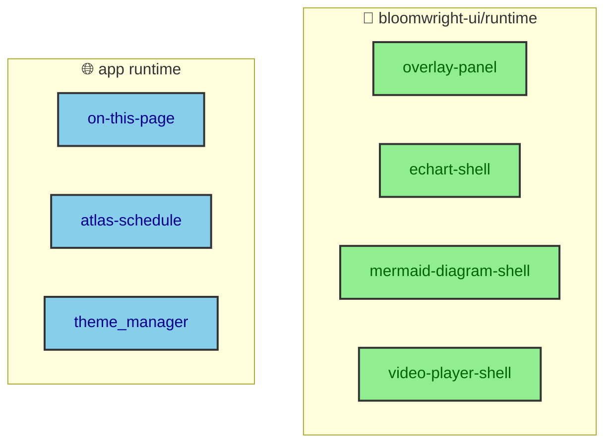

The rule for browser code on this site is short. Every runtime module improves something that already works without it. A diagram is already an SVG before its expander connects, a chart is already a figure before it hydrates, and an overlay's content is already in the page before its script runs. Extraction split the modules that do this across two repositories without moving the boundary itself. This page covers what runs in the browser, where it ships from, and why a failed enhancement is never a broken page.

---

## A baseline first, always

Progressive enhancement only means something if the baseline is real. On this site the baseline is static HTML that is complete on its own. The runtime modules add convenience, focus management, and local context on top of it, and if one fails, the page it enhanced still works.

That is the whole discipline. A module is allowed to make something nicer, and it is never allowed to be the thing that makes it function. The `rendering/` section shows the diagram and chart baselines. This page is about the layer that enhances them.

---

## Two repositories, one boundary

The custom elements that do the enhancing now ship from two places. The generic, reusable ones come from `bloomwright-ui/runtime/*`. The site-specific ones stay in the app.

- From `bloomwright-ui/runtime/*` come the overlay panel, the echart shell, the mermaid diagram shell, and the video player shell. These enhance components the package also ships.
- From the app come `on-this-page`, `atlas-schedule`, and the theme manager. These encode this site's own layout, data, and preferences.

The split follows the same rule as the rest of the extraction. Reusable enhancement is a package concern, and enhancement that only makes sense for this site stays local. `BaseLayout.astro` imports the package shells it needs, and the app registers its own.

---

## What the shells actually add

Each shell enhances a specific static baseline. The mermaid diagram shell turns a finished SVG into an expandable one, so a reader can open a dense diagram into a larger view. The echart shell hydrates a static figure into an interactive chart when the author asked for it. The video player shell drives media controls on top of a plain video element.

The overlay panel is the one worth naming, because it does the most delicate work. On a narrow screen the vault explorer and the table of contents live inside overlays, and the overlay panel manages their focus and scroll locking. When it opens, focus moves into the panel and the page behind it stops scrolling, and when it closes, focus returns. That is exactly the kind of behavior that has to be correct for keyboard and screen-reader users, and it is exactly the kind of thing that can only run in the browser.

---

## The app's own elements

Three elements stay in the app because they are about this site specifically. The theme manager owns the three theme deadlines the previous page described. The `on-this-page` element tracks the reader's position through an article, which the next page covers in detail. And `atlas-schedule` localizes the Atlas match time to the reader's timezone.

The Atlas widget is the cleanest small example of the whole baseline-plus-enhancement rule, which is why it earns its own page in this section rather than a paragraph here. The build renders the match time as a raw value, and `atlas-schedule` reformats it to the reader's local timezone in the browser. The full mechanism is documented in `build_time_data`. It stays named here so the app's runtime inventory is complete.

---

## Why failures stay local

The split across repositories does not change the most important property, which is that a failure is contained. Because every module enhances an independent baseline, a broken shell degrades one feature and touches nothing else. A failed diagram expander leaves a readable diagram. A failed overlay leaves content that is still in the page. A failed timezone localizer leaves a valid, if less local, time.

That containment is what makes the no-JavaScript tests meaningful, because there is a real baseline to test. It is also why splitting the runtime across two repositories was safe. The boundary between baseline and enhancement did not move when the modules did, so the guarantee it provides held through the extraction.
