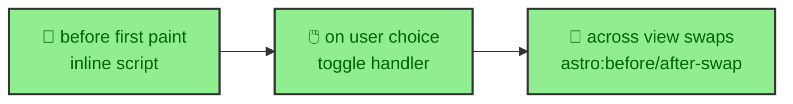

Theming is easy to get almost right and surprisingly hard to get right at every moment. A site can pick correct colors and still flash the wrong theme on load, or lose the reader's choice across a navigation. This site treats theming as three separate deadlines, each owned by a different layer, on top of a token system built in OKLCH. Getting all three right is what makes the theme feel solid rather than flickery. This page covers the tokens and the deadlines.

---

## Tokens in OKLCH

The themes are defined as DaisyUI 5 theme plugins, and the color values are OKLCH rather than hex. A dark theme and a light theme each declare a full set of semantic tokens, the base surfaces, the brand colors, and the semantic accents, as OKLCH coordinates.

```css
@plugin "daisyui/theme" {
  name: "dark";
  --color-base-100: oklch(0.15 0.0001 263.28);
  --color-primary: oklch(0.5333 0.2151 28.1);
}
```

OKLCH matters here because it describes color in terms of lightness, chroma, and hue, which makes it far easier to keep a palette perceptually consistent across a theme. Adjusting a color's lightness without shifting its hue is a coordinate change rather than guesswork. The tokens are semantic, so a component asks for `primary` or `base-100` and never a raw color, which is what lets one component render correctly in both themes.

---

## Three moments to be correct

A theme is not a single decision. It has to be right at three distinct moments, and a different layer owns each one.



Each deadline exists because the browser reaches that moment on its own schedule, and a theme that is correct at one can still be wrong at the next if nothing re-applies it.

---

## Before the first paint

The first deadline is the hardest, because it happens before most JavaScript runs. If the page rendered with a default theme and then corrected itself, the reader would see a flash of the wrong colors. The site avoids that with a tiny script that runs before paint, reading the stored preference or the system setting and stamping `data-theme` on the document root immediately.

That is why the theme manager reads both a stored value in `localStorage` and the system `prefers-color-scheme` setting. A returning reader gets their saved choice, a new reader gets their operating system's preference, and neither sees a flash, because the attribute is set before the first pixel is painted.

---

## On the reader's choice

The second deadline is the interactive one. When a reader flips the theme toggle, the handler applies the new theme to the document root and stores it, so the choice survives a reload. It also suppresses transitions for that instant, so the switch is a clean change rather than every colored element animating at once.

This is the only deadline the reader triggers directly, and it is the simplest, because the page is already alive and the manager can respond immediately. Storing the choice is what connects this moment back to the first deadline on the next visit.

---

## Across a navigation

The third deadline is the one a static site with view transitions has to handle carefully. A navigation swaps the page's content without a full reload, and a naive setup would lose the theme across the swap. The theme manager listens for the Astro swap events, `astro:before-swap` and `astro:after-swap`, and re-applies the theme so the incoming page keeps it.

Without that, a reader who chose dark would see a flash of light on every navigation, which would undo the work of the first deadline over and over. The three deadlines together are why the theme holds from the first paint, through a choice, and across every navigation, and why theming is a runtime concern the `progressive_enhancement` page counts among the app's own elements.
