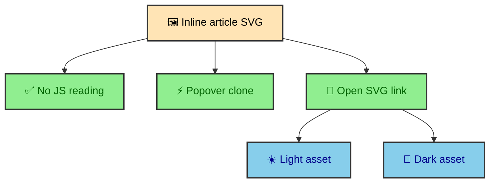

The Mermaid system does more than replace code fences with inline SVG. It also emits standalone theme-specific assets and hoists per-diagram CSS into page-level CSS. Readers receive inline diagrams, while the build receives stable asset URLs that it can reuse without claiming a measured speed result.

---

## Asset URLs

Standalone SVG assets use cache-addressed URLs.

```text
/_app/mermaid/{stableId}-{cacheKey}.svg
/_app/mermaid/{stableId}-{cacheKey}-dark.svg
```

The light asset and dark asset let the Open Diagram link target the current theme. The cache key includes renderer version and source content, so output-changing renderer updates can create new immutable URLs.

These assets are emitted during `astro:build:generated` by `emitAssets()`. The pipeline records used diagrams as it resolves them, then writes only the assets that appear in the built site.

### Why standalone assets matter

Inline SVG is best for reading inside an article. Standalone SVG is better for opening a diagram outside the article column, inspecting it at full browser width, and giving future builds a production cache target.

The standalone asset is also a static file like any other build output. Cloudflare can serve it from the edge. The article does not need to call a renderer when a reader opens the diagram in a new tab.

---

## Inline, expanded, and standalone

The article contains inline SVG for no-JS reading. The runtime popover clones that inline SVG when a reader expands the diagram. The standalone cached SVG remains available as a full-page or new-tab view.



Those three surfaces share the same source diagram but serve different reading moments. Inline supports the article. Expanded supports closer inspection without leaving the page. Standalone supports full-tab viewing and cache reuse.

The runtime shell does not need to render Mermaid. It only clones existing SVG, attaches page-level Mermaid CSS to the clone, rewrites clone IDs with an expanded suffix, and updates the Open link to match the current theme.

---

## Page CSS hoisting

`page-css.ts` scans built HTML, extracts `<style>` blocks from inline Mermaid SVGs, minifies them with CSSO, and injects a shared `<style data-mermaid-page-css>` block into the page head.

The core function removes style blocks from each inline Mermaid SVG and collects their CSS. It then minifies the collected CSS and writes one shared style block back into the HTML.

```ts
const result = minifyCss(css, {
  restructure: false,
});
```

The key detail is `restructure: false`. Mermaid page CSS depends on cascade order across diagram IDs and theme guards. Selector grouping can be valid CSS while changing how diagram-specific theme rules behave. The build keeps minification conservative for this CSS.

### Why hoisting belongs after build

The integration can only hoist CSS after Astro has generated complete HTML files. Before that point, diagrams are still HAST nodes inside MDX rendering. After route generation, the integration can scan full pages and operate on the exact markup that will be deployed.

This makes CSS hoisting a final output optimization rather than part of diagram rendering. The renderer creates SVG. The transform creates article-ready nodes. Page CSS hoisting reduces duplicate inline style weight in the finished HTML.

---

## Versioned output

`RENDERER_VERSION` is part of the Mermaid cache key. When emitted SVG or Mermaid CSS output changes for the same source diagram, changing the renderer version creates new asset URLs.

That version is a build contract. The site uses immutable asset URLs for Mermaid output, so the URL must change when the output bytes need to change. Source content handles most changes automatically. Renderer changes need the explicit version input.

The same idea appears in other static asset systems. A stable URL is useful only when the bytes behind it are meant to stay stable. When the bytes change, the address should change too.

---

## Asset discipline

This system checks several reuse layers. It can read memory, disk, and remote production assets before requesting a render, then emit standalone SVG files with input-derived names. Those mechanisms avoid known work, but the repository contains no comparative build timing that would support a speed claim.

The discipline is architectural rather than procedural. Cache keys include source and renderer version. Standalone assets include both light and dark variants. Page CSS hoisting avoids unsafe selector restructuring. Runtime expansion clones existing SVG instead of asking for a second render.

Those choices make Mermaid feel like a native part of the static publication system. A diagram starts as MDX text, becomes SVG during the build, and reaches readers as normal site output.

---

## Asset graph

Each Mermaid fence creates more than one useful output. The inline SVG sits inside the article. The light standalone SVG supports direct viewing in light mode. The dark standalone SVG supports direct viewing in dark mode. The wrapper carries data attributes that let the runtime choose the right Open link. Page CSS can be hoisted so repeated inline styles do not bloat the document.

This small asset graph is why Mermaid is handled by an integration instead of by a one-line markdown plugin. The site needs more than rendered SVG. It needs the rendered SVG to participate in routing, theming, static assets, runtime links, and page optimization.

The graph stays manageable because every output comes from the same source diagram and cache key. The build can reason about the diagram as one unit even though it emits multiple artifacts.

---

## Standalone SVG behavior

Standalone assets need to look right outside the article page. They cannot rely on the article's surrounding CSS or `data-theme` wrapper. That is why emitted assets receive background treatment and theme CSS appropriate to the file.

The light asset is the default no-JS Open link. The dark asset is available through runtime link switching. Both are static files under the built asset directory. A reader can open them directly, and Cloudflare can serve them like any other asset.

This is especially useful for dense diagrams. Inline diagrams keep the article readable. Standalone assets give readers a larger direct view without requiring a client-side render.

---

## Page CSS as output

Page CSS hoisting treats Mermaid styles as part of generated page output. The integration scans final HTML, finds repeated diagram styles, and moves shared CSS into a page-level style tag. That reduces repetition while keeping cascade behavior intact.

The hoisted style is also useful to the runtime shell. When a diagram is expanded, the shell can attach the page CSS to the cloned SVG so the popover version matches the inline version. Build-time optimization and runtime enhancement share the same marked CSS output.

This is another example of the build preparing a stable artifact the browser can reuse.

---

## Cache keys and reader experience

Cache keys are not only a build performance detail. They influence what readers receive. If a diagram source changes, the output URL changes. If the renderer version changes, the output URL changes. If nothing changes, the same asset can be reused.

That makes the reader experience stable. The browser and edge can cache unchanged diagrams confidently. Updated diagrams get new addresses. The article can link to the exact asset generated for its current source.

This is how static assets should behave. The URL represents a specific build product.

---

## Invalidate assets deliberately

Mermaid assets are treated like first-class publication output. Inline SVG serves the article. Standalone SVG serves direct inspection. Page CSS hoisting serves output weight and popover reuse. Cache keys and renderer versions keep asset URLs honest.

That asset discipline is what lets Mermaid diagrams feel immediate in the article while still supporting theme-aware direct viewing.

---

## How assets support no-JS

The inline SVG is the main no-JS path. It sits in the article HTML and remains readable without runtime code. The light standalone asset gives the Open link a valid destination even before the Mermaid shell updates the link for the current theme.

This means JavaScript is not required for diagram access. JavaScript improves the link target and popover experience, but the article already contains the diagram. That is the same progressive enhancement rule used across the site.

The asset system is therefore part of accessibility as well as performance. Diagrams are content, and content should be present in the static output.

---

## How assets support runtime

The runtime shell relies on asset metadata produced by the build. The wrapper stores light and dark standalone URLs. The shell reads those URLs and changes the Open link when `html[data-theme]` changes. The popover expansion clones inline SVG and can attach page CSS that the build marked.

Runtime code is small because the build prepared the assets and attributes. The browser does not need to discover where dark SVG files live or regenerate diagram CSS. It only reads what the integration placed in the page.

This is a clean handoff. Build emits artifacts. Runtime connects them to the current document state.

---

## Asset output as documentation

The emitted SVG files are also documentation of the build. A developer can inspect `dist/_app/mermaid/` and see the generated assets that correspond to article diagrams. The filenames carry stable IDs and cache keys. Light and dark variants sit beside each other.

That visibility matters for a custom integration. The output is not hidden inside a remote renderer or a browser runtime. It is a static artifact that can be inspected as part of the built site.
