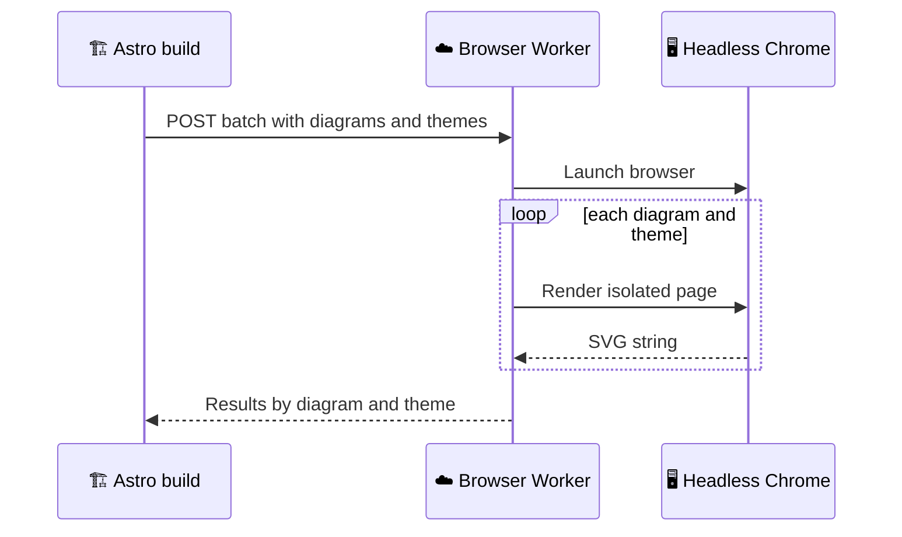

The primary Mermaid renderer is not part of this Astro repository. That separation is deliberate. Mermaid needs headless Chromium, a browser engine running without a visible window, for accurate layout. The site build should stay a static publishing pipeline. Browser work belongs in a Worker service that can own launch, payload shape, authentication, theme rendering, and SVG return values.

---

## Platform shape

The renderer service lives in `duranalberto/mermaid-cloudflare-browser-rendering`. It uses Cloudflare Browser Rendering, `@cloudflare/puppeteer`, a `BROWSER` binding in `wrangler.json`, and `nodejs_compat`.

The Astro build sends Mermaid source and theme config to that service. The service launches a browser, renders diagrams, returns SVG strings, and lets this repository transform those SVGs into site-ready assets.

That split keeps the Astro project from carrying a local browser process. The static site repository can be optimized for content, routes, and generated assets. The renderer service can be optimized for browser execution and Mermaid layout.

### Why Cloudflare Browser Rendering fits

The site already deploys to Cloudflare Workers Assets, so using a separate Cloudflare Worker for headless browser rendering keeps the operational model familiar. The renderer is still a service boundary, but it lives near the same platform family as the static host.

The important part is that the service is not on the reader's request path. It runs during builds. Readers receive the resulting SVG assets from the static site.

---

## Batch API

The service supports an optimized batch mode and legacy single-diagram modes. The batch mode is the important one for this site.

- The request sends `batch`, `themes`, and `fontFamily`.
- One browser launch can render many diagrams.
- Every diagram is rendered against all requested themes.
- The response returns `results` keyed by diagram ID and theme name.

Batching changes the economics of the build. Instead of launching a browser for every diagram and every theme, the Worker can handle a group of diagrams in one request. That is why the Astro pipeline collects registrations before flushing.

---

## Per-theme render isolation

Each theme render navigates to `about:blank` and reinjects the page shell. That hard reset keeps Mermaid's internal counters, registries, and generated IDs from carrying state between theme renders.

The Worker renders every requested theme independently, then returns raw SVG strings grouped by diagram ID. This repository merges those theme-specific SVGs later. The renderer does layout. The Astro integration owns HAST transformation, ID rewriting, CSS scoping, cache keys, and asset emission.

That boundary is useful because it keeps service output simple. The Worker does not need to know about article wrappers, runtime popovers, or page CSS hoisting. It returns SVG strings. The static site decides how those strings become publishable assets.

---

## Font handling

The build sends the site font family with the batch request. The renderer merges that font into Mermaid theme variables before rendering. The goal is SVG text metrics that match the frontend closely enough for diagrams to feel native in the article.

Fonts matter because Mermaid layout depends on text size. A node label measured in one font can produce a different diagram shape than the same label measured in another font. Passing the site's font family keeps build output and article typography aligned.

The renderer does not need to duplicate the entire site CSS. It needs the theme variables and font family that affect Mermaid layout. The site can then wrap and style the finished SVG in its own article shell.

---

## Service boundary

The Worker service owns browser execution, request payload size, authentication, Mermaid rendering, and SVG return structure. The Astro repository owns caching, transformation, static asset URLs, inline SVG placement, and runtime shell behavior.

That boundary is the main design point. Browser rendering is a specialized job. Static publishing is a different job. The site stays maintainable because those jobs meet through a small request and response contract rather than a shared tangle of build code.

The public `mermaid.ink` path remains available through the renderer chain, but the self-owned Worker is the service designed for this site's batch-oriented build.

---

## Why a browser renderer exists

Mermaid layout is browser-shaped work. Diagram text, font metrics, SVG sizing, and layout calculations are easier to produce in an environment that behaves like the browser. The static site could try to run that locally during every build, but a dedicated Worker keeps that concern in one service.

The Worker is not a publishing system. It does not know about MDX, article routes, code block wrappers, or Cloudflare Pages deployment. It knows how to receive Mermaid diagrams, apply theme configuration, render SVG, and return the results.

That focused responsibility makes the service easier to reason about. The Astro repository can evolve its content model and article shell without changing how the renderer executes Mermaid. The renderer can improve browser execution without changing the journal manifest.

---

## Request shape

The batch API receives diagrams, themes, and font information. The request is authenticated and constrained by payload limits because the service is a remote rendering surface. The service then renders each requested diagram and theme combination.

Batching is useful because a static build can know many diagrams at once. Sending them together reduces round trips and gives the renderer a build-oriented contract. The site is not asking the renderer to serve live readers. It is asking for build artifacts.

The response stays simple. SVG strings come back grouped by diagram ID and theme name. The Astro integration can then decide how to merge themes, rewrite IDs, emit assets, and wrap output.

---

## Clean render state

The renderer resets the page between theme renders so Mermaid internal state does not leak from one render to the next. That isolation matters because generated IDs, counters, and theme state can otherwise carry across diagrams or themes.

The site wants each SVG to be a clean product of its diagram source and theme config. A light render should not inherit state from a previous dark render. A second diagram should not inherit IDs from a first diagram. Resetting the page shell keeps the renderer output predictable.

The transform layer still rewrites IDs later, but clean renderer output makes that transform easier to reason about.

---

## Service and repository split

The external renderer repository can focus on browser automation, Mermaid execution, authentication, and response shape. The Astro repository can focus on build integration, caches, HAST transforms, CSS hoisting, article wrappers, and runtime shell behavior.

This split prevents the static site from becoming responsible for every operational detail of browser rendering. It also prevents the renderer service from learning project-specific article rules. The shared contract is SVG output.

That is the same architectural habit used elsewhere in the project. Each layer owns the information it has. The renderer knows how to render. The site knows how to publish.

---

## Fallback provider role

The provider chain still includes `mermaid.ink`, so the system has more than one rendering path. The Worker is the preferred path for this site's batch build because it is self-owned and designed around the needed contract. The public provider remains useful as another implementation behind the same renderer interface.

That interface is what matters. Downstream code receives rendered SVG maps. It does not need to know whether a Worker or public provider produced them until the transform layer handles provider-specific SVG differences.

The renderer service is therefore one provider in a larger build pipeline, not a special case that leaks through every file.

---

## Why batch rendering fits static builds

A static build can gather work before asking for output. That is different from a live request where one reader asks for one diagram at one moment. The build can see many diagrams across MDX files and ask the Worker to render them as a batch.

Batch rendering fits the site's cost model. Browser rendering is expensive compared with string transforms and file writes. Doing it in grouped requests makes that cost easier to manage and easier to cache around. The pipeline can render what changed and reuse what did not.

This is also why the Worker returns plain SVG strings rather than article-ready wrappers. The renderer should stay focused on the expensive browser work. The static site can then perform repository-specific transformations locally.

---

## Operational separation

The renderer repository has its own concerns. It can change how it launches the browser, loads Mermaid, enforces auth, or limits payloads without forcing article components to change. The Astro repository has its own concerns. It can change wrappers, asset paths, page CSS hoisting, or runtime popover behavior without changing browser execution.

That separation makes each side easier to evolve. The integration point is narrow enough to explain in one sentence. Send diagram sources and theme config. Receive SVG strings. Everything else belongs to one side or the other.

That narrow contract is what lets a remote browser renderer feel like part of a static build instead of a second application.
