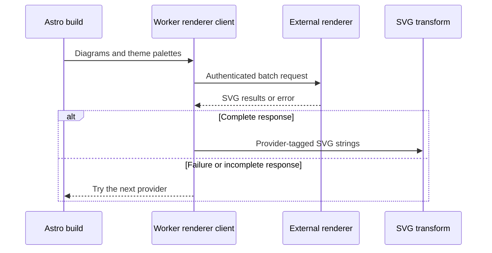

The build calls a Mermaid renderer that this repository does not contain. That missing source changes what I can responsibly document. The client code proves the request, response, timeout, and fallback contract. It cannot prove how the remote Worker launches browsers, isolates pages, loads fonts, or behaves in production. This page draws that line and shows what evidence would be needed to move it.

---

## Why the build needs a browser boundary

Mermaid turns text into an SVG whose layout depends on browser features such as text measurement. I wanted the published article to contain the finished diagram, so readers would not have to download Mermaid and render it themselves. The Astro build therefore sends unresolved diagrams to a remote renderer and receives SVG strings before static pages are written.

Cloudflare now calls its headless browser product [Browser Run](https://developers.cloudflare.com/browser-rendering/). Older repository names and environment variables may still use the former Browser Rendering name. The current name matters when someone searches the platform documentation, while the older identifier may remain part of a stable internal contract.

---

## What the repository verifies

`src/integrations/mermaid/renderers.ts` contains the client boundary. `CloudflareWorkerRenderer` becomes available only when the renderer URL and secret exist. It sends one JSON request with diagram IDs, Mermaid source, theme configuration, and a font family. The response must return SVG results grouped by diagram ID and theme.

```ts
const body = {
  batch: diagrams.map((diagram) => ({
    id: diagram.id,
    code: diagram.code,
  })),
  fontFamily: resolveFontFamily(themes),
  themes: themesPayload,
};
```

The renderer chain also proves failure behavior. A provider can decline, throw, time out, or return an incomplete result. The build then tries the next enabled provider. Deterministic test mode branches before that provider chain and creates fixture SVG locally, so CI does not need the remote service.

---

## The inferred sequence

The client lets us document the exchange without pretending to know the remote implementation. Everything inside the external service remains an operational claim until its source or telemetry is supplied.



This boundary also explains why batching belongs in the local pipeline. Many MDX files compile concurrently, but the integration collects their diagram registrations before it flushes. The external request can then carry several diagrams and themes instead of forcing each article to invent its own network lifecycle.

---

## What remains unverified

The Astro repository does not include the Worker's source, `wrangler.json`, binding declarations, authentication checks, font files, cleanup code, or production logs. Claims about browser reuse, page isolation, request limits, deployed Mermaid versions, or quota consumption would describe another system without showing its evidence.

> External evidence required. A production account setting, renderer implementation detail, or observed service result needs the Worker source, deployment configuration, or dated telemetry before it belongs in this case study.

The [Browser Run limits](https://developers.cloudflare.com/browser-rendering/platform/limits/) describe platform constraints, not this service's observed usage. They help an operator design quotas and retries. They do not tell us which plan is active, how close production runs come to a limit, or whether a particular build used cached output.

---

## Failure containment

The static build treats the renderer as a dependency that can fail. The Worker client has a request timeout, while the public `mermaid.ink` renderer provides a separate fallback path. If every enabled provider fails, the pipeline records an error result rather than silently presenting a diagram as successful.

The fallback carries its own cost. A public renderer has different availability and rate behavior, and its requests happen per diagram and theme rather than through the Worker's batch contract. The provider article explains those tradeoffs. This page only establishes that the external Worker is preferred, not guaranteed.

Authentication belongs at the same boundary. The local client sends a configured secret, but this repository cannot prove how the service validates it or rotates credentials. A future operational review should inspect both sides and avoid copying secret values into build logs or published examples.

---

## Evidence needed for an operational claim

A maintainer can make this page more specific once the missing service evidence is available. The useful package would include the renderer commit, deployment configuration with secrets removed, Mermaid and browser versions, a representative production response, and dated timing or error summaries.

That evidence would answer questions the current repository cannot. It could show whether browser sessions are reused, whether every theme starts from isolated state, how fonts load, which payload sizes fail, and where quota pressure appears. Until then, those details remain design expectations rather than verified behavior.

The contributor boundary is simple. Change the local request or response shape only alongside the external service, tests, fixture output, and fallback behavior. A small JSON edit here crosses a repository boundary, which makes compatibility more important than convenience.
