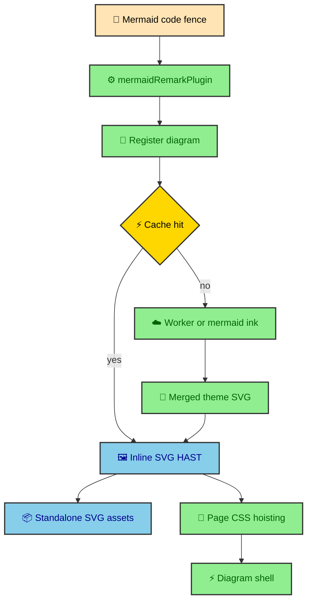

Mermaid looks like text until you ask for production-quality SVG. It is a diagram syntax that lets authors write flowcharts, sequence diagrams, and related visuals inside Markdown fences. Layout, text measurement, labels, and theme output all expect browser-like behavior. I did not want each reader's browser to perform that work, and a local headless browser did not fit the static Cloudflare deployment path. The site ended up with a custom build-time Mermaid integration that treats diagrams as generated assets.

---

## The rendering constraint

The site is static-first, but Mermaid rendering still needs a browser environment. Flowcharts and sequence diagrams are not simple text transformations. Mermaid has to measure labels, place nodes, produce SVG, and apply theme configuration.

That creates a shape problem. The Astro site wants to build a static `dist/` folder. Mermaid wants a browser-like renderer. The project solves that by moving browser work into renderer services and keeping the Astro repository focused on registration, caching, transformation, and asset emission.

The primary renderer is a self-owned Cloudflare Browser Rendering Worker. `mermaid.ink` remains as the public fallback. The Worker is the preferred steady-state path because it accepts batched work, renders all requested themes, and gives this repository a stable service contract.

### The goals

The integration exists to meet a few product and architecture goals.

- Readers should never see raw Mermaid source before a diagram appears.
- The browser should not download Mermaid just to read an article.
- Diagrams should match the site's light and dark themes.
- Repeated builds should reuse unchanged diagram output.
- Standalone SVG assets should exist for new-tab viewing and cache reuse.
- Inline SVG should remain readable before runtime enhancement.
- Runtime code should only add interaction around a diagram that already exists.

Those goals explain why the integration is broader than a remark plugin. It has to coordinate Markdown processing, external rendering, cache hierarchy, HAST transforms, standalone assets, CSS hoisting, and runtime shell attributes.

---

## Current flow

The integration turns a Markdown code fence into inline SVG and standalone SVG assets. The build path looks like a small rendering pipeline inside the larger Astro build.



The code fence starts in MDX. The remark plugin sees it before it becomes a regular code block. The plugin computes a stable diagram ID, registers the diagram with the build pipeline, and receives a HAST node containing the rendered SVG.

The rendered article gets inline SVG. The build also emits standalone light and dark SVG files under `/_app/mermaid/`. Runtime code wraps the inline diagram with expansion controls and theme-specific Open links, but the diagram itself is already part of the static HTML.

---

## Integration order

The order in `astro.config.mjs` matters. `mermaidIntegration()` appears before `mdx()` because the integration injects a markdown processor that MDX must pick up during its own setup.

```js
integrations: [
  mermaidIntegration({
    themes: new Map([
      ["light", LIGHT_PALETTE],
      ["dark", DARK_PALETTE],
    ]),
  }),
  mdx(),
  customHtmlMinifier(),
]
```

This ordering is part of the build architecture. Mermaid needs to intercept `mermaid` fences while the Markdown tree is still available. If MDX runs without the plugin, the fence becomes ordinary code and the diagram pipeline never sees it.

The custom HTML minifier runs after MDX and after Mermaid generation because it works on built HTML files. That lets minification operate on the final output while respecting protected fragments such as code blocks.

---

## Build hooks

The Mermaid integration uses Astro build hooks to place work at the right moment. `astro:build:start` creates a fresh `DiagramPipeline` and prepares `.astro/mermaid-cache/`. The remark plugin then registers diagrams as MDX files are processed.

`astro:build:generated` emits standalone SVG assets into `dist/_app/mermaid/`. At that point, Astro has generated routes and the pipeline knows which diagram assets were used. The emitted assets mirror the inline diagrams but receive standalone background and theme CSS for direct viewing.

`astro:build:done` hoists Mermaid page CSS from inline SVG into page-level CSS and logs a build summary. That final hook runs after HTML exists, which is the only time the integration can scan complete built pages.

### Why the renderer is external

The external renderer repo is `duranalberto/mermaid-cloudflare-browser-rendering`. The Astro site treats that service as a rendering dependency rather than a local module. This keeps browser launch, Mermaid execution, authentication, payload limits, and renderer lifecycle out of the static site repository.

The separation is important. The static site build remains a content and asset pipeline. The browser rendering service owns the browser. Each side does one kind of work.

---

## What the reader receives

The reader receives static HTML with inline SVG diagrams. If JavaScript never runs, the article still has readable diagrams and an Open SVG link. If JavaScript does run, `mermaid-diagram-shell` updates the Open link for the current theme and adds popover expansion.

That is the same progressive enhancement principle used elsewhere in the site. The build owns the content. Runtime owns optional interaction. Mermaid is one of the clearest examples because the expensive part is visibly absent from the browser bundle.

The custom integration exists because diagrams are content here. They are not decorative widgets, and they are not runtime chores. They are part of the published article output.

---

## Why Mermaid is a build system

Mermaid is not treated as a small markdown flourish in this project. A diagram affects article readability, theme consistency, asset output, runtime expansion, and page weight. That makes it a build system inside the larger static build.

The author writes a Mermaid code fence. The remark plugin records the diagram. The pipeline creates stable IDs and cache keys. Renderers produce SVG output for light and dark themes. The transform layer sanitizes and merges theme variants. Asset emission writes standalone SVG files. Page CSS hoisting reduces repeated inline style blocks. The runtime shell uses the generated artifacts for theme-aware links and popovers.

That path is longer than a normal markdown code fence, but it is exactly why the final article stays simple for readers. The browser receives diagrams as finished SVG, not as Mermaid source that still needs a renderer.

---

## Authoring stays ordinary

The system is complex so authoring can remain ordinary. An article author writes a Mermaid fence with diagram source. The integration does the heavy work. The MDX file does not need to import a diagram component, choose light and dark SVG paths, or wire a popover.

This keeps diagrams available to long-form writing. A technical article can explain a pipeline with a Mermaid flowchart without turning the article into a component implementation. The build translates that content into the site's diagram format.

That is the recurring publishing pattern in this repository. Authors write structured content. The build turns structure into a polished site.

---

## Static output and runtime shell

The runtime shell exists because the finished diagram can still benefit from browser interaction. It can update Open SVG links based on the active theme. It can clone an inline SVG into a larger popover. It can attach page CSS to that clone and rewrite IDs so the expanded copy stays self-contained.

None of that changes the core rendering decision. Mermaid itself is rendered before deployment. Runtime code inspects and clones finished SVG. The reader gets fast inline diagrams first and optional interaction second.

This split is why Mermaid belongs in both the integration and runtime sections of the vault. The build creates diagram output. The runtime makes that output easier to inspect.

---

## The section map

The Mermaid section follows the pipeline in pieces. `pipeline` explains registration, cache hierarchy, batch orchestration, asset emission, and fixture mode. `browser_renderer_service` explains the Cloudflare Worker that owns browser-based rendering. `renderers` explains provider selection and fallback. `transform` explains how raw SVG becomes article-ready HAST. `theming` explains how site palettes become Mermaid config. `assets_and_css` explains emitted files, page CSS hoisting, versioning, and runtime asset expectations.

Together, those entries show why diagrams feel native in the final site. They are not screenshots pasted into articles. They are build artifacts with theme, cache, asset, and runtime contracts.

---

## Why this belongs in the vault

The Mermaid system is the clearest example of how the website turns author-friendly source into deployment-friendly output. The source is a readable code fence in MDX. The output is inline SVG, standalone assets, page CSS, and runtime metadata. The authoring surface stays simple because the build pipeline carries the specialized work.

That makes Mermaid a useful mental model for the rest of the site. The journal manifest does the same kind of translation for content structure. The image pipeline does it for visual assets. The Atlas loader does it for external sports data. Each feature accepts source material, normalizes it during the build, and gives the browser finished output.

When reading this section, follow that translation. Start with the fence. Watch it become registered pipeline state. Watch rendering produce SVG. Watch transforms make that SVG safe and themed. Watch assets and CSS become files. Watch the runtime shell add interaction without taking ownership of rendering.

---

## The reader outcome

The reader does not need to know any of this while reading an article. They see a diagram where the author placed one. The diagram matches the theme, loads with the page, opens as an asset, and expands when requested. That is the user-facing value of the pipeline.

The build complexity is justified because it disappears from the reading experience. The site absorbs the hard parts so the article can present diagrams naturally.
