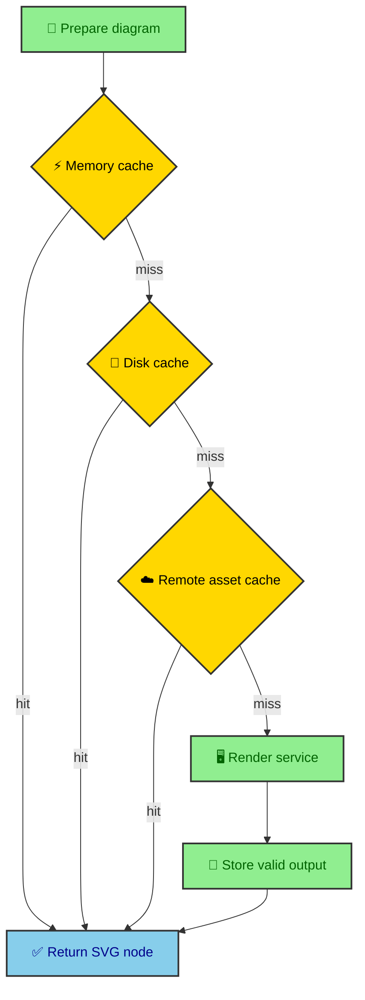

The Mermaid pipeline exists because every unnecessary render has a cost. It can cost build time, Browser Run quota, public fallback patience, and cache stability. `DiagramPipeline` is the build-scoped coordinator that receives Mermaid fences from MDX, checks caches, batches render requests, and records the assets that need to be emitted. It keeps unchanged diagrams stable across builds.

---

## Pipeline state

`createPipeline()` returns a build-scoped `DiagramPipeline` instance. The integration creates it at `astro:build:start`, scans publishable Markdown for Mermaid fences, calls `prepareDiagrams()`, and clears the reference after `astro:build:done`. During Markdown rendering, the Sätteri plugin only performs synchronous `getDiagram()` lookups against that prepared registry.

The important design choice is instance state. The pipeline does not rely on module-level singletons that need manual reset calls between builds. The integration creates one pipeline for one build, then the closures used by the plugin and build hooks share that instance.

Stable IDs use eight hex characters from SHA-256 of the diagram source. Cache keys use `RENDERER_VERSION` plus diagram source. That second value matters because the same Mermaid source can produce different SVG bytes after renderer or transform changes.

```ts
function buildCacheKey(code: string, version: string): string {
  return createHash("sha256").update(`${version}::${code}`).digest("hex");
}
```

The stable ID gives the diagram a readable identity inside the page. The cache key gives the generated asset an immutable output address.

---

## Cache reuse as design

The pipeline checks several caches before calling a renderer. Each layer avoids a different kind of work.



The memory cache handles repeated diagrams within the same build. The disk cache lives under `.astro/mermaid-cache/` through `AstroDiskBus`. The remote asset cache reads from `config.site + assetHref` unless `MERMAID_DISABLE_REMOTE_CACHE=true`.

Remote cache lookup is a static-site trick. If production already has the exact SVG asset for a diagram, the next build can fetch it, strip standalone-only CSS, sanitize it, and reuse it as the prepared SVG node. The generated site becomes part of the build cache.

---

## Batch orchestration

Diagram preparation can touch many source files at nearly the same time. The pipeline collects unresolved diagrams before it flushes a render batch.

`FLUSH_DEBOUNCE_MS = 800` gives concurrent preparation calls time to collect diagrams. `CHUNK_SIZE = 40` keeps Worker payloads within the expected size. `INTER_CHUNK_DELAY_MS = 22000` spaces Worker chunk requests so the rendering service is not treated like an infinite local function.

The batch flush copies the current batch, clears the queue, and renders chunks one at a time. Each chunk calls `fetchDiagrams()`, then transforms the returned theme map into a site-ready HAST node with `buildMergedThemeNode()`.

### What gets stored

Only usable SVG output gets cached. Placeholder nodes and transform states that do not produce usable SVG are left out of memory, disk, and asset caches. That keeps the cache focused on real diagram output.

The pipeline also records each used asset so `emitAssets()` can write only diagrams that actually appear in built pages. The asset registry is tied to `registerResolvedNode()`, which means memory, disk, remote, and fresh renders all flow through the same asset bookkeeping.

---

## Asset emission

`emitAssets()` writes light and dark SVG pairs to `dist/_app/mermaid/`. The file names combine the stable ID and cache key.

```text
/_app/mermaid/{stableId}-{cacheKey}.svg
/_app/mermaid/{stableId}-{cacheKey}-dark.svg
```

The article receives SVG image metadata. The standalone assets power visible diagrams, Open Diagram links, and production cache reuse. That split gives readers immediate static diagrams and gives the build a durable reuse target for unchanged diagrams.

Standalone assets receive background CSS and a background rectangle. The dark asset also receives unguarded dark CSS so it can render correctly as its own file rather than relying on a page-level `data-theme` wrapper.

---

## Fixture mode as build shape

`MERMAID_RENDERER_FIXTURE=true` switches rendering to deterministic local fixture output. That mode exists so the static build can exercise the pipeline without external renderer calls.

The fixture renderer still produces SVG maps for the requested themes. The rest of the pipeline still prepares diagrams, merges theme output, and emits assets. That keeps the build shape close to production while replacing the network-dependent rendering step.

This is another example of the site's general pattern. External work is isolated behind a contract, and the build can still walk the same architecture with controlled inputs.

---

## Preparation before MDX

The pipeline starts before MDX is processed. Mermaid code fences are not rendered directly by the browser. The integration scans publishable Markdown, prepares each source with the `DiagramPipeline`, and stores the resulting asset metadata in a build-scoped registry.

That preparation step is important because the build needs to know all diagrams before Sätteri transforms their files. A diagram is both article content and a future static asset. The pipeline gives it an identity before the renderer sees it.

The stable ID and cache key are separate ideas. The stable ID gives the diagram a readable anchor across output files. The cache key reflects the source, themes, renderer version, and other inputs that affect output bytes. Together they support predictable filenames and cache reuse.

---

## Cache hierarchy

The cache hierarchy is also a design statement. Memory cache helps within one build. Disk cache under `.astro/mermaid-cache/` helps across local builds. Production asset reuse can avoid rendering diagrams whose immutable assets already exist. Fixture mode can replace the renderer call while preserving downstream build shape.

This hierarchy exists because browser rendering is the expensive part. If the source and renderer inputs have not changed, rendering again is waste. The rest of the build still needs to know the diagram exists, but it can reuse the SVG output.

Caching is not only a speed feature. It also makes the pipeline feel like a static asset system. Diagram output is treated as a product of inputs, not as a fresh side effect every time.

---

## Renderer batching as a service contract

The Worker renderer supports batch requests, so the pipeline can send multiple diagrams and themes together. This is a service contract, not only an optimization. A vault article can contain several diagrams, and a full build can contain diagrams across many pages, so the renderer should accept the shape of build work.

Batch orchestration also centralizes renderer configuration. The pipeline can pass theme maps, font information, and diagram sources through one service contract. The renderer returns SVG strings grouped by diagram and theme. The transform layer then takes over.

The provider boundary stays clean. The pipeline does not need to know browser details. It needs rendered SVG output. The renderer does not need to know article layout. It needs diagram source and theme config.

---

## From SVG map to article node

After rendering, the transform layer receives theme-specific SVG strings and builds one merged SVG node. Asset emission writes light and dark standalone versions for article images and Open links. The Sätteri plugin later emits the wrapper metadata that points at those assets.

The pipeline therefore connects several outputs from one source fence. Article image metadata, standalone light SVG, standalone dark SVG, cache entries, and runtime data attributes all trace back to the same diagram source.

That is why pipeline state matters. The integration needs to remember diagrams not only as content snippets, but as build artifacts with multiple output responsibilities.

---

## Keep preparation build-scoped

The Mermaid pipeline turns a code fence into a set of static artifacts. It prepares diagrams before MDX processing, reuses cached SVG where possible, renders through provider contracts, transforms output into article-safe nodes, emits standalone assets, and supports deterministic fixture builds.

That is a lot of work, but it happens before deployment. The reader receives diagrams as part of the page, which is exactly the static-first philosophy applied to visual documentation.

---

## Pipeline state as memory

The pipeline acts as build memory. Before MDX files are processed, diagrams are collected from publishable source files. The pipeline gives them identities, tracks cache keys, stores render output, and later emits assets after Astro has generated routes.

That memory is necessary because Mermaid output is used in more than one build phase. The article needs asset metadata during rendering. The asset hook needs to write standalone files later. The build summary needs to know what happened.

Without a pipeline object, those phases would have to communicate through scattered globals or repeated filesystem scans. A named `DiagramPipeline` gives the integration one place to hold diagram state and one vocabulary for moving diagrams through the build.

---

## Why hooks matter

Astro hooks place each step at the moment when enough information exists. At build start, the integration can prepare caches and diagram metadata. During MDX processing, Sätteri can read the prepared registry. At build generated, the integration can emit assets into the output directory. At build done, it can report the build summary and clear state.

This hook order keeps the work honest. The integration does not try to emit assets before it knows what diagrams exist. It does not wait until runtime to do work that the build can finish.

The pipeline is therefore both a data structure and a schedule.
