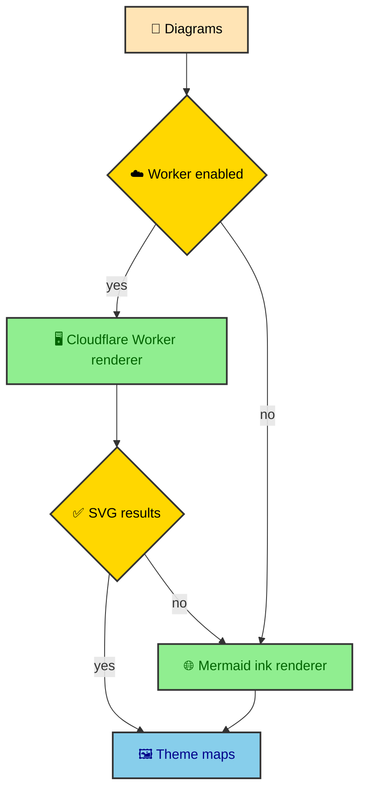

The renderer chain has two jobs. Prefer the external batch service, then use a public renderer when that path is unavailable. Both providers produce SVG strings, but they have different payload contracts, rate behavior, and transform requirements. The site hides those differences behind one `fetchDiagrams()` call.

---

## Provider chain

`renderers.ts` defines a `MermaidRenderer` interface and a first-enabled-provider-wins chain. The Cloudflare Worker renderer is enabled when `MERMAID_RENDERER_URL` exists and `MERMAID_DISABLE_WORKER` is not `true`. The Ink renderer is always available as the final provider.



The provider chain returns a `RenderResult` containing a service name and a record of diagram IDs mapped to theme-specific SVG strings. The pipeline does not care which provider produced the SVG until transform time, where Worker and Ink output need different cleanup strategies.

---

## Cloudflare Worker renderer

The Worker renderer sends one batched JSON payload with diagrams, themes, and font family. It receives a nested results object where each diagram ID has SVG output for each theme.

The request body contains a `batch` array, a theme payload, and the resolved font family from the Mermaid palette map. If an API key is configured, the renderer sends it with `X-API-Key`.

```ts
const body = {
  batch: diagrams.map((d) => ({ id: d.id, code: d.code })),
  fontFamily: resolveFontFamily(themes),
  themes: themesPayload,
};
```

The renderer also guards payload size before making the request. A batch over 900 KB is too large for the service contract, so the Astro pipeline uses chunking before it reaches that point.

### Why batching matters

Batch mode avoids one browser launch per diagram. The Worker can render many diagrams and themes in one request, which matches the way the MDX build discovers diagrams across many files.

That is why the pipeline and renderer are designed together. The pipeline collects diagrams and chunks them. The Worker consumes batches. The transform layer merges per-theme SVG output into one article-ready node.

---

## mermaid.ink renderer

`mermaid.ink` is the public renderer path. It renders one diagram and theme per request, so the implementation serializes requests with a promise tail.

The payload is deflate-compressed and sent through a `pako:` URL. The request includes both an init directive inside the Mermaid code and top-level Mermaid config for the HTTP API layer. Those two config locations serve different parts of the public service.

The Ink renderer also inserts a delay between requests and uses backoff behavior around the public service's rate limits. That timing belongs inside the provider because it is specific to the provider contract.

### Why transform knows the provider

The Worker returns SVG rooted in dynamic render IDs. Ink returns SVG rooted at `mermaid-svg`, and classDef colors can appear as inline styles. The output is still SVG in both cases, but the cleanup rules differ.

`buildMergedThemeNode()` receives the `RenderService` value and chooses the right transform strategy. That keeps provider differences out of the pipeline while still producing one consistent article node.

---

## Fixture rendering

The renderer module also supports fixture output when `MERMAID_RENDERER_FIXTURE=true`. In that mode, `fetchDiagrams()` returns local SVG strings that mimic themed renderer output.

Fixture rendering is not the production path, but it preserves the shape of the build. The pipeline still receives theme maps. The transform layer still scopes CSS and rewrites IDs. Asset emission still writes SVG files. Only the browser service call is replaced.

That makes the renderer chain easier to reason about. Production providers and fixture providers all feed the same downstream contract.

---

## Provider chain as a contract

The renderer module presents providers through one shape. The pipeline asks for diagrams and themes. The renderer layer chooses how to obtain SVG strings. Downstream code receives a map of rendered output. That contract keeps provider-specific behavior from spreading into registration, caching, asset emission, or article rendering.

The chain can prefer the Cloudflare Worker because it is designed for this site's batch build. It can use `mermaid.ink` when the public provider is appropriate. It can use fixture output when deterministic builds need local, stable data. The rest of the pipeline keeps moving through the same steps.

This is a small abstraction with a real payoff. It isolates the only part of the Mermaid system that needs to talk to rendering services.

---

## Worker provider shape

The Worker provider is build-oriented. It can render multiple diagrams and multiple themes in one request. It accepts theme config and font data. It returns raw SVG strings grouped by diagram. It is the provider that most closely matches the static site's needs.

The client contract can carry authentication, request limits, and theme inputs, but this repository cannot verify how the Worker enforces them. Those operational concerns belong near the renderer service and require its source or telemetry before this case study can describe their behavior.

The Worker output still needs transformation. It is raw renderer output, not final article markup. That is why provider choice and transform strategy remain separate.

---

## Public provider shape

The `mermaid.ink` provider has a different shape. It renders one diagram and theme per request. It expects a compressed payload in a URL. It has public service limits, so the implementation serializes calls and waits between them.

That does not make it a bad provider. It means its contract is different. The renderer module handles that difference so the rest of the Mermaid pipeline does not need to care about request pacing or payload encoding.

The public provider also produces SVG with different ID and style patterns. The transform layer knows how to handle those differences after rendering. Provider selection and provider cleanup are related, but they remain separate responsibilities.

---

## Fixture provider shape

The fixture provider is not a fake page. It is a build-shape substitute for the renderer call. It returns themed SVG strings in the same kind of map that production providers return. That lets the pipeline exercise registration, transformation, asset emission, and CSS hoisting without a remote service.

This is why fixture mode belongs in the renderer module. It replaces the renderer boundary and nothing else. The build still behaves like a build. It simply receives controlled renderer output.

For a static site with external rendering, that is the right level of determinism. The custom code is still exercised while the outside dependency is removed from the quality path.

---

## Transform dispatch

Provider output differences are handled by passing the `RenderService` value into `buildMergedThemeNode()`. The transform layer can then choose the Worker or Ink strategy. This avoids pretending all SVG providers produce the same structure.

The important part is that they produce the same final contract. After transform, the article receives one sanitized, scoped SVG node. Asset emission receives standalone SVG content. Runtime receives stable wrappers and links.

The renderer module therefore creates variety upstream while preserving consistency downstream.

---

## Add providers behind the contract

The renderer layer is a provider boundary. It hides how SVG is obtained and exposes what the rest of the build needs. Worker, Ink, and fixture paths all feed the same downstream contract even though their request patterns, service limits, and SVG shapes differ.

That boundary keeps Mermaid rendering flexible without making the article pipeline provider-dependent.

---

## Selection and stability

Provider selection is part of the build configuration, but provider output still needs to be stable enough for downstream work. The cache key includes renderer-related inputs because the same Mermaid source can produce different SVG when the provider or renderer version changes.

That is why renderer versioning appears in the asset story. If the provider changes output semantics, the site should not reuse old asset URLs as if nothing happened. The renderer layer influences bytes, so it participates in cache identity.

This keeps rendered assets honest. A diagram URL represents a specific source and renderer context, not only a block of Mermaid text.

---

## Why providers are not components

Renderers are not UI components because they do not render inside Astro pages directly. They produce intermediate SVG strings. Those strings still need sanitation, ID rewriting, theme merging, asset output, and page wrapping before they are publication-ready.

Keeping providers out of component code makes the article layer cleaner. Article components can assume diagrams have already been prepared. Provider details stay in the integration where build-time rendering belongs.

This is the same reason the Atlas component does not contain ESPN parsing and the theme toggle does not contain DaisyUI theme definitions. The codebase keeps source acquisition, transformation, rendering, and interaction in separate layers.

---

## Future providers

The provider boundary also leaves room for future rendering paths. A different browser service, a local renderer, or another remote API could be introduced if it can return the expected themed SVG map. The downstream pipeline would still need a transform strategy for that provider's SVG shape, but the article and asset layers would not need a rewrite.

That flexibility is useful, but it is not abstraction for its own sake. It exists because Mermaid rendering has real provider differences, and the site needs a clean place to contain them.
