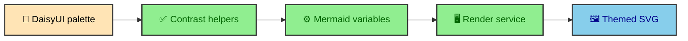

Mermaid diagrams should feel like part of the site, not screenshots from another tool. The integration uses DaisyUI-aligned palettes and generates Mermaid theme variables from them. That keeps diagram backgrounds, text, nodes, labels, and edges aligned with the same light and dark design system as the rest of the page.

---

## Base theme requirement

Mermaid must use `theme: "base"` for full variable control. The renderer sends a config object where each DaisyUI theme maps to a Mermaid base theme with generated `themeVariables`.

The palette shape lives in `MermaidPalette`. The light and dark palettes define base surfaces, content, primary, secondary, accent, neutral, semantic colors, borders, subtle surfaces, font family, and diagram-specific Gantt tokens.

That palette is not a copy of every DaisyUI token. It is the subset Mermaid needs to render diagrams that feel related to the site. The theme generator turns those values into the broader set of Mermaid variables used by different diagram types.

### Why Mermaid needs its own theme output

DaisyUI tokens style the surrounding page through CSS variables. Mermaid rendering happens inside a service that needs a Mermaid config object before it can produce SVG. The site therefore converts design tokens into renderer input.

That conversion is build-time work. The browser does not generate Mermaid themes. The browser receives themed SVG and CSS that already reflect the chosen palettes.

---

## Token generation

`generateMermaidTheme()` groups output variables by diagram family.

- Global variables cover dark mode, background, font family, and font size.
- Core node variables cover primary, secondary, tertiary, text, and line colors.
- Flowchart variables cover nodes, clusters, edges, labels, and titles.
- Sequence variables cover actors, activations, loops, labels, and sequence numbers.
- State, class, requirement, git graph, Gantt, Kanban, timeline, pie, journey, and mindmap variables receive matching tokens.

That breadth matters because the publication system should allow more than flowcharts. A future article can use sequence, state, class, or Gantt diagrams without needing a separate styling system.

The generated object is broad because Mermaid's diagram families do not share one small visual vocabulary. Flowchart edges, sequence actors, Gantt tasks, and pie slices all read different variables.

---

## Contrast helpers

The theme generator includes `hexToRgb`, `luminance`, `contrastRatio`, `mixHex`, and `ensureContrast`. These helpers push text colors toward readable contrast when a token pair is too close.

`ensureContrast()` starts with the requested foreground and background. If the pair already meets the minimum ratio, it returns the foreground. If not, it nudges the foreground toward white or black until the pair becomes readable, then falls back to the better extreme.

This matters because diagrams combine colors in ways the rest of the UI might not. A token that works as a button background can become a node fill, label background, or timeline stripe. The generator protects those new pairings.

### Mixing as design glue

`mixHex()` blends palette colors to create secondary diagram surfaces. For example, timeline and mindmap tokens can blend semantic colors with base surfaces. That gives diagrams variety without leaving the site's color family.

The goal is not to make every Mermaid diagram identical to a DaisyUI component. The goal is for diagrams to sit inside the article without feeling imported from a separate visual system.

---

## Memoization

`renderers.ts` uses a `WeakMap` to memoize generated themes per palette reference. During a large build, many diagrams can request the same light and dark theme variables. Recomputing those variables for every render request would be wasteful.

The memoization key is the palette object reference. That fits the build because palettes are imported once and passed through the integration. The same palette object can produce one generated Mermaid theme and be reused across many diagrams.

This is a small optimization, but it follows the same pattern as the rest of the Mermaid system. Do work once when the input has not changed. Reuse the result through a clear boundary.

---

## Theme output as a contract

The renderer service receives Mermaid config, not site CSS. The transform layer receives SVG strings, not palette objects. Runtime receives SVG asset links, not Mermaid token maps.

That chain makes theme generation a contract between the design system and the renderer. DaisyUI owns the site palette. `generateMermaidTheme()` translates that palette into Mermaid language. The renderer turns that language into SVG.

The diagram then becomes normal article output. That is the point of the custom theming layer. It keeps the design system upstream and lets the published article remain static.

---

## Palette input

The Mermaid integration receives light and dark palettes from `astro.config.mjs`. Those palettes are the bridge between the site's design system and Mermaid's renderer configuration. The renderer does not read DaisyUI CSS directly. It receives generated Mermaid theme variables.

That bridge is important because Mermaid is not a DaisyUI component. It has its own config language and rendering rules. The site needs to translate local design tokens into that language before rendering starts.

The palette input keeps ownership clear. The design system owns the source colors. The Mermaid theming code owns translation. The renderer owns diagram layout.

---

## Base theme and variables

Mermaid's generated theme still needs a base theme. The integration uses a base that Mermaid understands, then overrides variables with project-specific values. Those variables cover text, nodes, clusters, labels, sequence elements, notes, actor styling, and other diagram-specific surfaces.

This is different from styling an HTML card. Diagrams contain many internal shapes that Mermaid names in its own vocabulary. The theme generator has to speak that vocabulary while preserving the site's visual tone.

The result is not a one-to-one copy of website tokens. It is an adaptation. A diagram node, a cluster, and an edge label need colors that work inside SVG and remain readable at article sizes.

---

## Contrast as a build concern

Contrast helpers exist because diagram text and shapes can combine in many ways. A node fill can be light or dark. Text may need to sit on primary, secondary, base, or mixed colors. The theming layer chooses candidate foregrounds before the renderer produces SVG.

Doing this during the build is better than trying to patch diagram colors in the browser. The renderer lays out text using the chosen theme. The output assets already contain the intended visual relationships.

This makes color pairing part of the diagram build, but the repository does not record measured contrast values. The helper name and its color mixing are implementation evidence, not proof that every generated label meets an accessibility threshold.

---

## Light and dark as siblings

The light and dark diagram themes are siblings generated from the same theme function. That matters because the diagrams should feel like the same content in different palettes. The dark version should not look like a separate diagram style pasted into the article.

The integration renders both versions and emits assets for both. Runtime can then point Open links at the correct asset based on `html[data-theme]`. Article diagrams and standalone diagrams share the same theme source.

This keeps the article experience coherent across theme changes. The reader sees a site-wide palette shift, not an unrelated diagram swap.

---

## Verify contrast before release

Mermaid theming is translation. Site palettes become Mermaid variables. Contrast helpers choose candidate pairings. Mix helpers create diagram-specific surfaces that still belong to the local color family. Memoization avoids recalculating the same theme input.

The final SVG is static, but its colors come from the same design thinking as the rest of the site. That is why the diagrams feel integrated rather than imported.

---

## Why theme generation is centralized

Theme generation happens in one place so diagrams do not invent colors independently. If every Mermaid fence carried its own init block with custom colors, the article set would drift quickly. Central generation keeps diagram colors tied to the site palette.

Authors can still choose diagram structure, labels, and relationships. They do not need to choose the design system for every diagram. The build applies the site's Mermaid theme consistently.

This is especially important for a vault full of architecture diagrams. The diagrams appear across many entries, but they should feel like one documentation system.

---

## Diagram types and shared tone

Different Mermaid diagram types use different internal tokens. Flowcharts, sequence diagrams, state diagrams, and other structures have their own surfaces, labels, actors, notes, and edges. The theme generator has to cover enough of those tokens for diagrams to feel consistent across types.

The goal is shared tone, not identical shapes. A sequence note and a flowchart node are different objects. They can use related colors, contrast rules, and typography so they feel like they belong to the same article system.

That is why the theming layer is broader than a few primary colors. It translates the site palette into a diagram vocabulary.

---

## The static theme payoff

Because themes are generated before rendering, the SVG output already contains the intended visual values. The article does not need a runtime Mermaid theme engine. Standalone SVG files also carry the right styling for direct viewing.

Runtime theme switching still matters for Open links and wrappers, but theme application happens during rendering. That keeps the browser from running Mermaid and gives the build consistent diagram inputs. A speed claim would still need measurement.
