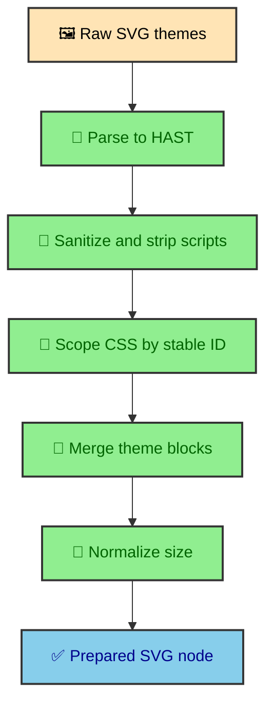

The renderers return SVG strings, but the site cannot publish those strings unchanged. IDs can collide, scripts must disappear, styles need scoping, and theme output has to merge into predictable SVG assets. The transform layer uses HAST, an HTML-shaped syntax tree, because SVG is a tree of elements and attributes. Treating that structure as plain text would be too fragile.

---

## Shared cleanup

The shared utilities parse SVG to HAST, strip scripts, sanitize style attributes, collapse `foreignObject` line breaks, update IDs and URL references, and normalize intrinsic width and height from `viewBox`.

That cleanup runs before the final SVG node is stored and emitted as an asset. It protects both the article image asset and the direct-open asset path, where duplicated IDs would otherwise confuse marker references, clip paths, and CSS selectors.

The transformation starts with a parsed tree. That gives the code direct access to elements, attributes, and child nodes. It can remove `<script>` elements, rewrite IDs, and move CSS without relying on brittle string replacement across full SVG documents.

### Why size normalization matters

Mermaid often emits responsive SVGs with percentage width and `max-width` styles. That is useful in a normal document, but generated SVG assets need concrete intrinsic size so image layout and popover scrolling can calculate useful dimensions.

The transform reads width and height from `viewBox`, writes them back as pixel attributes, and removes the stale `max-width` style. The article CSS can still make the SVG image responsive, while expanded views get a stable natural size.

---

## Worker strategy

Worker output has dynamic render IDs. The transform strips those prefixes, scopes the base theme to `#mermaid-{stableId}`, scopes non-base themes to `[data-theme="theme"] #mermaid-{stableId}`, keeps valid `:root` rules, and dedupes keyframes.

The first theme becomes the base SVG tree. The code removes existing style blocks from that tree and injects one merged style block at the front. That merged block contains base rules plus theme-guarded rules for the other themes.

The result is one SVG element with predictable theme rules. The pipeline can use that prepared node to emit light and dark image assets without keeping raw renderer output in the article.

---

## Ink strategy

The Ink path starts from a different shape. The SVG root is always `id="mermaid-svg"`, and classDef colors often appear as inline styles instead of usable CSS blocks.

The transform hoists inline colors into scoped CSS with `!important`, removes color declarations from inline style attributes, strips the literal root selector, scopes each theme block, and renames the root through `updateHastIds()`.

This extra work exists because inline color declarations would otherwise outrank page-level theme CSS. Hoisting them into scoped CSS gives the site one place to control the light and dark versions of the diagram.

### Service-aware dispatch

`buildMergedThemeNode()` receives the `RenderService` value and delegates to the correct strategy. That keeps renderer-specific cleanup out of the pipeline and gives the transform layer a clear boundary.

The pipeline knows it has a map of theme names to SVG strings. The transform knows how those strings differ by renderer. The pipeline receives one prepared HAST `svg` node either way.

---

## Why HAST is the right level

String manipulation is tempting because SVG arrives as text. It becomes risky as soon as the transform needs to reason about nested elements, ID references, style elements, and attributes at the same time.

HAST gives the integration a structured representation of the SVG. It can select the root, walk nodes, rewrite references, remove elements, and serialize the result back to HTML-compatible output. That makes the transform layer closer to a compiler pass than a text cleanup step.

The payoff is consistent output. Regardless of renderer source, a diagram becomes one sanitized, scoped, multi-theme SVG node with predictable IDs and dimensions.

---

## Shared cleanup as a compiler pass

The shared cleanup step removes the pieces that should never reach published output. Scripts are stripped. Unsafe style attributes are sanitized. ForeignObject line breaks are normalized. The root SVG is shaped into the form asset emission expects.

Thinking of this as a compiler pass is useful. The renderer emits SVG for a diagram. The transform layer turns that renderer-specific SVG into site-specific SVG. It is not merely cleaning text. It is enforcing the contract between external renderers and the publication system.

The contract includes safe markup, stable IDs, scoped styles, usable dimensions, and theme behavior. Once the transform completes, the rest of the site can treat the diagram as generated article assets.

---

## ID rewriting

SVG IDs matter because diagrams often contain markers, gradients, clip paths, labels, and style selectors. If two generated SVGs share an unscoped ID, references can collide or style selectors can target the wrong element.

The build transform updates renderer IDs into scoped diagram IDs before the asset is stored. Each generated SVG needs its own ID space.

HAST makes that work practical. The transform can find elements with IDs, update attributes that reference those IDs, and rewrite style selectors. Doing that with plain string replacement would be much more fragile.

---

## Multi-theme output

The transform layer also shapes light and dark SVG output into one prepared node. The renderer can return separate SVG strings for each theme. The site needs a structure that can be emitted as theme-specific assets and displayed by the article wrapper.

The Worker path and Ink path reach that goal differently because their raw SVG differs. The final output still needs the same behavior. The article should display the appropriate themed diagram, and standalone assets should exist for direct viewing.

This is why the transform layer sits after rendering and before asset emission. It is the point where provider output becomes site output.

---

## CSS and specificity

Mermaid output includes CSS, and CSS specificity can decide whether a theme actually appears. The Ink strategy hoists inline colors into scoped CSS with `!important` because inline color declarations would otherwise outrank the theme rules. The Worker path has a different shape and can be transformed differently.

The goal is not to make CSS more complicated. The goal is to put color rules where the site can manage them. A themed diagram needs the right color values for the active theme and the right scoping so those values do not leak into other diagrams.

That is also why the transform keeps SVG styling inside the emitted asset contract. Diagram CSS carries theme behavior, so optimization must preserve cascade intent.

---

## Transform output for runtime

The runtime shell depends on the transform output being stable. It expects data attributes that point to light and dark SVG assets. The transform layer does not implement the popover, but it prepares the SVG files that the wrapper and popover can reuse.

This is a good example of build and runtime cooperation. The build creates readable SVG assets. The runtime only keeps the Open link aligned with the active theme while the wrapper displays the prepared images.

---

## Preserve the transform boundary

The transform layer is where raw renderer output becomes publication output. It sanitizes, scopes, rewrites, merges themes, and protects CSS behavior. HAST gives the integration a structured way to perform that work.

Without this layer, the site would either trust provider SVG too much or push diagram rendering into the browser. With it, Mermaid diagrams become static article assets that still support theme-aware runtime affordances.

---

## Why transforms stay build-time

The transform work is deterministic once renderer output exists. There is no reader-specific information needed to sanitize SVG, rewrite IDs, merge themes, or scope CSS. That makes the build the right place to do it.

Doing this work in the browser would increase page cost and make diagrams depend on client-side execution. Doing it during the build turns diagrams into finished content. The runtime shell can then focus on the small interactive layer around that content.

This is the same pattern used across the site. Durable transformation belongs before deployment. Browser code belongs to session-specific behavior.

---

## Output expectations

After transform, the rest of the site expects predictable SVG. IDs should be scoped. Theme CSS should be present in the expected form. Unsafe nodes should be gone. Dimensions should be usable. Provider quirks should no longer leak into article rendering.

Those expectations let later stages stay simple. Asset emission can write SVG files. The article wrapper can place SVG images. The runtime shell can point Open links at the right theme asset.

The transform layer therefore creates trust between renderer providers and publication output.

---

## Transform as design protection

The transform layer also protects visual design. Mermaid output is generated by an external renderer, but it needs to sit inside the site's article system. Scoped CSS, rewritten IDs, and theme-aware output keep diagrams from looking or behaving like foreign embeds.

That is why transformation belongs in the Mermaid architecture article, not only in code comments. It is where external SVG becomes local design material.
