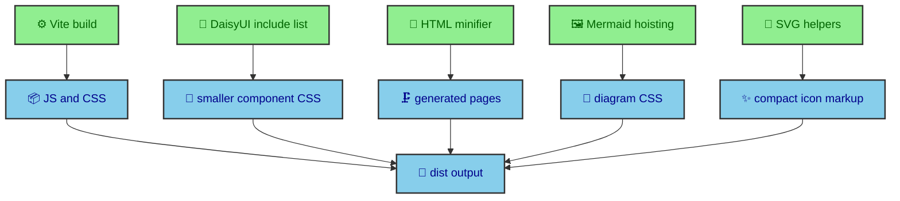

The build does not treat file optimization as one giant squeeze at the end. It uses several smaller decisions that understand the kind of file being produced. JavaScript and CSS go through Vite. Component CSS is limited by DaisyUI's include list. HTML is minified after Astro writes pages. Mermaid CSS is hoisted with cascade safety in mind. SVG icons are compressed where the project controls the markup. The result is lighter output without turning article content into an optimization casualty.

---

## The optimization boundary

The first rule is that optimization should happen at the layer with the most context. Vite understands JavaScript and CSS bundles. Tailwind and DaisyUI understand utility and component generation. The custom HTML minifier understands final HTML documents. The Mermaid integration understands generated diagram markup. The SVG ribbon helper understands repeated icon patterns. Cloudflare understands delivery.

That layered approach keeps each tool from pretending it knows everything. A generic HTML minifier does not know that code samples are part of the article's meaning unless the project tells it. A CSS optimizer does not know that Mermaid's repeated style blocks can be hoisted unless the integration marks them. A CDN cannot know which DaisyUI components the design system intends to use.



The goal is not the smallest possible number in a report. The goal is output that is small, readable by the browser, and faithful to the source material.

---

## Vite and Terser

`astro.config.mjs` configures Vite for production minification with Terser. Vite is the bundler Astro uses for modules and CSS, while Terser is the JavaScript minifier that removes extra syntax and development-only statements from production output.

```ts
vite: {
  build: {
    minify: "terser",
    terserOptions: {
      compress: {
        drop_console: true,
        drop_debugger: true,
      },
    },
    cssMinify: true,
  },
}
```

That block is intentionally compact. It lets Vite handle production bundling, asks Terser to remove console calls and debugger statements, and enables CSS minification. The site does not carry a large JavaScript application, so there is no need for a complicated bundle strategy. The important part is to keep the generated module scripts lean and predictable.

This is especially relevant for runtime modules. Theme management, overlays, diagram expansion, and article navigation all run in the browser, but they are small modules attached to static pages. Minifying those modules reduces delivery cost while keeping the runtime philosophy intact. The browser should spend its time on interaction, not on downloading unused framework code.

Vite also sits behind Astro's build process, so the site can keep one configuration surface. Astro handles pages, content, assets, integrations, and fonts. Vite handles the bundling layer below that. The project does not need to split performance policy across unrelated build tools.

---

## CSS pruning

Tailwind 4 and DaisyUI 5 are loaded through `global.css`. DaisyUI uses an include list for the components this site actually needs, such as buttons, cards, navbar, swap, badges, mockup, modal, join, alert, link, table, and textrotate.

The include list is a performance decision and a design decision. It limits CSS output and keeps component usage inside a known set. If the design system only uses a subset of DaisyUI, the build should only produce that subset. This makes the CSS smaller and keeps new UI work inside a familiar vocabulary.

The order in `global.css` also matters. Tailwind loads first. DaisyUI registers its component set. Theme tokens load before base rules, utilities, shared styles, layout styles, UI partials, and page styles. That ordering prevents late surprises in the cascade. A compact file is good. A compact file that is hard to reason about is not.

Tailwind v4 also encourages the site to express design tokens as CSS variables. The `_tailwind-theme.css` partial maps font families, radii, shadow opacity, and sizing tokens. DaisyUI themes define semantic colors in OKLCH. Together they let component classes stay terse without forcing raw values into every Astro file.

The CSS output is therefore shaped by two kinds of restraint. The build limits the frameworks to the pieces the site uses. The authoring model limits components to semantic tokens and known partials. Both forms of restraint reduce drift.

---

## HTML minification

`customHtmlMinifier()` runs at `astro:build:done`. It finds generated HTML files under `dist/`, skips `_astro`, and runs `html-minifier-terser` with `HTML_MINIFIER_OPTIONS`.

The options collapse whitespace, remove comments, minify inline JS, and minify inline CSS. They also protect `<pre>`, `<code>`, and `<kbd>` fragments, which prevents code examples and keyboard tokens from being rewritten in ways readers would notice.

That protection is one of the more important performance details in the project. The journal is a technical publication area, so code blocks are content, not decoration. Shiki already transforms code into a carefully structured HTML fragment with spans, line attributes, and theme classes. A minifier that aggressively rewrites those fragments could change spacing, highlighting, or copy behavior.

Running the minifier after Astro completes gives it a complete view of the generated documents. It can work across all pages in `dist/`, including MDX output, article layouts, Mermaid wrappers, homepage sections, and catalog pages. It does not need to know the source route that produced each file because by that point the files are ordinary HTML.

The minifier is also intentionally a custom Astro integration. That keeps it inside the build lifecycle rather than as a separate deploy script. When the site builds, minification is part of the result. The source code and the output contract live in the same project.

---

## SVG and Mermaid output

Mermaid page CSS hoisting reduces repeated inline style blocks in built article pages. It also keeps cascade behavior guarded by disabling unsafe CSS restructuring.

Inline SVG icons are handled through `src/data/icons.ts` and helpers such as `compressSVGContent()` in `ribbon.ts`. That lets the site avoid icon fonts and still keep SVG payloads compact.

The Mermaid work is a good example of project-specific optimization. Mermaid diagrams produce SVG with embedded style rules. The site needs those diagrams to work in light and dark themes, inline inside articles, and as standalone assets. The integration can inspect that exact output and hoist repeated CSS into a page-level style block while keeping theme behavior intact.

The SVG icon path is similar. `src/data/icons.ts` loads skill icons from disk and defines small UI icons inline. `SVGIcon.astro` renders those icons with accessible labeling rules. `generateRibbonSVGData()` then compresses repeated SVG content, scopes IDs, rewrites references, and returns dimensions for pattern strips. A generic icon library would not know about that decorative ribbon use case.

These optimizations are not isolated tricks. They are part of the visual architecture. Mermaid diagrams, skill icons, social icons, and ribbon backgrounds are all SVG, but they have different jobs. The build treats them differently because their output requirements are different.

---

## Cloudflare delivery

Cloudflare Pages receives the static output. At that point, the site has already done the semantic work. Routes are generated, HTML is minified, assets are bundled, images are transformed, diagrams exist as SVG, and CSS is ordered.

That means Cloudflare can do what an edge host is good at. It can serve static files close to readers, apply compression, and cache output. It does not need to run application logic for each journal page. This keeps the deployment model simple and matches the static architecture described in the foundations section.

There is a quiet advantage here. Because build optimization happens before deployment, the output can be inspected as files. The site does not depend on opaque server behavior to make pages fast. The deployment host is important, but it is not the only place performance exists.

---

## What stays unoptimized

Not every byte deserves the same pressure. The site keeps readable MDX source, explicit frontmatter, descriptive component names, and organized CSS partials. Those files do not ship directly to readers in their authoring form, so they should be optimized for maintainers first.

The same principle applies inside generated pages. Code samples keep their structure. Mermaid diagrams keep IDs and CSS relationships needed for themes and popovers. Accessible labels remain in markup. Images keep width and height attributes. The build removes noise where it can, but it does not erase the information the browser and assistive technologies need.

This is the difference between optimization and flattening. Optimization respects the purpose of each artifact. Flattening treats every artifact as a string to shorten. This site chooses the first approach because publication quality depends on meaning surviving the build.

---

## The build lesson

The file optimization story is a set of small, contextual decisions. Vite and Terser handle scripts and CSS bundles. Tailwind and DaisyUI keep the component surface limited. The HTML minifier reduces generated documents while protecting code-oriented fragments. Mermaid CSS hoisting removes repetition from diagram-heavy pages. SVG helpers compress and scope icon output. Cloudflare serves the finished files.

The shape is more important than any one tool. Work happens where context is strongest. The source stays readable. The output gets lighter. The browser receives pages that are already structured, styled, and ready to enhance.

That is the project’s preferred optimization shape. Reduce output after meaning is established, and keep the source clear enough to keep improving.
