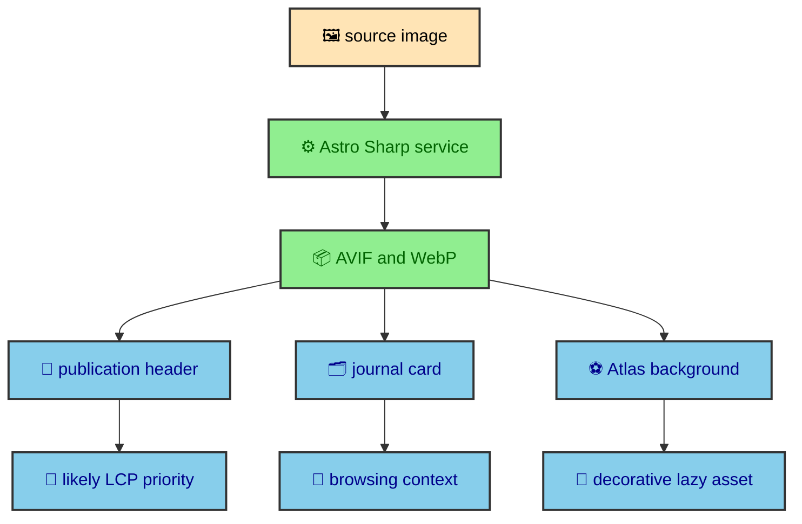

Images and fonts are the assets readers notice before they understand any architecture. A journal page can have perfect static routing and still feel heavy if the first image is oversized or the reading font arrives late. This site treats those assets as part of the build, not as decoration added after the fact. Astro transforms images, the layout chooses priority by context, and fonts are registered as named variables the rest of the design system can rely on.

---

## Image service

`astro.config.mjs` uses Astro's Sharp image service with `limitInputPixels: true`. Sharp is the image processing library Astro uses here to resize and convert local images during the build. The pixel limit gives local image transforms a guardrail against unexpectedly huge source files.

The project uses Astro `Picture` in `PublicationHeader.astro`, `JournalCard.astro`, and `AtlasStats.astro`. Article featured images use AVIF and WebP variants, eager loading, high fetch priority, and responsive widths because they are likely LCP candidates.

The important decision is that images are transformed during the build. The browser does not receive one large source image and then negotiate everything alone. Astro can generate modern formats, sizes, and metadata before deployment. Components can then express what kind of image they are rendering.

That context matters. A publication header image appears at the top of the article, so it has a strong chance of being the largest contentful element. A journal card image appears in a list, so it should be responsive and economical but does not need to steal priority from the page's main visual. A decorative background inside the Atlas section should load lazily and stay out of the accessibility tree.

The image service gives the project a consistent transformation layer. The components still choose loading behavior because only the component knows whether an image is primary content, a preview, or atmosphere.

---

## Publication images

Publication pages use featured images as part of the article identity. The image is not hidden deep in the page. It helps the reader recognize where they are, and on many pages it participates in the first viewport. That is why the publication header treats it with more urgency than a lazy gallery image.

The content collection requires images for standalone entries and vault roots, while child vault entries can inherit from the root. That policy lives in the journal manifest, but it has a performance consequence. The route can render a complete header without discovering assets later in the browser. The image path, alt text, title, description, and reading context are all known during static generation.

Using `Picture` lets the component emit multiple formats. AVIF and WebP give modern browsers lighter options. Responsive widths keep smaller screens from receiving desktop-sized imagery. Width and height metadata help the browser reserve space and reduce layout movement.

The rule is not that every image should be eager. The rule is that the first meaningful article image deserves a priority that matches its role. If a visual is part of the page's first read, it should be treated as part of the page foundation.

---

## Journal cards

Journal cards use images differently. A catalog page may show many entries, and not every card is equally close to the reader's immediate focus. The image still needs to look good, but it should not make the entire listing expensive.

This is where responsive image generation pays off. Cards can share the same source assets as article pages while receiving sizes appropriate to their own layout. The component can present a polished catalog without forcing the browser to download every full-resolution source.

The card image also supports content strategy. A vault root image can represent a whole project section. Child entries inherit that visual identity unless they have a reason to override it. That keeps the journal visually coherent and reduces the temptation to add arbitrary images only to satisfy a layout.

From a build perspective, the catalog is another static output. The manifest decides which entries exist. Astro renders the cards. The image service prepares variants. The browser receives a page that is already ready to browse.

`AtlasStats.astro` also uses manual responsive `<picture>` behavior for mobile and desktop background crops. That component needs more control than a generic article image because the crop is part of the design.

---

## Atlas background images

The Atlas section is the main place where the site chooses manual image sources instead of relying only on `Picture`. `AtlasStats.astro` uses `getImage()` to create mobile and desktop AVIF and WebP variants for the background. Mobile receives a tall crop. Desktop receives a wide crop. The `<picture>` element then selects the source by media query.

That extra control exists because this image acts as a compositional layer inside `ParallaxHero`. The crop affects how the logo, metric panels, and background motion feel at different viewport sizes. A generic responsive image can choose a smaller file, but it cannot decide the emotional crop of a section.

The background image is marked with empty alt text and `aria-hidden="true"` because it is decorative. It uses `loading="lazy"`, `fetchpriority="low"`, and `decoding="async"` because the section does not need to compete with the first page content. The Atlas logo inside the same component is different. It is a visible brand element and uses `Picture` with responsive widths, formats, and lazy loading appropriate to its position.

This is the pattern the site follows. Image performance is not one rule. It is a set of choices based on meaning, viewport position, and layout role.

---

## Font loading

`BaseLayout.astro` registers three font families. Registering fonts at the layout level gives the whole site named font variables instead of making each component choose a raw font file.

Inter comes from Fontsource as `--font-inter`. Montserrat comes from Fontsource as `--font-montserrat`. Fira Code loads from a local WOFF2 subset as `--font-fira-code`. The full Nerd Font remains in `src/assets/fonts/` as the source file, and `npm run font:subset` regenerates the smaller runtime file when that source changes.

The Tailwind theme maps those variables to `--font-sans`, `--font-display`, `--font-reading`, and `--font-mono`.

That mapping is the main architectural decision. Components should not need to know where a font came from. They should choose the semantic role. Body text uses the sans or reading token. Headings and display moments can use the display token. Code blocks use the mono token. If the underlying font source changes later, the component language can stay the same.

Fonts also affect perceived speed because they shape text rendering. The site uses `display: "swap"` for Fontsource families so text can appear while the custom font loads. The local Fira Code file is registered for code, but code reading is secondary to the first page impression, so it does not receive the same priority as primary text.

This choice matches the journal's content. A reader arrives to read headings, paragraphs, and navigation labels first. Code samples matter once the article content is being studied. Prioritizing all fonts equally would dilute that order.

---

## Loading priorities

The priority choice is intentional. Body and display fonts affect the first read. Code font matters after the article has loaded and only on pages with code. Featured article images use eager loading because they sit at the top of publication pages.

The rule is to prioritize the assets that shape first paint and first read, then let secondary assets load normally.

That rule appears throughout the site. The homepage Atlas background is lazy. The article header image is eager. The decorative parallax image is not announced to assistive technology. The publication image has meaningful alternate text through the content model. Reading fonts are part of the layout foundation. The code font is available without forcing itself into the critical path.

Loading priority is also a way to avoid false performance work. It would be easy to mark many assets as important, but if everything is important, nothing is. The browser only has so much early bandwidth and scheduling attention. The site should spend that budget on the assets the reader sees first.

---

## Widths and layout stability

Responsive images do more than reduce bytes. They help the browser choose a file that fits the layout. Widths, heights, and `sizes` attributes give the browser information before the image is fully loaded. That reduces layout movement and helps the page feel stable.

This matters for the journal because article pages have several fixed structural regions. The header, main content column, sidebars, mobile dock, code blocks, and diagram wrappers all need to coexist across breakpoints. A top image that shifts late can make the whole page feel loose. Reserving the correct geometry keeps the article calm.

The Atlas section uses fixed generated dimensions for its sources. The background is absolutely positioned inside the parallax wrapper, while the content sits above it. The logo uses `max-w-full`, `h-auto`, and responsive `sizes` so it can scale without escaping its column. These details are small, but they are part of why the site can combine visual richness with static output.

---

## Preserve loading intent

The image and font strategy is another version of the site's larger rule. Do as much useful work as possible before the browser gets involved, then give the browser honest hints about what matters first.

Astro's image service prepares modern formats and dimensions. Components choose loading behavior based on meaning and position. The manifest makes sure publication images are known before routes are generated. The Atlas component uses manual sources when crop control is part of the design. Fonts are registered centrally and exposed as semantic CSS variables.

That gives the site a clear asset model. Images are not random files sprinkled into components. Fonts are not hardcoded family strings. Both are part of the build system, and both contribute to the feeling that pages arrive already composed.
